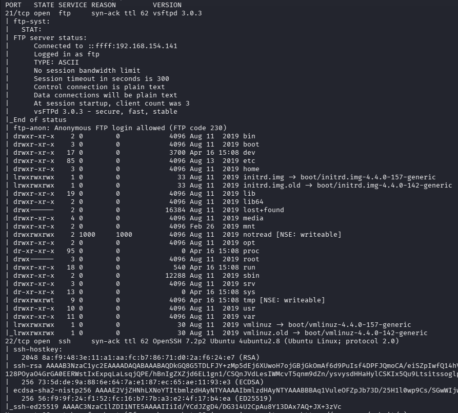
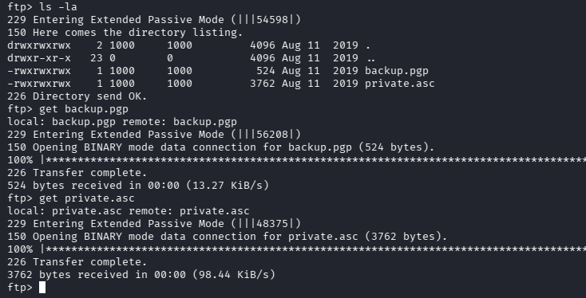
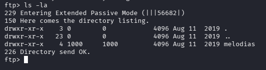
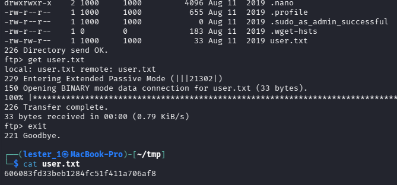
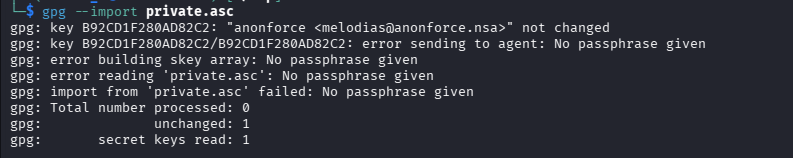
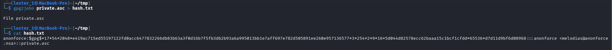
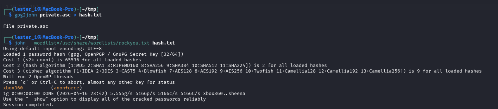
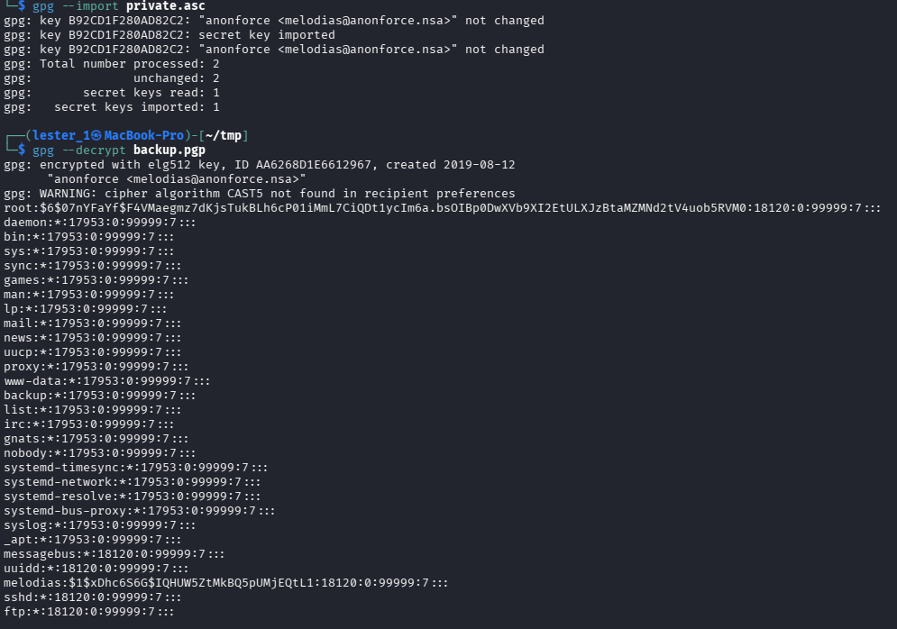
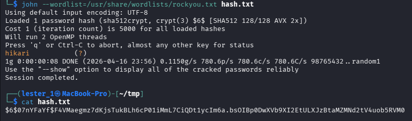
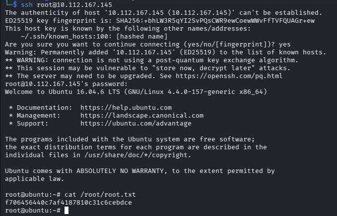

# Anonforce - boot2root machine for FIT and bsides guatemala CTF

Складність: Easy

Ціль: 10.112.167.145

1. Розвідка (Reconnaissance & Enumeration)

    1.1. Сканування портів (Nmap):

     `nmap -sC -sV -O -p- -vv 10.112.167.145`

      
   
    1.2. FTP:

      Знаходжу зашифрований файл та ключ, забираю собі.

      

      Також дивлюсь домашні директорії користувачів.

      

      Знаходжу прапор `user.txt`.

      

   
3. Отримання доступу

      Пробую глянути що це за файл та ключ, але треба пароль.

      

      Дістаю хеш, та за допомогою `john` дізнаюсь пароль.

       

      

      Імпортую ключ та дивлюсь вміст зашифрованого файлу.

      

      Беру з попереднього файлу хеш `root`-а та знову використовую `john`.

      

      Підключаюсь по SSH та забираю прапор `root.txt`.

      
