# Billing - Some mistakes can be costly. 

Складність: Easy

Ціль: 10.114.135.208

1. Розвідка (Reconnaissance & Enumeration)

    1.1. Сканування портів (Nmap):

     `sudo nmap -sS -sV -sC -Pn -p- -vv 10.114.135.208`    

     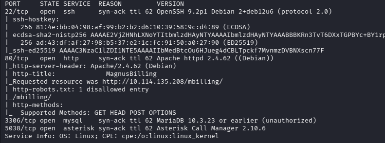
        
    1.2. Веб-розвідка:

     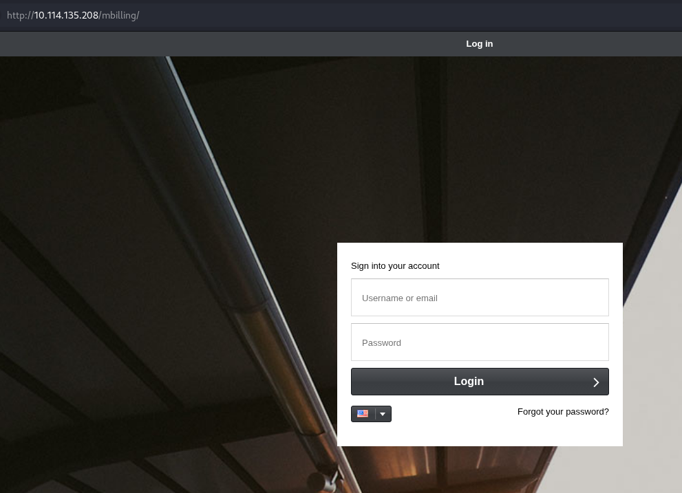

     `gobuster dir -w /usr/share/wordlists/seclists/Discovery/Web-Content/common.txt  -u http://10.114.135.208/ -t 50 -k -x html,txt,php`
     
     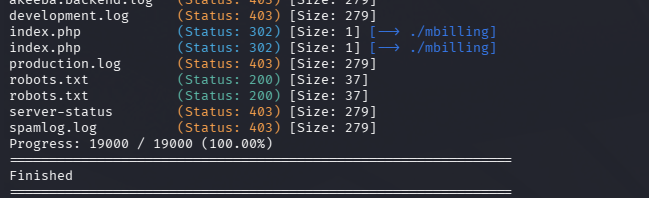

     `gobuster dir -w /usr/share/wordlists/seclists/Discovery/Web-Content/common.txt  -u http://10.114.135.208/mbilling -t 50 -k -x html,txt,php`

     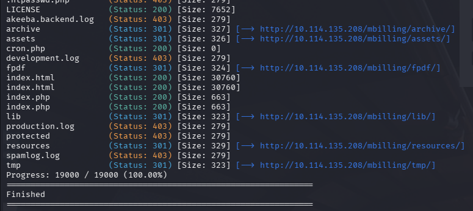

     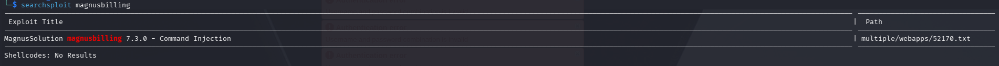

     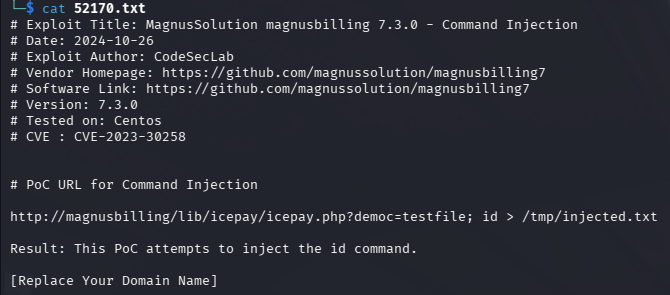

3. Точка входу (Initial Access / Foothold)

    2.1. Експлуатація вразливості:

      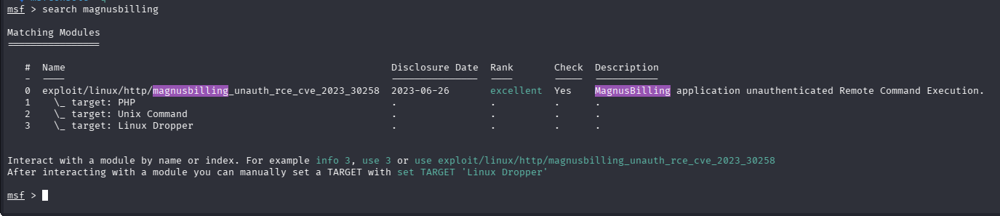
   
    2.2. Отримання реверс-шеллу:

     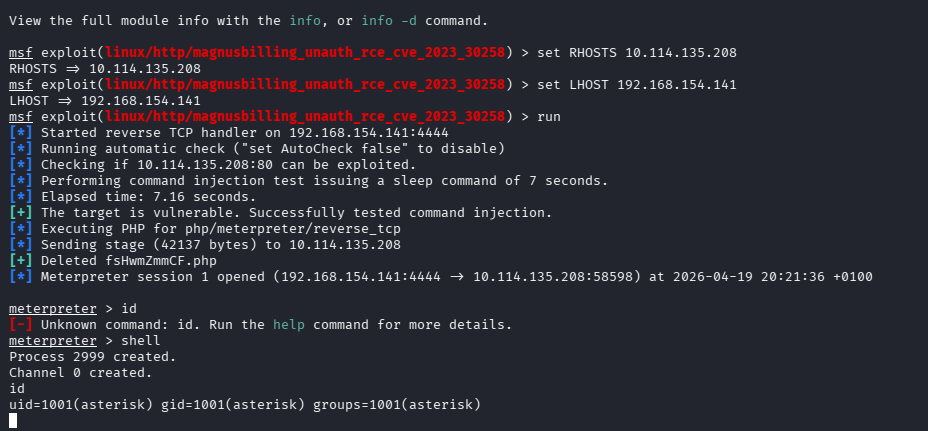

3. Підвищення привілеїв (Privilege Escalation)

    3.1. Вертикальне підвищення (asterisk -> Root):

      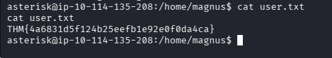

      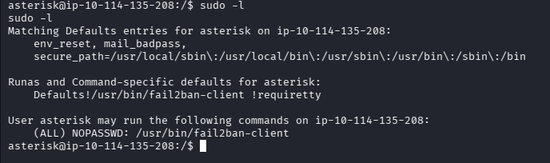

      Перепробував різні варіації, але вони не працювали, пробую ще цей варіант.

      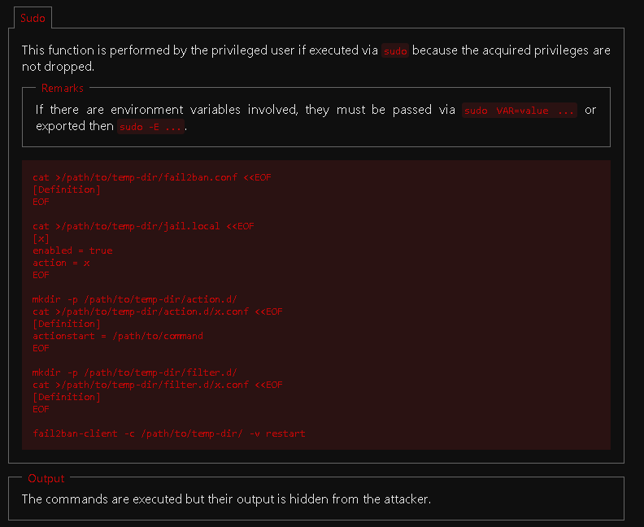

      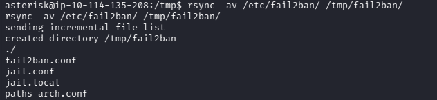

      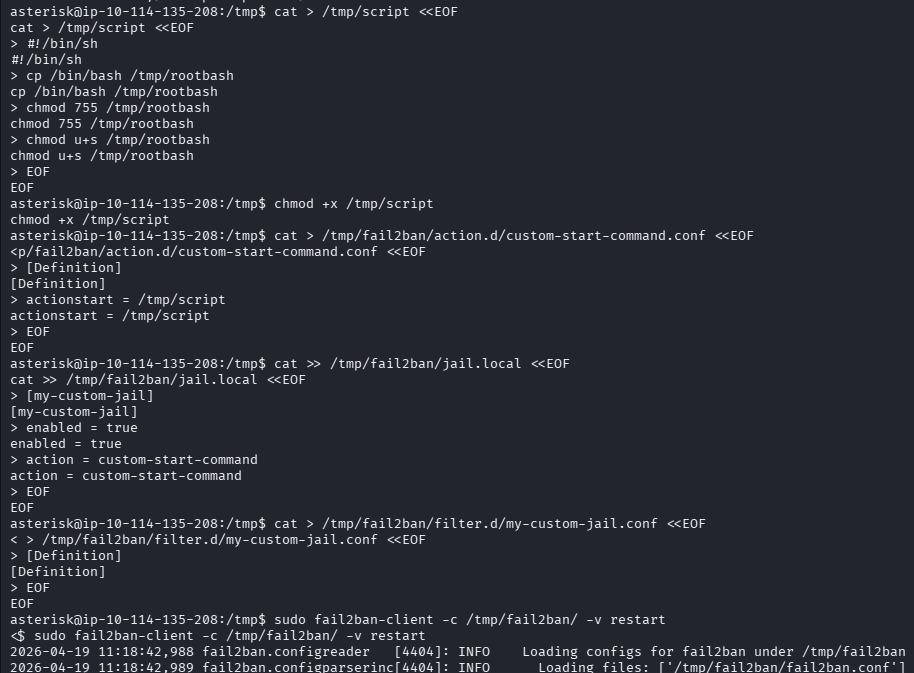

      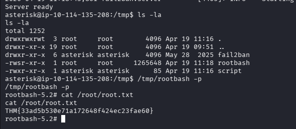

     

     

      

