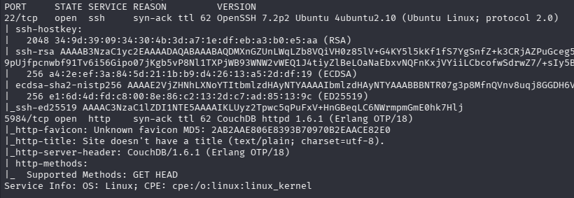
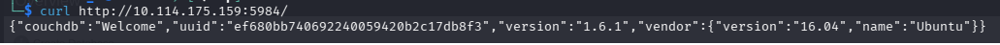
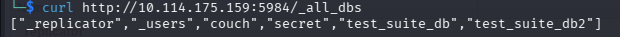
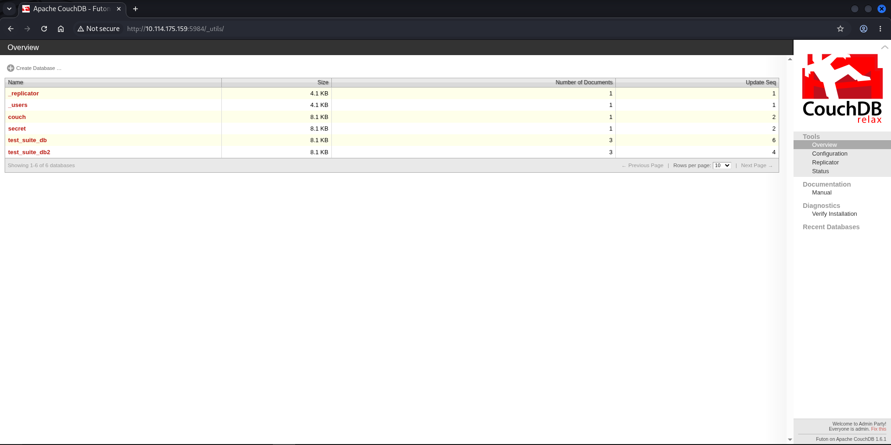
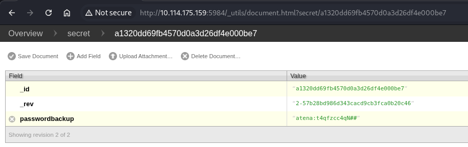
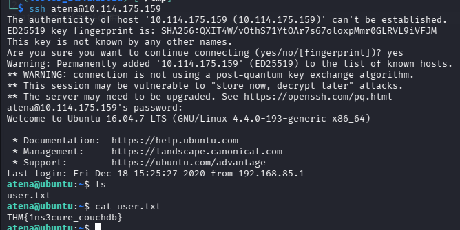
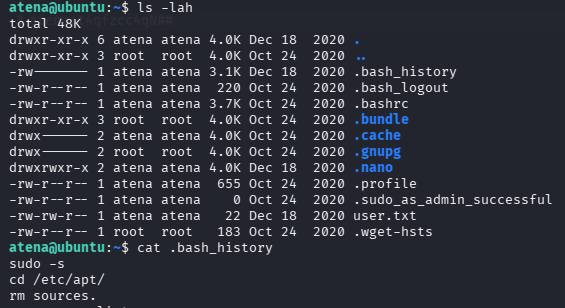
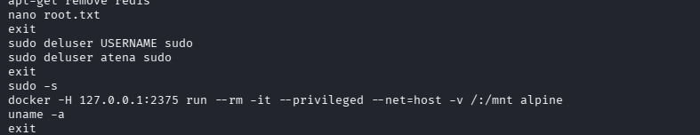
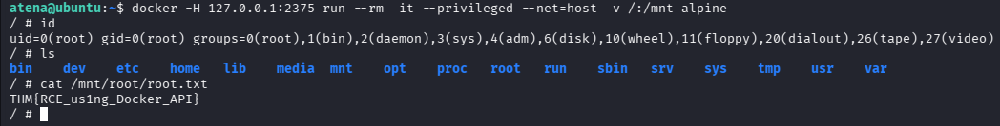

# [Couch - Hack into a vulnerable database server that collects and stores data in JSON-based document formats, in this semi-guided challenge.] 

Складність: Easy

Ціль: 10.114.175.159

1. Розвідка (Reconnaissance & Enumeration)

    Сканування портів (Nmap):
    ```bash
    sudo nmap -sC -sV -p- -vv -oN nmap_result.txt 10.114.175.159
    ```

   

2. Експлуатація CouchDB та витік даних

   CouchDB за замовчуванням конфігурується без автентифікації. Перевіряємо доступність API та список наявних баз даних через утиліту `curl`.

   
   

   У веб-інтерфейс адміністрування `_utils/` знайдено базу `secret`, в якій є дані користувача.
   
   
   

4. Первинний доступ (User Flag)
   Використовуємо знайдені облікові дані для підключення через `SSH`. Успішно авторизуємося та забираємо прапор користувача.

   

5. Підвищення привілеїв (Root Flag)
   Під час пошуку можливих векторів підвищення привілеїв проаналізовано історію команд користувача.  Знайдено запис, що вказує на запуск Docker-демона на локальному TCP-порті 2375 (без автентифікації).

   
   

   Оскільки порт `2375` відкритий локально, будь-який користувач у системі може надіслати команду Docker-демону. Використовуємо цю команду для запуску контейнера `alpine` із монтуванням кореневої файлової системи хоста (`/`) у директорію `/mnt` всередині контейнера.
   Після успішного запуску ми отримуємо root-доступ всередині контейнера з можливістю взаємодіяти з усіма файлами хоста. Переходимо в примонтовану домашню директорію рута на хості та забираємо фінальний прапор.

   
