# Flatline - How low are your morals? 
Складність: Easy 
Ціль: 10.113.151.34

1. Розвідка (Reconnaissance & Enumeration)
   
      1.1. Сканування портів (Nmap):
      Так як машина не пінгувалась взяв таку команду  
          `sudo nmap -sS -sV -sC -Pn -p- -vv 10.113.151.34`
 
      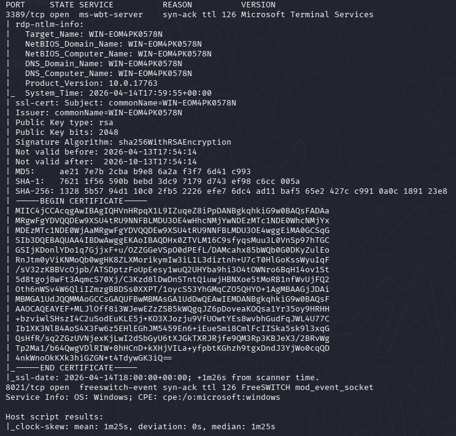

     1.2. Пошук вразливості:
      Бачу RPD та якийсь FreeSWITCH. шукаю в гуглі та знаходжу CVE-2019-19492 (https://pentest-tools.com/vulnerabilities-exploits/freeswitch-mod-event-socket-default-password-vulnerability_4004 , https://www.exploit-db.com/exploits/47698 , https://github.com/Chocapikk/CVE-2019-19492).

      FreeSWITCH (Port 8021) інфа від ШІ:
   
       *Що це: Потужна Open Source платформа для IP-телефонії (VoIP), відеозв'язку та створення АТС. Аналог Asterisk, але більш модульний та продуктивний.
       *Чому цікавий для атаки: Має модуль mod_event_socket, який дозволяє керувати сервером ззовні.
       *Головна вразливість: Часто залишається зі стандартним паролем ClueCon.
       *Вектор (RCE): Якщо пароль підходить, через команду api system <command> можна виконувати системні команди в ОС (Windows/Linux) з правами сервісу FreeSWITCH.
   
      Перевіряю стандартний пароль. 

   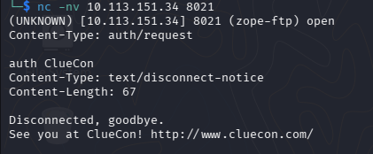

   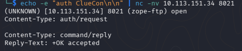

3. Точка входу (Initial Access / Foothold)

     2.1. Експлуатація вразливості:
       Шукаю FreeSwitch в Metasploit, обираю перший варіант в списку та виставляю налаштування.

      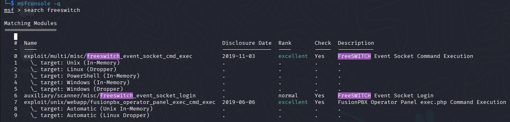

      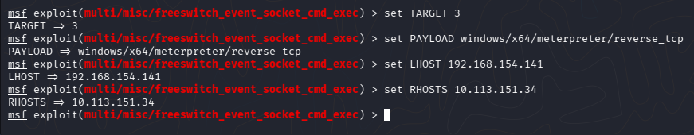

      Помилка, але бачу, що вразливість працює, треба лише обрати сумісний payload.
   
      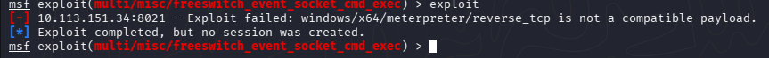
     
  2.2. Отримання реверс-шеллу:
    
   Знайшовши робочу комбінацію отримую реверс шелл та забираю прапор user.txt.
    
   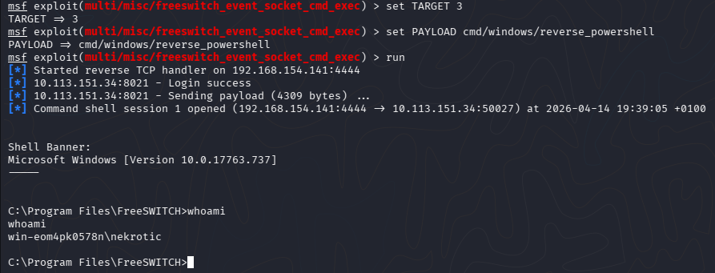
    
   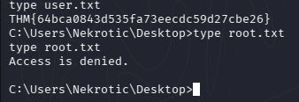

3. Підвищення привілеїв (Privilege Escalation)

   Перевіряю привілеї поточного користувача

   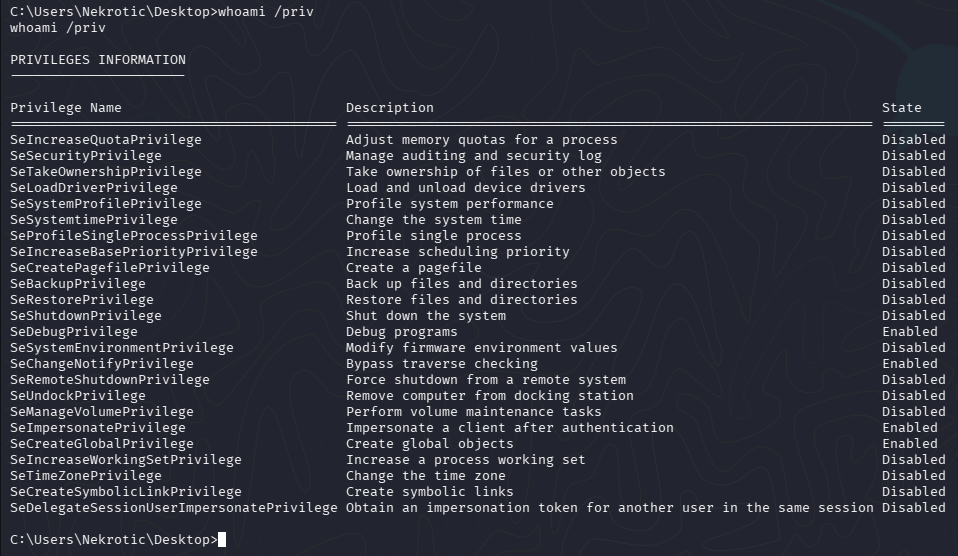

   Інфа від ШІ:

       *SeDebugPrivilege — це дуже потужно. Дозволяє взаємодіяти з будь-яким процесом у пам'яті (навіть системним).
       *SeImpersonatePrivilege — це золотий стандарт для CTF. Це означає, що ти можеш "видавати себе" за іншого користувача (наприклад, SYSTEM), якщо змусиш його           підключитися до тебе.
       *SeCreateGlobalPrivilege — допомагає в атаках типу Potato.

   Машина лягла чи ще щось, тому перезапускаю ціль. Поки ціль завантажується підготую 'PrintSpoofer.exe'.
  
   Новий айпі цілі: '10.114.149.159'.
  
   Танці з бубном і я знову піднімаю реверс шелл та закидую підготований файл.
  
  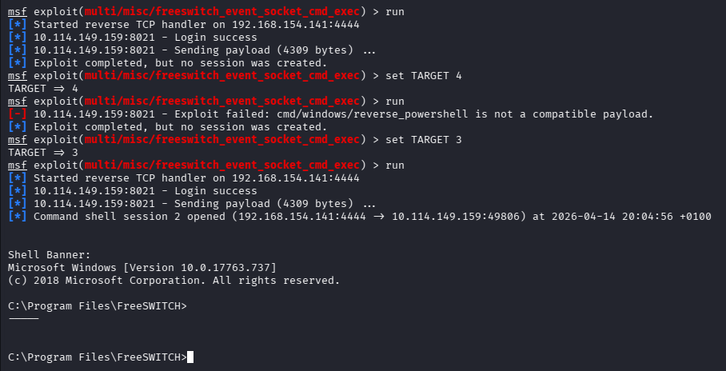
  
  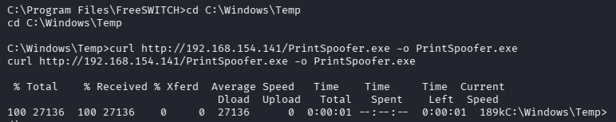

  Запускаю та забираю root.txt.
  
  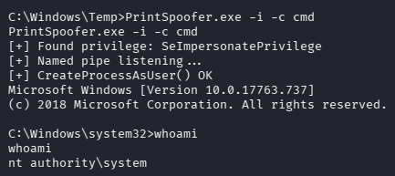
  
  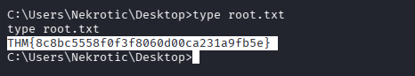
