# LazyAdmin - Easy linux machine to practice your skills

Складність: Easy

Ціль: 10.113.166.242

1. Розвідка (Reconnaissance & Enumeration)

    1.1. Сканування портів (Nmap):

      `nmap -sC -sV -O -p- -vv 10.113.166.242`

      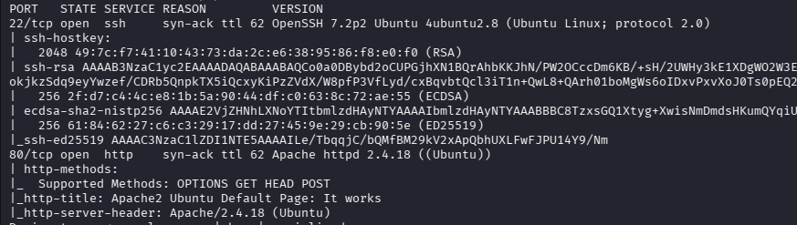

    1.2. Веб-розвідка:

      Бачу сторінку `Apache2`, в коді коментім або якихось данних не має.
    
      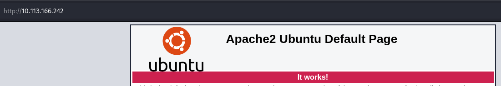

      Запускаю `gobuster` з словником `common.txt`.

   `gobuster dir -w /usr/share/wordlists/seclists/Discovery/Web-Content/common.txt  -u http://10.113.166.242 -t 50 -k -x html,txt,php`
   
      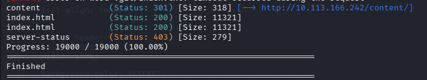

      Запускаю скан ще раз для `/content/`.

      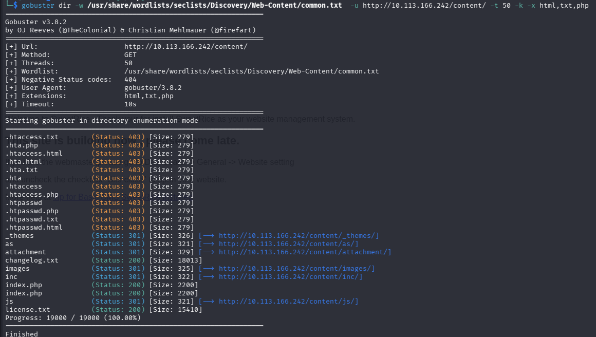

      Переглядаю результати. 

      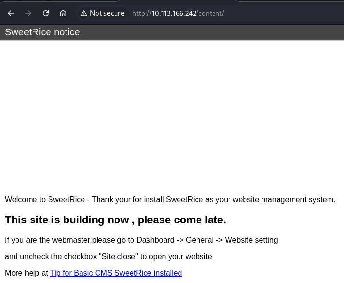

      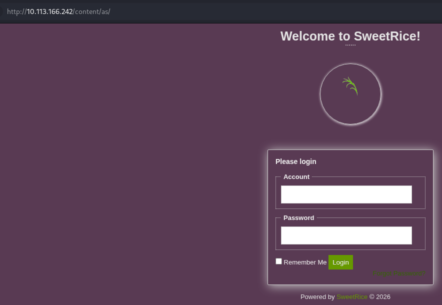

      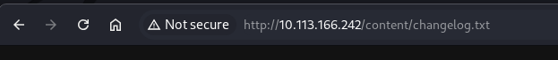

      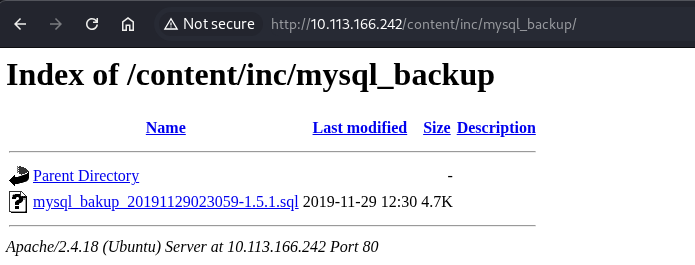

      Починаю гуглити про SweetRice 1.5.1, знаходжу. Після цього ще дивлюсь вміст завантаженого бекапу та знаходжу користувача `manager` та його хеш.

      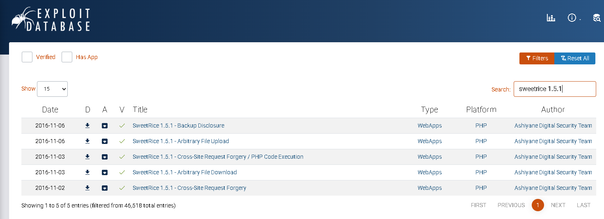

      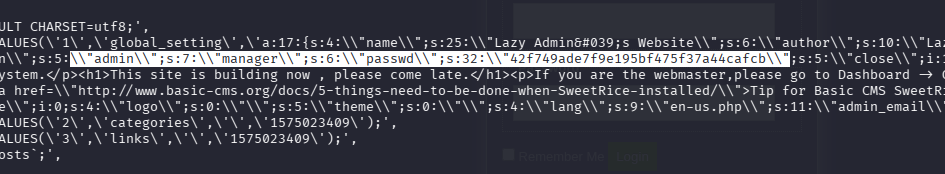
   
      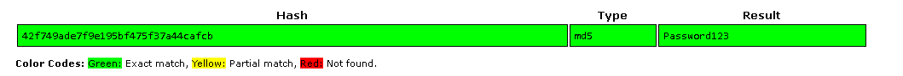   
    
3. Точка входу (Initial Access / Foothold)

    2.1. Експлуатація вразливості:

      Для початку, перевіряю отриманий логін та пароль.
          
      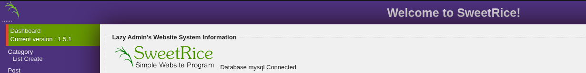

      Поглянувши тут https://www.exploit-db.com/exploits/40700 , бачу `# In SweetRice CMS Panel In Adding Ads Section SweetRice Allow To Admin Add PHP Codes In Ads File`. Тому закидую код реверс-шеллу `PentestMonkey`.

      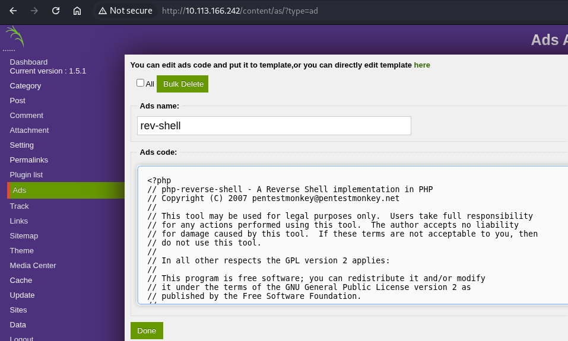

   2.2. Отримання реверс-шеллу:

      Знаходжу завантажений файл, піднімаю реверс-шелл та стабілізую його.

      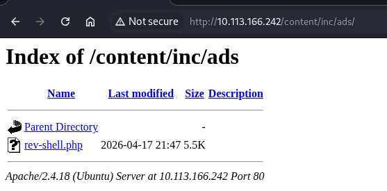

      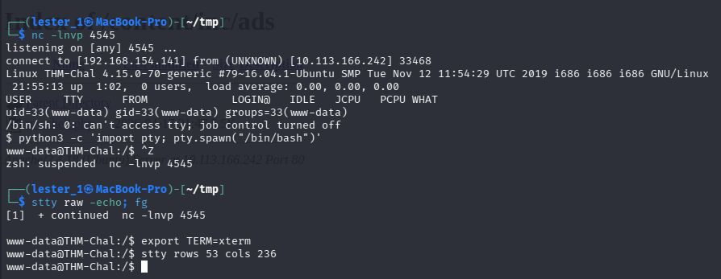

4. Підвищення привілеїв (Privilege Escalation)

    3.1. Вертикальне підвищення (www-data -> Root):

     Перевіряю `sudo -l`, бачу виконання скрипта без пароля з правами `root`. Закидаю свій реверс-шелл та запускаю.

     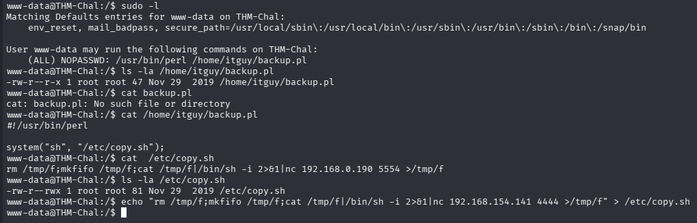

     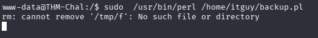

     Забираю прапори `user.txt` та `root.txt`.

     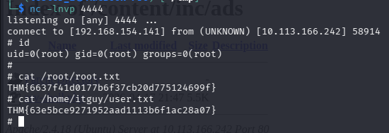
