# RootMe - A ctf for beginners, can you root me? 

Складність: Easy

Ціль: 10.114.136.228

1. Розвідка (Reconnaissance & Enumeration)

    1.1. Сканування портів (Nmap):
     Запускаю nmap `nmap -sC -sV -O -p- -vv 10.114.136.228`.

      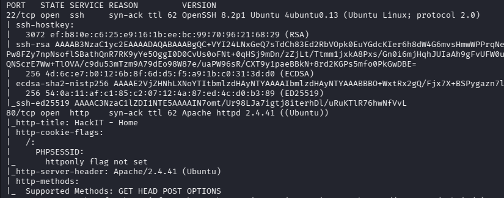

    1.2. Веб-розвідка:

      Запускаю gobuster `gobuster dir -w /usr/share/wordlists/seclists/Discovery/Web-Content/common.txt  -u http://10.114.136.228 -t 50 -k -x html,txt,php`.

      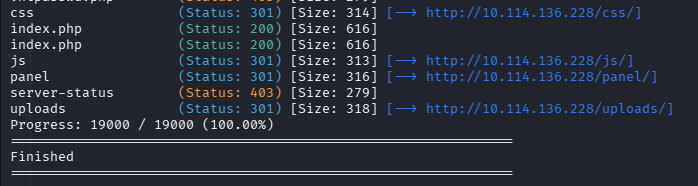

      Перевіряю результати, звертаю увагу на `http://10.114.136.228/panel/` `http://10.114.136.228/uploads/`.

      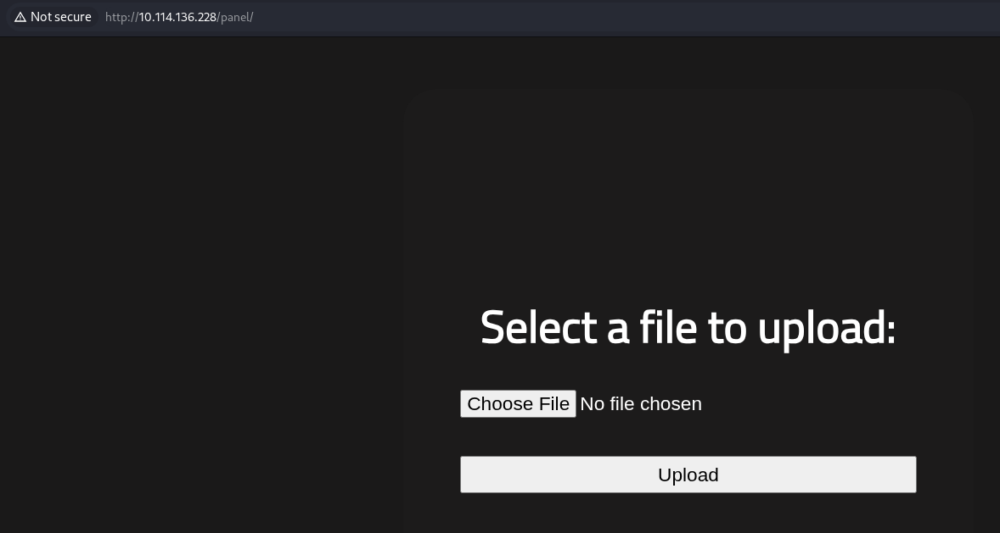

      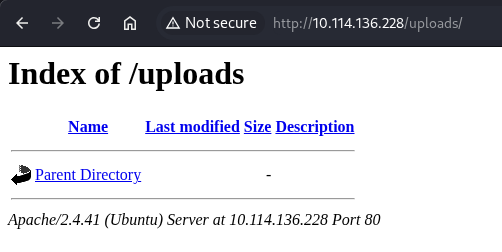

      Пробую завантажити файл для тесту. Як я і думав файл опинився в каталозі `/uploads/`. 

      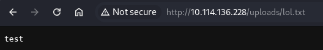

      Відповіді на питання `Task 2`.

      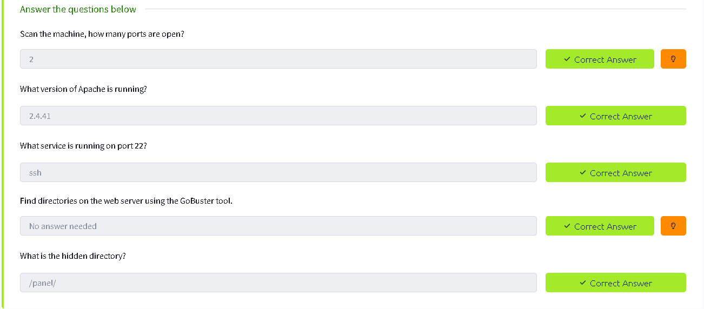

2. Точка входу (Initial Access / Foothold)

    2.1. Експлуатація вразливості:

     Перше, про що подумав - це завантажити PHP реверс-шелл `PentestMonkey`. Але сервер видав помилку на PHP файл.

      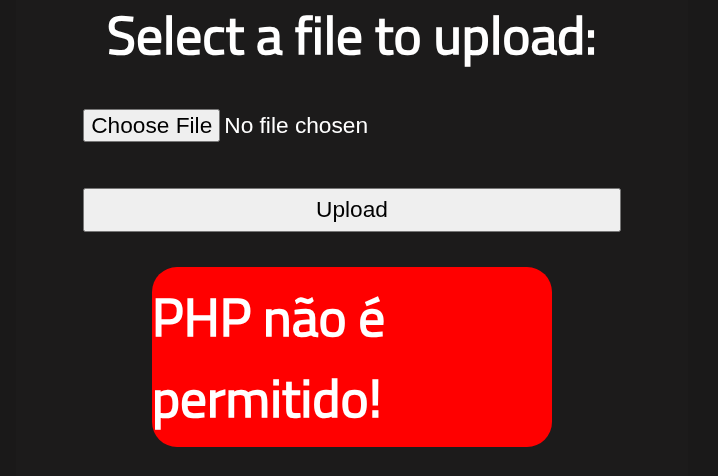

     Під час перегляду HTML коду я побачив, що використовуються js скрипти, тому знаходжу на `https://www.revshells.com/` реверс-шелл `node.js`.
     Завантажую його через панель та пробую затрігерити, попередньо запустивши слухач.

      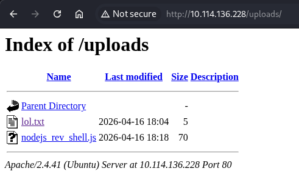

     Але не пішло.

      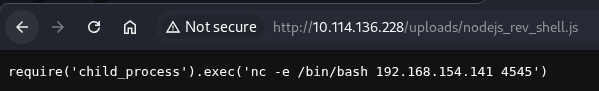

     Пробую ще декілька варіантів, але вони не працюють, тому починаю гуглити, які є вразливості під час завантаження файлу. 

    2.2. Отримання реверс-шеллу:

     Перше посилання в гуглі `https://www.vaadata.com/blog/file-upload-vulnerabilities-and-security-best-practices/`, запрацював варіант зі зміною розширення на `.php5`.

      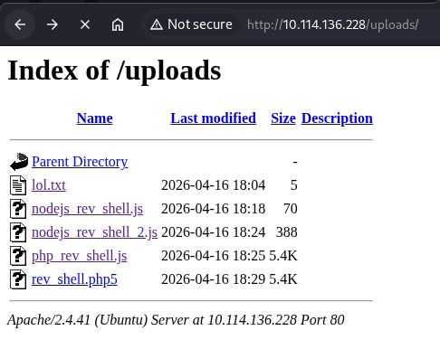

    Запускаю та стабілізую реверс-шелл, забираю прапорт `user.txt`.

     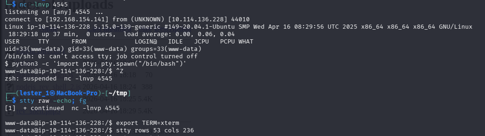

     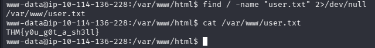

3. Підвищення привілеїв (Privilege Escalation)

    3.1. Вертикальне підвищення (www-data -> Root):

      Переглядаючи програми з SUID доступом знаходжу `python2.7`.

      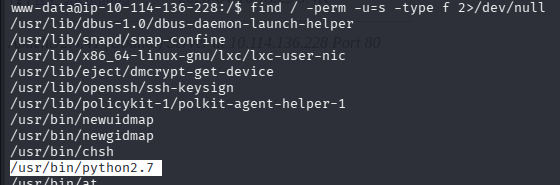

      Йду на `https://gtfobins.org/gtfobins/python/` і бачу що маючи python з SUID я можу заспавнити root шелл або реверс-шелл. Отримую `root` та забираю прапор `root.txt`.

      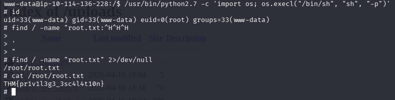  

