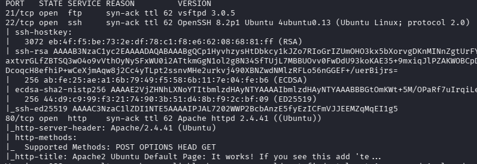
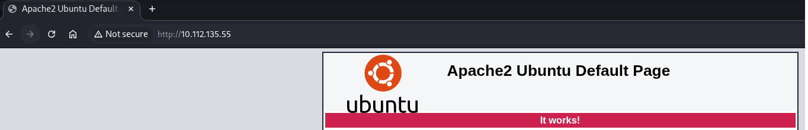
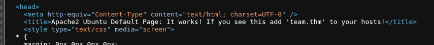
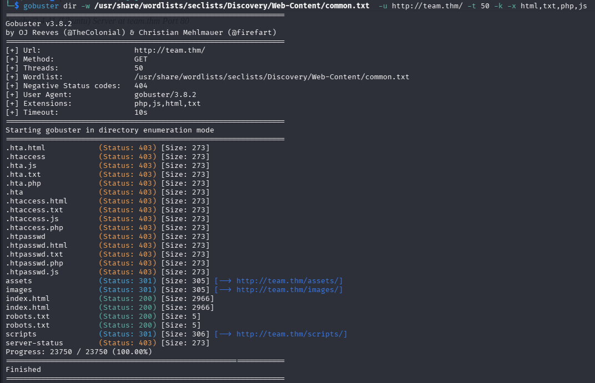
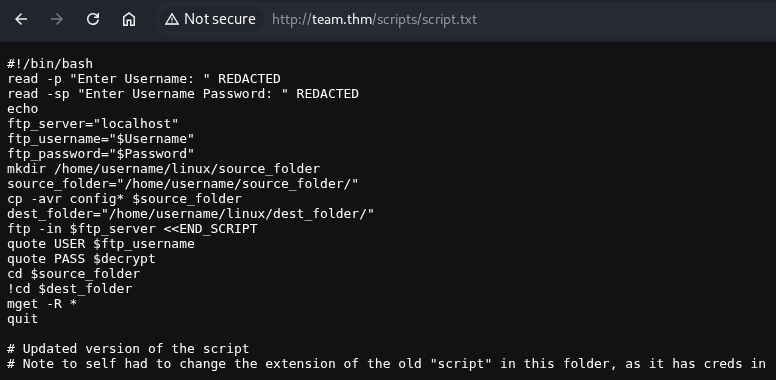
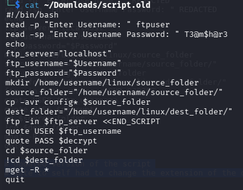
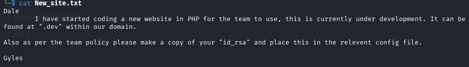
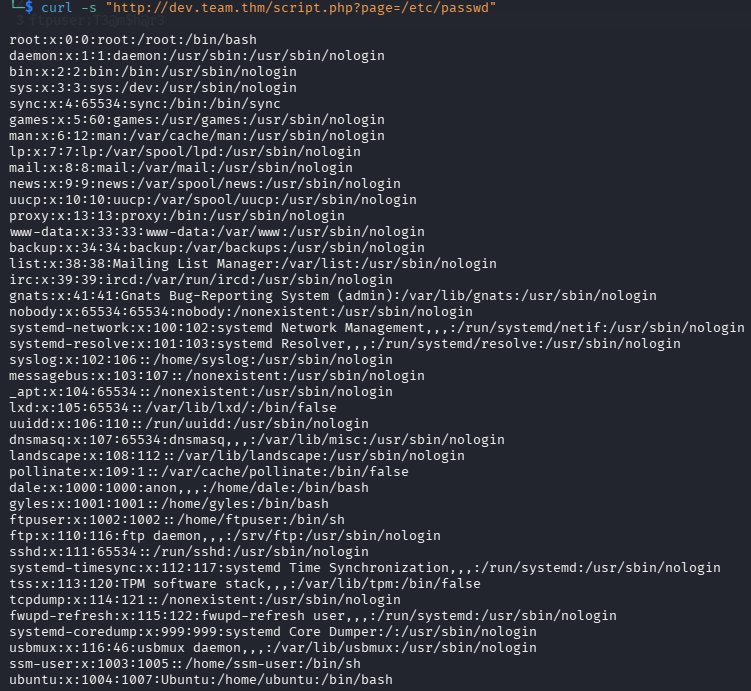
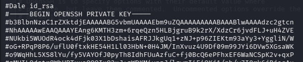
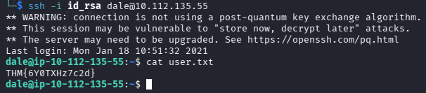

Team
Beginner friendly boot2root machine

Складність: Easy
Ціль: 10.112.135.55

1. Розвідка (Reconnaissance & Enumeration)
   1.1. nmap:
   `nmap -sC -sV -O -p- -vv 10.112.135.55`
   
   
   
   1.2. Веб-розвідка:

      На 10.112.135.55:80 стандартна сторінка Apache2
      

      Переглянув код сторінки бачу запис:" Це працює! Zкщо хочеш побачити додай 'team.thm' до своїх хостів"
      

      Додаю в etc/hosts та переходжу на http://team.thm , дивлюсь код сторінки бачу скрипти js та коментар:"Треба оновити цю сторінку більше"

      Запускаю сканування gobuster , в robots.txt тільки одне слово 'dale' , запишемо. 
       

      Далі сканую сайт та знаходжу файлик
   `gobuster dir -w /usr/share/wordlists/seclists/Discovery/Web-Content/common.txt  -u http://team.thm/scripts/ -t 50 -k -x html,txt,php,js`

      

      Переглядаю вміст текстового файлу та бачу напис про те що є старий файл script, після чого змінюю назву в адресі на 'script.old' та завантажую його.

      
      
   
      Залогінився в ftp , де бачу цікавий файл. По-перше - є імена dale та gyles. По-друге - є ще .dev сайт.  
      

      Додаю dev.team.thm => /etc/hosts  
      
2. Точка входу (Initial Access / Foothold)
   2.1. Експлуатація вразливості:

      Переходжу по адресу, а далі на сторінку `http://dev.team.thm/script.php?page=teamshare.php`. Перевіряю LFI (Local File Inclusion).
       

      Перевіряю файли за допомогою fuff та знаходжу файл /etc/ssh/sshd_config

   `ffuf -u "http://dev.team.thm/script.php?page=FUZZ" -w /usr/share/seclists/Fuzzing/LFI/LFI-gracefulsecurity-linux.txt -fs 0,1`
   `curl -s "http://dev.team.thm/script.php?page=/etc/ssh/sshd_config" `

      Отримав id_rsa користувача dale
       

      Зберігаю його та прописую доступи `chmod 600 id_rsa`

   2.2. Підключаюсь по SSH та забираю прапор user.txt:

      
   
4. Підвищення привілеїв (Privilege Escalation)

   3.1. Горизонтальне переміщення (www-data -> User): Як ти знайшов дані користувача (паролі в бекапах, скриптах або конфігах).

   3.2. Вертикальне підвищення (User -> Root): Твій шлях до "корони". Опис sudo -l, вразливих SUID-файлів або кривих скриптів.
