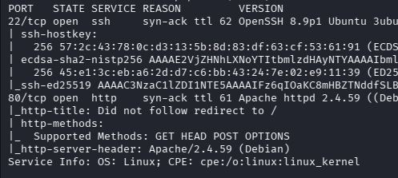
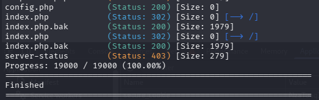
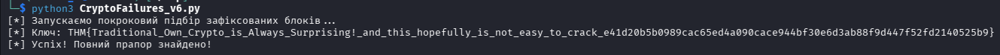

# Crypto Failures - Implementing your own military-grade encryption is usually not the best idea.

Складність: Medium

Ціль: 10.114.146.107

## 1. Розвідка (Reconnaissance & Enumeration)

### 1.1. Сканування портів (Nmap):
   Запуск базового сканування для виявлення відкритих портів та версій служб:
```bash
└─$ sudo nmap -sC -sV -p- -vv -oN nmap_result.txt 10.114.146.107
```   


  
### 1.2. Веб-розвідка:
   Під час аналізу вихідного коду головної сторінки (HTML-коментарів) було знайдено підказку від розробника, яка натякала на наявність резервної копії файлу конфігурації.
   На основі цього ми запустили Gobuster для пошуку файлів із розширеннями `.php`, `.bak` та `.php.bak`:
```bash
└─$ gobuster dir -w /usr/share/wordlists/seclists/Discovery/Web-Content/common.txt   -u http://10.114.146.107 -k -t 50 -x php,bak,php.bak
```



   У результаті було знайдено файл `index.php.bak`. Завантажуємо його:
```bash
└─$ curl http://10.114.146.107/index.php.bak
```

### 1.3. Аналіз вихідного коду (Source Code Review)
   Вихідний код отриманого файлу виявив логіку створення сесій:
```php
<?php
include('config.php');

function generate_cookie($user,$ENC_SECRET_KEY) {
    $SALT=generatesalt(2);
    $secure_cookie_string = $user.":".$_SERVER['HTTP_USER_AGENT'].":".$ENC_SECRET_KEY;
    $secure_cookie = make_secure_cookie($secure_cookie_string,$SALT);
    setcookie("secure_cookie",$secure_cookie,time()+3600,'/','',false); 
    setcookie("user","$user",time()+3600,'/','',false);
}

function cryptstring($what,$SALT){
    return crypt($what,$SALT);
}

function make_secure_cookie($text,$SALT) {
    $secure_cookie='';
    foreach ( str_split($text,8) as $el ) {
        $secure_cookie .= cryptstring($el,$SALT);
    }
    return($secure_cookie);
}

function generatesalt($n) {
    $randomString='';
    $characters = '0123456789abcdefghijklmnopqrstuvwxyzABCDEFGHIJKLMNOPQRSTUVWXYZ';
    for ($i = 0; $i < $n; $i++) {
        $index = rand(0, strlen($characters) - 1);
        $randomString .= $characters[$index];
    }
    return $randomString;
}

function verify_cookie($ENC_SECRET_KEY){
    $crypted_cookie=$_COOKIE['secure_cookie'];
    $user=$_COOKIE['user'];
    $string=$user.":".$_SERVER['HTTP_USER_AGENT'].":".$ENC_SECRET_KEY;
    $salt=substr($_COOKIE['secure_cookie'],0,2);

    if(make_secure_cookie($string,$salt)===$crypted_cookie) {
        return true;
    } else {
        return false;
    }
}

if ( isset($_COOKIE['secure_cookie']) && isset($_COOKIE['user']))  {
    $user=$_COOKIE['user'];
    if (verify_cookie($ENC_SECRET_KEY)) {
        if ($user === "admin") {
            echo 'congrats: ******flag here******. Now I want the key.';
        } else {
            $length=strlen($_SERVER['HTTP_USER_AGENT']);
            print "<p>You are logged in as " . $user . ":" . str_repeat("*", $length) . "\n";
            print "<p>SSO cookie is protected with traditional military grade en<b>crypt</b>ion\n";    
        }
    } else { 
        print "<p>You are not logged in\n";
    }
} else {
    generate_cookie('guest',$ENC_SECRET_KEY);
    header('Location: /');
}
?>
```

   Головні архітектурні помилки додатка:
  * Розбиття `str_split($text, 8)`: Довгий рядок авторизації ріжеться на окремі незалежні шматки (блоки) рівно по 8 символів.
  * Застосування `crypt($el, $SALT)` з 2-символьною сіллю: В PHP це активує старий алгоритм DES. Через особливості DES, якщо вхідний рядок більший за 8 символів, функція просто відкидає все, що йде далі. Але оскільки розробник сам розбив рядок по 8 символів, кожен блок шифрується окремо і додається один за одним (по 13 символів на блок: 2 символи солі + 11 символів хешу) у фінальну куку.
  * Повторення солі: Функція `make_secure_cookie` використовує одну й ту саму `$SALT` для всіх блоків у циклі. Це дозволяє нам порівнювати блоки між собою та брутфорсити їх локально.
  
## 2. Перший прапор: Обхід автентифікації (Privilege Escalation)

   Звичайний запит повертає нам куку користувача `guest`:  
```bash
└─$ curl -i http://10.114.146.107/                         
HTTP/1.1 302 Found
Date: Mon, 20 Jul 2026 19:31:25 GMT
Server: Apache/2.4.59 (Debian)
X-Powered-By: PHP/8.3.8
Set-Cookie: secure_cookie=Sq8Q9LuYqcGnQSqcU%2FHpa3Va3cSqybrVY8K9R6cSqZh3VRbnRfDkSqCXfxGNEqWNASqp.Kh1ve2C.ASqGIcfTH5xlZ6SqSN5g.hYnRQgSqwMZH1li%2FJn2SqTF8XwNtep9MSqPcxE5kyAQo2SqShEtHtcOkgUSqhVmc63qeQCESq%2Fw5tgks2.IYSqGRzwbuii5EUSqLWDyWrtjeZsSqyGsHt.ScVKASqJH6yItuzwZgSqLuYYB2OH23YSqdlewzjroV3ASqgeAqOgCmCHsSqLd7tyYxxy7Y; expires=Mon, 20 Jul 2026 20:31:25 GMT; Max-Age=3600; path=/
Set-Cookie: user=guest; expires=Mon, 20 Jul 2026 20:31:25 GMT; Max-Age=3600; path=/
Location: /
Content-Length: 0
Content-Type: text/html; charset=UTF-8
```

   Тут `Sq` — це сіль додатка. Перший 13-символьний блок дорівнює `Sq8Q9LuYqcGnQ`.
Бачимо з коду, що рядок сесії збирається як: `$user . ":" . $USER_AGENT . ":" . $KEY`.

   Для `guest` і дефолтного User-Agent від утиліти `curl` (`cu`), перший блок (8 символів) має вигляд: `guest:cu`. Перевіряємо це в локальному PHP:
```bash
└─$ php -a
Interactive shell
```

```php
php > echo crypt("guest:cu", "Sq");
Sq8Q9LuYqcGnQ
php > 
```

   Хеші ідеально збігаються. Для того, щоб стати адміном, нам потрібно підробити цей перший блок для імені `admin`.
   Рядок `admin:` займає 6 символів. Додаємо ще 2 символи нашого керованого User-Agent (`cu`), отримуємо потрібні 8 символів: `admin:cu`.
   Генеруємо підроблений хеш в PHP:
```php
php > echo crypt("admin:cu", "Sq");
Sql6K5EKO51J.
php > 
```

   Замінюємо оригінальний перший 13-символьний блок куки на наш новий `Sql6K5EKO51J.`, змінюємо куку `user` на `admin` і відправляємо запит на сервер:
```bash
└─$ curl -i -H "Cookie: user=admin; secure_cookie=Sql6K5EKO51J.SqcU%2FHpa3Va3cSqybrVY8K9R6cSqZh3VRbnRfDkSqCXfxGNEqWNASqp.Kh1ve2C.ASqGIcfTH5xlZ6SqSN5g.hYnRQgSqwMZH1li%2FJn2SqTF8XwNtep9MSqPcxE5kyAQo2SqShEtHtcOkgUSqhVmc63qeQCESq%2Fw5tgks2.IYSqGRzwbuii5EUSqLWDyWrtjeZsSqyGsHt.ScVKASqJH6yItuzwZgSqLuYYB2OH23YSqdlewzjroV3ASqgeAqOgCmCHsSqLd7tyYxxy7Y" http://10.114.146.107/
HTTP/1.1 200 OK
Date: Mon, 20 Jul 2026 19:35:51 GMT
Server: Apache/2.4.59 (Debian)
X-Powered-By: PHP/8.3.8
Content-Length: 65
Content-Type: text/html; charset=UTF-8

congrats: THM{ok_you_f0und_w3b_fl4g_6cbe2bc}. Now I want the key.
```

Результат: Сервер успішно авторизував нас під обліковим записом адміністратора та видав перший веб-прапор.

## 3. Другий прапор: Атака зсуву блоків (Byte-at-a-Time Attack)

   Творець кімнати вимагає секретний ключ (`$ENC_SECRET_KEY`).
   Спробувавши надіслати порожній заголовок `User-Agent:`, ми викликали помилку PHP:   
```bash
└─$ curl -i -H "User-Agent:" http://10.114.146.107/
HTTP/1.1 200 OK
Date: Mon, 20 Jul 2026 19:37:40 GMT
Server: Apache/2.4.59 (Debian)
X-Powered-By: PHP/8.3.8
Vary: Accept-Encoding
Content-Length: 680
Content-Type: text/html; charset=UTF-8

<br />
<b>Warning</b>:  Undefined array key "HTTP_USER_AGENT" in <b>/var/www/html/index.php</b> on line <b>7</b><br />
<br />
<b>Warning</b>:  Cannot modify header information - headers already sent by (output started at /var/www/html/index.php:7) in <b>/var/www/html/index.php</b> on line <b>11</b><br />
<br />
<b>Warning</b>:  Cannot modify header information - headers already sent by (output started at /var/www/html/index.php:7) in <b>/var/www/html/index.php</b> on line <b>12</b><br />
<br />
<b>Warning</b>:  Cannot modify header information - headers already sent by (output started at /var/www/html/index.php:7) in <b>/var/www/html/index.php</b> on line <b>93</b><br />
```

   Це підтвердило, що структура рядка перед розбиттям на блоки виглядає так: 
   `guest` + `:` + `USER_AGENT` + `:` + `СЕКРЕТНИЙ_КЛЮЧ`
   Керуючи довжиною `USER_AGENT`, ми можемо по одному символу заштовхувати секретний ключ у керовані нами блоки і розгадувати його по одній літері.

### Ручна перевірка першого символу ключа:
   Надсилаємо `User-Agent` довжиною рівно 8 символів (`AAAAAAAA`).
   Рядок на сервері ділиться на блоки по 8 символів так:
  * Блок 1 (байти 1-8): `guest:AA`
  * Блок 2 (байти 9-16): `AAAAAA:` + `[1-й символ ключа]`
   
   Шлемо запит:
```bash
└─$ curl -i -H "User-Agent: AAAAAAAA" http://10.114.146.107/
HTTP/1.1 302 Found
Date: Mon, 20 Jul 2026 19:56:19 GMT
Server: Apache/2.4.59 (Debian)
X-Powered-By: PHP/8.3.8
Set-Cookie: secure_cookie=rTihuhuX0TM9wrTFTTkh8UnZlkrTbtwLYnvPwG2rTqF5F.9MBDdUrTclrvEZhRW0UrT0G0pVqnhTg6rTppRzSn3WOCkrTf%2F4PBhMx7qkrTmHLrJxeDPC.rTVbdn36Hpjp2rTX0oEMCzxYS6rTeSa3fl0GW0ArT94dzaEFGf3wrTEgcQCKUbFp6rTTz5%2F5zUlQtorT.V.rygNFvnkrTslgjpyCSNc6rTnwEKA5ckFaMrT2ZwFyUV6eq6rTiiTUPGdvVXArT5fsPSClTbKIrTlR.N2fkdi96; expires=Mon, 20 Jul 2026 20:56:19 GMT; Max-Age=3600; path=/
Set-Cookie: user=guest; expires=Mon, 20 Jul 2026 20:56:19 GMT; Max-Age=3600; path=/
Location: /
Content-Length: 0
Content-Type: text/html; charset=UTF-8
```

   У другому блоці перші 7 символів відомі (`AAAAAA:`). Останній 8-й символ — невідома перша літера ключа. Брутфорсимо її локально в PHP (знаючи, що прапори THM починаються з `T`):
```php
php > echo crypt("AAAAAA:T", "rT");
rTFTTkh8UnZlk
php > exit
```

   Збіг знайдено! Перша літера ключа — `T`.

### Ручна перевірка другого символу ключа:
   Зменшуємо `User-Agent` на один символ — до 7 літер `A` (`AAAAAAA`). Рядок зсувається:
  * Блок 1 (байти 1-8): `guest:AA`
  * Блок 2 (байти 9-16): `AAAAA:T` + `[2-й символ ключа]`

   Шлемо запит:
```bash
└─$ curl -i -H "User-Agent: AAAAAAA" http://10.114.146.107/
HTTP/1.1 302 Found
Date: Mon, 20 Jul 2026 19:58:33 GMT
Server: Apache/2.4.59 (Debian)
X-Powered-By: PHP/8.3.8
Set-Cookie: secure_cookie=UQOIjL8%2Ffpxx2UQCFt0mn1zTE2UQ3.9wablqyTMUQqz1Y6XrM9isUQ2Gkd84GqHtoUQJJ2XY77sT0IUQe.ba9PSbQ1sUQYoCwYUubR02UQZfZ7VshsveMUQy869TClL55sUQUDXLMLjoAkcUQXtYvIoFviaQUQjUt7zP1c5AEUQPZw83DI%2FjkEUQpVqYFvjqLxUUQ9xPgW8Nkh66UQKcnkqvfCxFoUQnBaWIV37gpYUQG2CxTOYZXWkUQjGgIMTmoROwUQvUt4suubUwc; expires=Mon, 20 Jul 2026 20:58:33 GMT; Max-Age=3600; path=/
Set-Cookie: user=guest; expires=Mon, 20 Jul 2026 20:58:33 GMT; Max-Age=3600; path=/
Location: /
Content-Length: 0
Content-Type: text/html; charset=UTF-8
```

   Перевіряємо в PHP відому `T` та додаємо наступний передбачуваний символ `H`:
```php
php > echo crypt("AAAAA:TH", "UQ");
UQCFt0mn1zTE2
php > 
```

   Збіг! Друга літера — `H`. Тепер ми чітко бачимо початок прапора `THM{`.

## 4. Автоматизація атаки за допомогою Python

   Оскільки ключ довгий, для повного його витоку було написано скрипт автоматизації. Враховуючи, що в сучасних версіях Python (починаючи з 3.13) застарілий модуль `crypt` було видалено, скрипт використовує бібліотеку `passlib` для сумісності з DES-хешами.

### Скрипт (CryptoFailures.py):
```python
#!/usr/bin/env python3
import requests
import urllib.parse
import string
from passlib.hash import des_crypt

BASE_URL = "http://10.114.146.107/"
CHARSET = string.printable

def get_secure_cookie(user_agent: str) -> str:
    session = requests.Session()
    headers = {"User-Agent": user_agent} if user_agent else {}
    try:
        response = session.get(BASE_URL, headers=headers, timeout=5)
        cookie = session.cookies.get("secure_cookie")
        if not cookie:
            return ""
        return urllib.parse.unquote(cookie)
    except Exception:
        return ""

def main():
    discovered = ""
    print("[*] Запускаємо покроковий підбір зафіксованих блоків...")
    print("[*] Ключ: ", end="", flush=True)

    while True:
        # Визначаємо, скільки літер 'A' нам потрібно для поточного кроку
        # ua_len буде змінюватися від 8 до 1 циклічно
        ua_len = 8 - (len(discovered) % 8)
        user_agent = "A" * ua_len
        
        # Визначаємо, який саме блок куки нам потрібен (кожні 8 символів ключа переходимо до наступного блоку)
        # Перші 8 символів ключа шукаємо в 2-му блоці (index 1), наступні 8 — в 3-му (index 2) і т.д.
        block_index = 1 + (len(discovered) // 8)
        
        secure_cookie = get_secure_cookie(user_agent)
        if not secure_cookie:
            print("\n[!] Не вдалося отримати куку від сервера.")
            break
            
        # Вирізаємо потрібний 13-символьний зашифрований блок
        target_block = secure_cookie[block_index * 13 : (block_index + 1) * 13]
        if not target_block or len(target_block) < 13:
            print("\n[!] Блок куки порожній або занадто короткий. Можливо, це кінець рядка.")
            break
            
        salt = target_block[:2]
        found_char = False

        for char in CHARSET:
            if char in "\r\n": 
                continue
                
            # Повністю моделюємо рядок, який збирає сервер: guest:USER_AGENT:KEY
            full_str = f"guest:{user_agent}:{discovered}{char}"
            
            # Нарізаємо змодельований рядок на 8-символьні шматки
            chunks = [full_str[i:i+8] for i in range(0, len(full_str), 8)]
            
            # Перевіряємо шматок під тим самим індексом, що й на сервері
            if block_index < len(chunks):
                candidate_chunk = chunks[block_index]
            else:
                continue

            try:
                candidate_hash = des_crypt.hash(candidate_chunk, salt=salt)
                if candidate_hash == target_block:
                    discovered += char
                    print(char, end="", flush=True)
                    found_char = True
                    if char == "}":
                        print("\n[*] Успіх! Повний прапор знайдено!")
                        return
                    break
            except Exception:
                continue

        if not found_char:
            print("\n[!] Не вдалося підібрати символ на поточній позиції.")
            break

if __name__ == "__main__":
    main()
```

### Запуск скрипта:



## Висновки та винесені уроки (Lessons Learned)
* Не розробляйте власні криптосистеми ("Don't roll your own crypto"): Намагання створити кастомну схему авторизації поверх застарілих та слабких алгоритмів (DES `crypt`) гарантовано призводить до компрометації системи.
* Вразливість блочного шифрування без сесійного контексту: Поділ рядка на фіксовані 8-байтові блоки (`str_split`), які шифруються з однаковою сіллю та без використання векторів ініціалізації (IV) або правильних режимів зчеплення блоків (наприклад, CBC), відкриває можливість проведення атак типу Byte-at-a-Time Chosen-Plaintext Attack, якщо атакуючий здатний впливати на довжину вхідного вектора (у нашому випадку через заголовок `User-Agent`).
